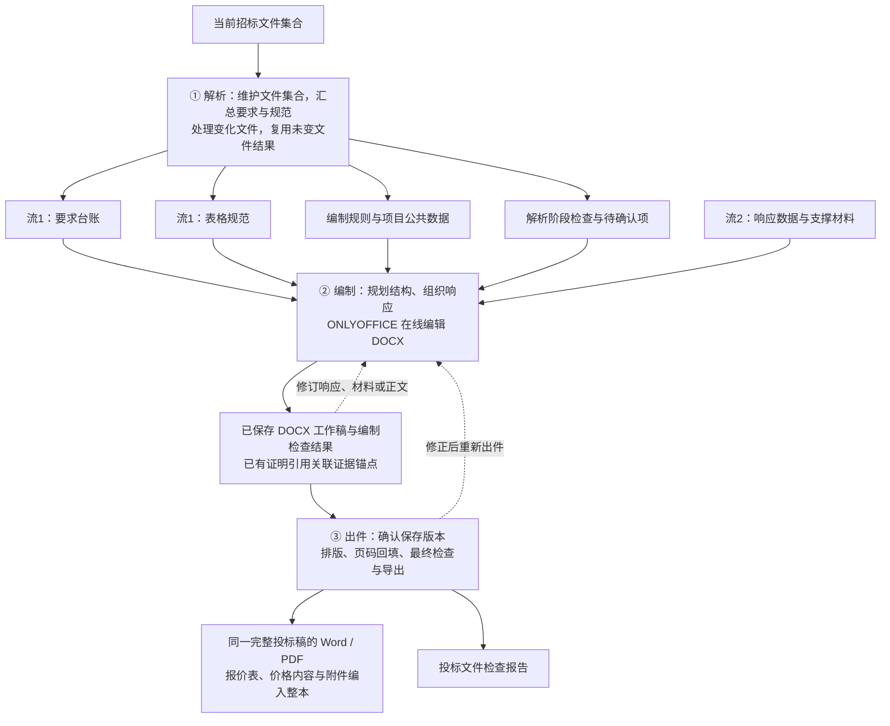
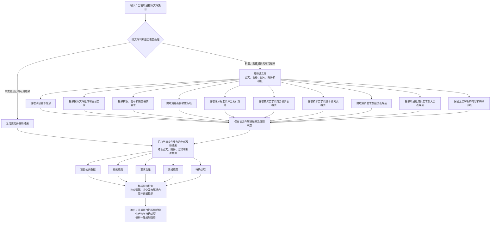
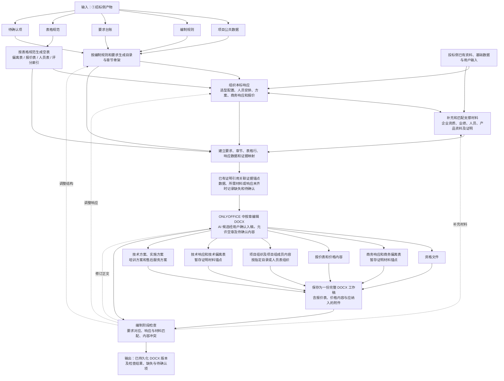
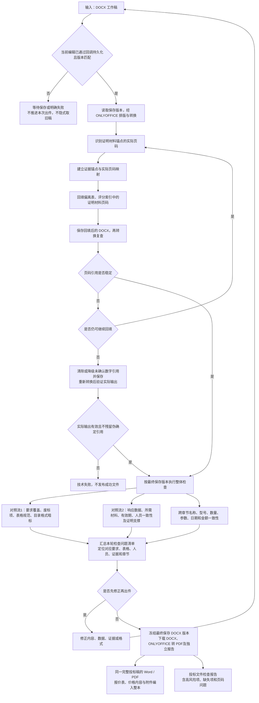

# 招标文件到投标文件程序化流程

## 文档定位

本文是乙方投标文件编制的 **业务划分**，描述如何根据招标文件及附件组织响应、编写投标文件并导出当前稿。范围只含可程序化的内容处理、响应组织、材料匹配、文档生成和检查，不含资料清点、内部会议、人员分工等外围管理，也不覆盖甲方组织招标、开评标等流程。

正文编辑采用 **ONLYOFFICE Docs 在线 DOCX 编辑**。DOCX 是投标正文的唯一正式来源，要求、证据、报价和检查仍结构化保存；不再通过 Markdown 或 Tiptap/ContentBlock 往返重建正式稿。解析工具内部的中间文本或 Markdown 可暂时保留，不因此重写全部解析。接入目标见 [`onlyoffice.md`](onlyoffice.md)，实施顺序见 [`../../plans/bidding/onlyoffice-integration.md`](../../plans/bidding/onlyoffice-integration.md)；方案批准不代表已经实现或部署。

本期优先交付按招标文件要求组织的完整可编辑模板：目录、全部应有章节、指定格式与附表、招标侧固定内容和填写位置；投标方事实、人员、报价、证明及实际响应的自动填充后置。该交付切片不删除本文的长期业务范围。Agent 运行、逐范围提取、附表关系和独立复核的实施统一见 [Rig 方案](../../plans/bidding/agent-runtime-rig.md)，当前实现与真实验收见[执行台账](../../plans/implementation-tasks.md)。

业务主链固定为三个部分，并与用户步对齐：

| 业务部分 | 用户步 | 这一步做什么 |
| --- | --- | --- |
| ① 解析：维护文件集合，汇总要求与规范 | 文件 | 处理新增或变更文件，复用未变文件的解析结果，汇总当前项目要求与规范 |
| ② 编制：规划结构、组织响应、编写工作稿 | 编制 | 生成 DOCX 初稿，在 ONLYOFFICE 中组织响应、匹配支撑材料、按章编辑并保存 |
| ③ 出件：排版、页码回填、最终检查与导出 | 导出 | 确认当前编辑已保存，以持久化 DOCX 排版、回填和检查，输出同稿 DOCX/PDF及独立报告 |

实现可在各部分内再划分阶段、任务或界面动作，不增加第四个业务部分。部分之间传递的是可追溯工作产物和待确认项，不是「全绿才能进入下一步」。

三部分是职责划分，不是只能执行一次的单向向导。招标文件不变时，可以在编制、检查和出件之间往返修订；招标文件发生变化时，按最新文件集合重新汇总要求，再重新编制和出件，不对旧稿做局部影响分析或自动合并。

---

## 统一口径

1. 业务主链固定三部分，对应用户步：文件 / 编制 / 导出。
2. 输入分为两条流：招标侧「要求 + 表格规范」，投标侧「响应数据与支撑材料」。两条流是输入分类，不是两个独立业务阶段。
3. 实现可内部分切；大纲、人员、报价、偏离表等在三部分内部处理，不另增并列主流程。
4. 文件级增量处理：未变更且已有可用解析结果的文件直接复用；新增、变更或尚无可用解析结果的文件才需要处理。
5. 招标文件变更后，基于当前文件集合重新汇总要求、重新编制和出件；复用文件解析结果，不等于增量修补旧投标稿。
6. 检查贯穿三部分：解析与编制阶段及时反馈问题，出件阶段执行最终整体检查。
7. 高风险项必须明示；缺材料、检查不通过不作为禁止编制或禁止导出的业务闸门。
8. 报价表、价格内容和应纳入投标稿的附件统一编入一份完整投标文件，Word（DOCX）/PDF是同一完整稿的两种输出格式；独立检查报告另行提供。系统不自动拆分文件，招标要求单独提交的内容由用户导出后自行拆分。

9. ONLYOFFICE 中编辑真实 DOCX；已持久化 DOCX 版本是出件来源。保存请求已发出不等于保存完成，有未保存修改时不能静默导出旧稿并称最新；PDF由同一保存版本经 ONLYOFFICE 转换。

### 两条输入流

| 流 | 是什么 | 从哪来 | 典型产物 |
| --- | --- | --- | --- |
| 流1 招标侧 | 要求 + 表格规范 | 招标正文、附件、格式模板、澄清补遗 | 废标项、评分点、偏离表/报价表/人员表列定义、目录与暗标规则 |
| 流2 投标侧 | 响应数据与支撑材料 | 企业已有资料、本标补充材料、用户输入，以及编制过程中形成的本标响应 | 执照、证书、业绩、人员社保、检测报告、产品配置、方案草稿、商务响应和报价数据 |

招标文件提供要求和编制规范，其中的图片或附件不得自动当作投标方证明插入输出。投标方事实、证明和响应数据来自流2；方案和正文基于招标要求及这些投标侧输入组织生成，不得把招标要求直接当作我方已具备的事实。

流2既包含「证明已有事实」，也包含「形成本标响应」。资质和业绩主要依靠材料匹配；产品选型、技术方案、实施安排、商务承诺和报价则需要在②中组织和编写，不能简化为按证件填表。尚未确认的方案可以保留为草稿，但不能写成已落实的事实。

人员、偏离表、评分索引、报价表都是「流1出要求与规范，流2组织响应并提供支撑」在②汇合，不各做一套并列流水线。下文 1.3、2.4、3.4 的清单是两条流上的业务类型，不是额外的业务部分。

全流程可追溯链路：

```text
招标条款
→ 招标要求 / 表格规范
→ 强制程度或评分属性
→ 投标文件章节
→ 响应内容
→ 响应数据与支撑材料
→ 证明材料锚点（涉及证明引用时）
→ 最终证明页码（需要填写时）
→ 检查结果
```

总流程：

```text
当前招标文件集合（正文、附件、澄清、补遗等）
        │
        ▼
① 解析（文件）
   未变文件：复用已有解析结果
   新增或变更文件：解析处理
   尚无可用解析结果的文件：处理或保留未解析提示
        │
        └→ 汇总当前文件集，执行解析阶段检查
           项目公共数据 + 编制规则 + 要求台账 + 表格规范 + 待确认项
        │
        ▼
② 编制（编制）
   DOCX 初稿 → ONLYOFFICE 中组织响应、匹配材料与按章编辑（可往返）
   编制阶段持续检查并反馈 → 保存 DOCX 工作稿（证明引用使用锚点）
        │
        ▼
③ 出件（导出）
   确认当前编辑已持久化 → 排版与页码回填 → 保存并复查
   → 同一 DOCX 版本下载 / ONLYOFFICE 转 PDF + 独立检查报告

招标文件变化：回到①，只处理需处理的文件，再重新编制和出件。
仅修改投标稿：在②③之间修订、重检和重新导出，不重跑招标文件解析。
```



---

## 第一部分：解析：维护文件集合，汇总要求与规范

### 1.1 目标

维护当前项目的招标文件集合，通过文件级处理或已有结果复用，汇总出②可以直接使用的结构化结果。文件内容包括自然语言、表格、图片、附件和指定模板；不因项目重新编制而重复处理未变更且已有可用结果的文件。

这一部分要同时抽出两样最重要的招标侧材料：

- **要求**：投标文件需要写什么、必须满足什么；
- **表格规范**：固定表怎么填，列、行、字段、证明名称和页码写在哪。

格式、签章、证明页码、装订和提交方式等编制规则，必须与商务、技术和资格要求同时进入结构化结果，不能只在最终检查时处理。

### 1.2 输入

- 招标文件正文；
- 招标文件附件；
- 投标文件格式模板；
- 商务、技术和报价表格；
- 图纸、采购清单和技术规范书；
- 澄清、答疑、补遗和变更文件。

① 对应「文件」步：维护当前项目已纳入的招标文件集合。文件不必一次给齐，澄清、补遗和变更可以后续追加。资料清点、内部会议、人员分工不在范围。

**文件级处理与结果复用：**

| 文件情况 | 处理方式 |
| --- | --- |
| 首次纳入或新增文件 | 处理该文件，形成可复用的文件级解析结果 |
| 文件内容发生变化 | 处理变更后的文件，形成新的文件级解析结果 |
| 文件未变更，且已有可用解析结果 | 直接复用，不重复转换、识别和抽取 |
| 文件未变更，但尚未解析成功或没有可用结果 | 处理或重试该文件；仍无法处理的内容保留为未解析提示和待确认项 |

**项目级汇总与重新编制：**

1. 汇总当前纳入的全部文件及其对应解析结果，包括复用结果和新处理结果。
2. 根据当前文件集合整理项目公共数据、编制规则、要求台账和表格规范。补遗通常要与原招标文件共同理解，不能只用补遗重新编制，也不能把相互冲突的要求简单拼接；无法确定的内容列入待确认项。
3. 招标文件集合发生变化后，基于最新汇总结果重新开始②编制和③出件。不对旧投标稿识别受影响章节，不做局部重编、新旧稿自动合并或自动修补。
4. 旧稿及其输出可以保留备查，但新一轮编制不自动沿用旧稿的响应结论、检查结果和证明页码。企业资质、人员证书、产品资料等基础材料仍可复用，并在新一轮编制中重新匹配。

因此，「重新开始流程」不等于「重新处理所有文件」：文件级只处理需要处理的文件，项目级基于最新文件集合重新汇总、编制和出件。

### 1.3 需要提取的招标内容

以下分类是要求类型和表格类型，进入 1.4 的四类产物，不是九条并列主流程。

#### 1.3.1 项目基本信息

- 项目名称、项目编号和标包编号；
- 招标人、招标代理机构；
- 采购内容和采购范围；
- 投标截止时间、开标时间和地点；
- 投标有效期；
- 交付地点、交付期限和服务期限；
- 投标保证金的金额、形式和有效期；
- 是否允许联合体、分包或备选方案。

项目名称、编号、标包、日期等基础数据需要形成统一数据源，供封面、投标函、报价表、授权书、偏离表等多个章节共同引用。

#### 1.3.2 投标文件组成和目录要求

- 投标文件是否分为资格、商务、价格和技术分册；
- 各分册必须包含的章节；
- 章节顺序是否固定；
- 是否提供强制目录或固定章节名称；
- 是否要求逐条响应招标文件；
- 是否要求商务响应表、商务偏离表；
- 是否要求技术响应表、技术偏离表；
- 是否要求评分索引表或证明材料索引表；
- 是否允许增加、删除或调整目录。

#### 1.3.3 格式、签章和提交要求

- 封面、目录及固定表格格式；
- 纸张规格和页面方向；
- 字体、字号、行距和页边距；
- 标题层级和编号规则；
- 页眉、页脚和页码规则；
- 表格样式及单元格填写要求；
- 正本、副本及电子文件数量；
- 签字人、签字位置和盖章位置；
- 是否要求逐页盖章、骑缝章或电子签章；
- 装订、密封和包封标识要求；
- 电子文件格式、大小、命名、加密及分册提交要求；
- 暗标对投标人名称、标识、字体和版式的限制。

招标文件未明确规定的格式，可以使用默认编制规则；招标文件已经明确规定的格式必须覆盖默认规则。

#### 1.3.4 资格条件和废标项

- 营业执照和经营范围；
- 行业许可证和企业资质；
- 财务、纳税和社保证明；
- 企业信用和无重大违法记录；
- 类似项目业绩；
- 制造商授权和原厂服务承诺；
- 法定代表人身份证明和授权委托书；
- 实质性响应条款；
- 明确标注的废标、否决投标和无效投标条件；
- 证明文件的有效期、签发单位和时间范围。

#### 1.3.5 评分标准

- 评分项和评分子项；
- 分值及评分方法；
- 得分条件；
- 需要编写的响应内容；
- 需要提供的证明材料；
- 证明材料形式和有效期要求；
- 评分项对应的投标文件章节；
- 是否要求在评分索引中填写证明页码。

#### 1.3.6 商务要求

- 交付期限、服务期限和实施周期；
- 付款方式；
- 质保期限；
- 售后服务和响应时间；
- 培训、验收和运维要求；
- 合同主要条款；
- 违约责任；
- 不可偏离条款；
- 商务响应表或商务偏离表的固定字段；
- 是否要求填写证明材料名称和证明材料页码。

#### 1.3.7 技术要求

- 产品和服务范围；
- 产品名称、数量和单位；
- 技术参数、功能和性能指标；
- 部署架构、接口和兼容性要求；
- 实施、迁移、培训和售后要求；
- 检测报告、产品证书、白皮书或截图要求；
- 星号项、关键项和其他特殊标记；
- 是否允许正偏离、负偏离或不允许偏离；
- 技术响应表或技术偏离表的固定字段；
- 是否要求填写证明材料名称和证明材料页码。

#### 1.3.8 报价要求

- 总价、分项报价和单价要求；
- 数量、单位和计算关系；
- 含税或不含税要求；
- 税率和币种；
- 最高限价或预算金额；
- 是否允许缺项报价；
- 报价表固定模板；
- 大写金额和小写金额填写规则；
- 价格文件是否需要单独成册、密封或提交。

#### 1.3.9 项目组成员要求

项目组成员必须作为独立要求类型提取，不能只作为企业资格的附属信息处理。

- 项目负责人、技术负责人及其他岗位名称；
- 各岗位要求的人数；
- 学历、专业和工作年限；
- 职称和职业资格证书；
- 类似项目经验；
- 项目业绩要求；
- 社保或劳动关系证明；
- 简历格式；
- 证书和证明材料的有效期；
- 是否属于资格条件、评分项或一般响应项；
- 是否要求在人员表或评分索引中填写证明页码。

1.3 各类内容进入四类产物的方式如下。义务进要求台账，表头、字段和页码填写规则进表格规范，二者不再混在一张「响应要求表」里。

| 1.3 分类 | 主要进入 |
| --- | --- |
| 项目基本信息 | 项目公共数据 |
| 组成和目录 | 编制规则；若有强制目录或固定表，同时进入表格规范 |
| 格式、签章和提交 | 编制规则 |
| 资格条件和废标项 | 要求台账，并记录需要的证件类型 |
| 评分标准 | 要求台账；若有评分索引或证明材料索引，同时进入表格规范 |
| 商务要求 | 要求台账；商务响应表/偏离表进入表格规范 |
| 技术要求 | 要求台账；技术响应表/偏离表进入表格规范 |
| 报价要求 | 要求台账；报价表模板进入表格规范 |
| 项目组成员要求 | 要求台账；人员表、简历格式进入表格规范 |

### 1.4 结构化输出

① 只产出招标侧结果，不在这一步匹配投标材料或形成投标响应。文件级解析结果用于后续复用；传入②的是基于当前文件集合汇总的以下项目级产物，而不是仅有变更文件的解析结果。

| 输出数据 | 主要内容 |
| --- | --- |
| 项目公共数据 | 项目名称、编号、标包、招标人、日期、地点、有效期等，供各章节引用的单一数据源 |
| 编制规则 | 分册、目录、排版、签章、暗标、装订、密封及提交规则 |
| 要求台账 | 资格、废标、实质性条款、评分、商务、技术、报价、项目组成员等全部义务 |
| 表格规范 | 偏离表、响应表、报价表、人员表、评分索引等列/行/字段、必填证明名称和页码字段 |
| 待确认项 | 冲突、歧义、无法解析的内容；必须显式保留并带入②③，不能静默忽略 |

每一条要求至少应保留以下字段：

```text
要求ID
要求类型
要求原文
来源文件
来源章节
来源页码
强制程度
是否属于废标项
是否属于评分项
目标投标章节
响应方式
证明材料要求
证明页码填写要求
当前状态
```

“响应方式”字段必须存在，但不要求凭空填入响应项。仅有资格、禁止事项、费用承担或履约约束而未规定提交产物时，在核对关联总则后可保留空响应数组；原约束、适用条件和来源仍进入要求台账。若原文或上位条款明确要求响应，则必须保留实际响应项；未知的引用目标进入待确认项，不能用空数组掩盖。证明义务独立保留，不能因响应数组为空而删除。

每一份表格规范至少应保留以下字段：

```text
表格规范ID
表格类型
来源文件 / 来源章节 / 来源页码
列、行或字段定义
合并单元格和填写约束
是否要求填写证明材料名称
是否要求填写证明材料页码
对应要求ID
当前状态
```

### 1.5 第一部分流程图



### 1.6 第一部分完成条件

- 当前文件集合中的文件均已有对应解析结果，或已明确记录未解析状态和待确认项；未变更文件已复用可用结果；
- 项目级产物已汇总当前全部文件的结果，而不是仅包含新增或变更文件；
- 资格、商务、价格、技术和项目组成员要求均已进入要求台账，或已列入待确认项；
- 固定表格、偏离表、报价表、人员表、评分索引等规范均已识别，或已列入待确认项；
- 目录、格式、签章、暗标和提交规则均已进入编制规则；
- 评分项、废标项和实质性条款均可追溯到原始位置；
- 冲突、歧义和无法解析的内容已形成待确认项，不能静默忽略。

解析阶段即检查处理状态、汇总结果和已发现的遗漏或冲突，不等到出件时才反馈。未解析完成或仍有待确认项时，允许进入②，但这些项必须随结构化产物一起传递。

---

## 第二部分：编制：规划结构、组织响应、编写工作稿

### 2.1 目标

用①的编制规则、要求台账和表格规范铺出投标文件目录、章节骨架和空表；围绕本标要求组织响应，补充和匹配投标侧材料，按章编写并组装成一份完整工作稿。报价表、价格内容和应纳入投标稿的附件均编入该稿，不另建独立报价文件、附件包或分册文件。

初稿及空表以 DOCX 形式进入 ONLYOFFICE，用户在真实 Word 文档中编辑标题、正文、表格、图片和附件，并通过保存回调形成我方持久化版本。结构化大纲与内容块可以用于初稿、业务映射或 AI 候选，但不是第二份正文真源，不能按旧树覆盖用户在 DOCX 中的修改。

②不只是「按证件填表」，而是同时完成两类工作：

- **证明已有事实**：匹配企业资质、业绩、人员和产品等事实及其证明材料；
- **形成本标响应**：组织产品选型、配置、技术方案、实施安排、商务承诺和报价等本标内容。

内部过程为「结构规划 → 响应组织与材料匹配 → 章节编写与组装」。响应组织、材料匹配和编写可以交替推进，并根据检查反馈修订，不要求材料全部齐备后再开始写作。

已有事实必须有来源，不得因为缺少材料而自动虚构企业资质、人员经历、项目业绩或产品参数。本标方案、商务响应和报价可以先形成草稿或待确认数据，但不得把未经确认的内容写成已落实的事实或承诺。缺材料时输出缺失项，仍可继续编制空章、手写响应或先出工作稿。

### 2.2 输入

招标侧（①的产物）：

- 项目公共数据；
- 编制规则；
- 要求台账；
- 表格规范；
- 待确认项。

投标侧（流2，在②补充和形成）：

- 企业资质、人员、业绩、产品及其他可用证明材料；
- 已有产品资料、商务数据和报价基础数据；
- 用户为本标输入或确认的产品选型、配置、方案、商务响应和报价数据。

这些输入不必在进入②前全部具备。尚未形成的本标响应在②中组织和编写，尚未取得的材料在②中补充和匹配。

### 2.3 生成投标文件目录、章节骨架和空表

先按规范规划文件结构，铺出目录和空表，再逐章组织响应和编写内容。目录和空表可以先于材料齐备存在，并可随编制过程调整。

规划对象是本项目应提交的投标文件。Agent 必须从完整招标文件集中定位投标文件组成、编制要求、指定目录与格式，并交叉核对投标人须知及前附表、评审办法、技术规范和澄清补遗中的追加要求。这些要求可能分散在多处，不能只读“投标文件格式”一章，也不能把招标文件自身的目录当作投标文件目录。上述名称仅为常见说明位置，不是程序识别或章节生成的关键词规则。

每个输出章节及附表须能追溯到组成要求、具体响应或证明义务、指定格式及其适用条件；保留原文规定的层级、顺序、附表子项、跨页续表、说明和签署位置。复核从提交要求逐项核对实际稿件，再从稿件反查来源，检查遗漏、错位、重复和无依据新增。

目录生成需要遵循以下优先顺序：

1. 招标文件提供的固定目录；
2. 招标文件规定的投标文件组成和章节顺序；
3. 招标文件提供的固定表格和附件模板；
4. 评分标准要求单独呈现的章节；
5. 资格、商务、价格和技术要求对应的必要章节；
6. 招标文件没有明确规定的部分，由 Agent 根据本项目已提取的义务提出结构，记录组织依据和待确认事项。

商务、技术、报价等是要求的业务分类，不构成预设章节。只有本项目原文明确要求这样的组成时，才依其规定组织；不保留通用三章、固定章节数量或按样稿附件编号生成的备用路径。

固定表格按表格规范生成 DOCX 中可编辑的空表，保留招标列/字段，响应列先空着。指定 DOCX 模板、合并表格及版式需通过真实文档保真验证，不承诺任意格式完全兼容。不得用与本次招标无关的通用目录无条件铺开章节。

用户后续修改文档标题、表格或顺序，以 DOCX 为准；业务映射失效时提示核对，不由旧大纲自动回写整稿。

招标要求分册或单独提交的内容，仍按要求组织其章节、表格和附件，但统一编入同一份工作稿；相关提交要求保留并提示用户导出后自行拆分，不因此生成独立文件。

每个章节需要关联：

- 对应的招标要求ID；
- 对应的评分项ID；
- 对应的表格规范ID；
- 需要引用的数据；
- 需要插入的证明材料；
- 生成方式；
- 格式规则；
- 完成状态。

### 2.4 组织本标响应，补充和匹配支撑材料

围绕要求台账中的具体要求和表格规范中的具体行/字段，同时组织「我方如何响应」和「用什么数据、材料支撑响应」。

- 对已有事实，选择适用的企业、人员、业绩和产品资料，并匹配证明材料。
- 对本标响应，形成或输入选型、配置、方案、商务承诺和报价，再与已有事实及材料相互核对。
- 尚未确定的响应保留为草稿或待确认项；尚未取得的必要材料保留为缺失项。

响应组织和材料匹配可以往返进行，不是两条独立流水线，也不是进入②之前的独立闸门。以下按业务类型列出需要组织的数据与材料。

#### 2.4.1 企业资格材料

- 营业执照；
- 企业资质和许可证；
- 财务、纳税和社保证明；
- 信用证明和承诺函；
- 制造商授权和原厂服务承诺；
- 法定代表人及授权代表材料。

#### 2.4.2 企业业绩和案例

- 项目名称、客户、合同金额和实施时间；
- 项目内容与本次招标要求的相似性；
- 合同关键页；
- 验收报告；
- 中标通知书；
- 客户证明材料。

#### 2.4.3 项目组成员数据

项目组成员数据需要独立组织，但不无条件生成专章；按招标固定目录、人员表及评分要求放入指定位置，仅在要求独立呈现或无固定目录且确有必要时形成章节。每名成员至少关联：

```text
人员ID
姓名
拟任岗位
岗位职责
学历和专业
工作年限
职称
职业资格证书
证书编号
证书有效期
类似项目经验
个人项目业绩
社保或劳动关系证明
个人简历
证明材料ID
证明材料锚点
对应招标要求ID
对应评分项ID
```

人员响应通常覆盖以下内容（按指定章节/表格组织，不强制拆为可见章节）：

- 项目组织结构；
- 项目组成员一览表；
- 岗位职责；
- 项目负责人简历；
- 技术负责人简历；
- 其他项目成员简历；
- 学历、职称和职业资格证明；
- 项目经验和业绩证明；
- 社保或劳动关系证明；
- 招标文件要求的其他人员附件。

#### 2.4.4 产品选型、配置与技术材料

根据本标采购范围和技术要求形成产品拆分、选型和配置，并匹配相应的产品资料与证明。选型和材料匹配可以交替校核，不把产品拆分和选型仅当作外部已经完成的输入。

- 产品拆分结果；
- 产品选型和配置；
- 产品功能和参数；
- 产品白皮书和技术白皮书；
- 检测报告；
- 产品证书；
- 功能规格表；
- 产品截图和其他证明材料。

#### 2.4.5 商务和报价数据

结合招标要求、产品配置和服务安排，形成或输入本标商务响应与报价。已有基础数据可以复用，本标响应仍需在编制中组织；未确认的数据保留为待确认，不直接当作正式承诺或已确定报价。

- 交付周期；
- 质保和服务期限；
- 售后响应时间；
- 培训和验收安排；
- 商务条款响应结论；
- 报价产品、数量、单价、税率和总价；
- 价格计算关系；
- 商务和报价待确认数据。

### 2.5 建立要求、响应和证据映射

每一条招标要求都需要关联到对应章节和响应；涉及证明材料时，继续关联证据及其引用位置。不完整时保留已有环节并输出缺失项：

```text
招标要求ID
→ 投标章节ID
→ 响应结论
→ 响应内容
→ 偏离类型
→ 响应数据来源
→ 证明材料ID（涉及证明引用时）
→ 证明材料锚点（涉及证明引用时）
→ 最终证明页码（需要填写时）
```

事实类响应关联事实与证明；方案、商务承诺等本标内容关联相应响应数据，需要证明的部分再匹配材料，不为没有证明要求的方案内容强行补造证件。

偏离类型至少包括：

- 完全响应；
- 正偏离；
- 负偏离；
- 不适用；
- 待确认。

如果响应数据、所需证据或结论不完整，应输出缺失项或待确认项，不能虚构后当作已完成。缺失不阻止继续编制其他章节，也不阻止进入③；这些项必须进入工作稿状态和后续检查。

### 2.6 证明材料锚点规则

商务响应偏离表和技术响应偏离表可能要求填写证明材料所在页码。但在完整文件合并和排版前，最终页码尚未确定，因此②不能直接写入固定页码。

每份证明材料应先分配唯一标识和稳定锚点，例如：

```text
证明材料ID：EVIDENCE-PM-001
证明材料名称：项目负责人高级工程师证书
证明材料锚点：ANCHOR-EVIDENCE-PM-001
```

偏离表在内容生成阶段保存：

```text
响应结论：完全响应
证明材料ID：EVIDENCE-PM-001
证明材料锚点：ANCHOR-EVIDENCE-PM-001
最终页码：待回填
```

最终页码在③完成整体排版后计算并回填。

### 2.7 投标文件内容生成

根据章节结构，结合已组织的本标响应和已匹配的材料，逐章生成或编写内容。不要求全部响应和材料一次配齐后再整本生成，编写过程中可以返回响应组织或材料匹配。需要覆盖的主要内容包括：

1. 资格文件；
2. 商务响应和商务偏离表；
3. 报价表和价格内容；
4. 项目组织和项目组成员内容（按指定目录/表格组织）；
5. 技术参数响应和技术偏离表；
6. 技术方案；
7. 实施方案；
8. 培训方案；
9. 售后服务方案；
10. 招标文件要求的其他附件和固定表格。

其中，技术方案应与产品拆分、选型配置和技术响应相互对应。可以先编写待确认方案，再补充数据与证明；但不能把未确认选型、缺乏依据的参数或拟议安排写成已经落实的事实，也不能脱离招标要求和投标侧数据编造内容。

AI 生成内容仍是候选，用户确认后通过已获许可并验证可用的文档接口或插件定点入稿，再确认保存；不得后台覆盖人工修改。新稿可以单向生成初始 DOCX，已编辑的正式稿不得回转为 Markdown/ContentBlock 后重新生成整本。具体接口能力与授权前置见 [`onlyoffice.md`](onlyoffice.md)。

编写过程中同步检查要求与章节对应、响应与材料匹配，以及已发现的内容冲突，不等到③才反馈。检查结果可以用于修改结构、调整响应、补充材料或修订正文，也可以保留问题后继续编制或出件。

### 2.8 第二部分流程图



### 2.9 第二部分完成条件

- 已按编制规则和表格规范形成目录、章节骨架和空表；
- 本标产品选型、配置、方案、商务响应和报价已形成相应内容，或已保留为草稿、缺失或待确认项；
- 每一条资格、商务和技术要求均已关联投标章节，或已标记缺失/待确认；
- 每个评分点均已关联响应内容或证明材料，或已标记缺失；
- 项目组成员要求均已匹配到具体人员或形成缺失项；
- 商务和技术偏离表已经按表格规范铺出，并在已有证据处关联证明材料ID和锚点；
- 缺少的事实、证据、报价或确认事项没有被虚构；
- 资格、商务、价格、技术内容和应纳入投标稿的附件已经统一组装成一份完整工作稿，允许仍含缺失项；
- 编制阶段已检查要求对应、响应与材料匹配及已发现的内容冲突，未解决问题随工作稿进入③；
- 当前编辑已通过保存回调形成可核验的 DOCX 版本，重新打开可恢复；仅发出保存请求或保存失败不能视为完成。未保存时仍可继续编辑，但出件需先确认保存。

---

## 第三部分：出件：排版、页码回填、最终检查与导出

### 3.1 目标

对完整工作稿进行整体排版和证明页码回填，执行最终整体检查，导出同一完整稿的 Word（DOCX）和 PDF 版本，并单独给出检查报告。报价表、价格内容和应纳入投标稿的附件均在整本中，不自动生成独立报价文件、附件包或分册文件。

出件以已持久化并冻结的 DOCX 版本为来源。存在未保存编辑时先确认保存完成，不能静默取旧版本称为当前稿；正式 PDF 由该 DOCX 经 ONLYOFFICE 转换，不再按旧 Markdown/ContentBlock 独立重排生成。回填也是文档修改，必须保存并复查后再确定最终出件版本。

③不是第一次检查：①检查文件解析和要求汇总，②在编写时检查响应与材料，③对完整工作稿和排版结果执行最终检查，并汇总本轮尚未解决的问题。

③ 对应「导出」步。检查用于发现问题并定位，不作为「全部通过才能出件」的业务闸门。装订、密封、正本副本和平台递交属于编制规则抽取和报告提示，不是程序化出件的通过条件。

### 3.2 输入

- 已确认保存的完整 DOCX 工作稿版本及摘要；
- 项目公共数据、编制规则、要求台账、表格规范、待确认项；
- 招标要求、投标章节、响应内容和证明材料映射；
- 证明材料ID和锚点；
- 已组织的本标响应数据与已补充的支撑材料，含项目组成员数据；
- 解析、编制阶段的检查结果及尚未解决的问题。

### 3.3 证明材料页码回填

证明材料页码是出件工序，采用「先锚定、后分页、再回填」：

```text
生成响应内容时引用证明材料ID和锚点
  ↓
在 DOCX 中组织全部章节和证明材料并确认保存
  ↓
根据编制规则通过 ONLYOFFICE 完成排版与转换
  ↓
计算每个证明材料锚点的实际页码
  ↓
回填商务响应偏离表、技术响应偏离表和评分索引
  ↓
保存回填后的 DOCX，再转换并复查
  ↓
检查回填后页码是否发生变化
  ↓
稳定后冻结最终版本；无法稳定时清除或降级未确认数字引用并明示
```

最终偏离表可以形成如下引用：

```text
完全响应，证明材料详见《项目负责人高级工程师证书》第126页。
```

如果回填页码后表格内容换行、章节位置变化或目录更新导致证明材料页码发生变化，应重新计算和回填，直至页码映射稳定。若在限定次数内仍无法稳定，先清除或降级未确认的数字引用并验证实际输出，再在检查报告中明示；不能安全生成有效文件则技术失败，不得保留上一轮页码冒充确定引用。

接入 ONLYOFFICE 不等于自动获得证明页码映射；DOCX 转 PDF 成功也不等于引用正确。需要验证目标标记、实际页码反馈和回填后稳定性，同稿两格式不承诺在任意桌面 Word 或字体环境下分页一致。

### 3.4 检查维度

检查按两条流对账：流1看要求是否响应、表格是否按规范；流2看响应数据是否一致、所需材料是否齐全、事实和证明是否真正支撑结论。

以下是最终整体检查的维度，其中能够在编制过程中检查的内容应提前反馈，不必等到③才执行；依赖完整文件和最终排版结果的检查在③完成。

#### 3.4.1 招标要求覆盖检查

- 每一条招标要求是否都有对应章节；
- 每一条必须响应的要求是否都有响应结论；
- 是否存在遗漏章节、遗漏表格或遗漏附件；
- 招标文件要求逐条响应时是否逐条完成。

#### 3.4.2 资格条件和废标项检查

- 资格材料是否齐全；
- 证书、资质和证明是否在有效期内；
- 法定代表人和授权代表材料是否完整；
- 实质性条款是否全部响应；
- 是否触发废标或否决投标条件。

#### 3.4.3 评分点及证明材料检查

- 每个评分项是否有明确响应内容；
- 需要证明材料的评分项是否有对应材料；
- 证明材料是否满足形式、时间和有效期要求；
- 评分索引中的章节和页码是否准确；
- 同一证明材料被多个评分项引用时，引用是否一致。

#### 3.4.4 项目组成员检查

- 岗位是否齐全；
- 人数是否满足要求；
- 人员是否重复占用不允许兼任的岗位；
- 学历、专业、年限和经验是否满足要求；
- 职称和职业资格证书是否有效；
- 人员简历是否完整；
- 项目业绩是否有对应证明；
- 社保或劳动关系证明是否符合时间要求；
- 人员表、简历和证书中的姓名、岗位、编号是否一致；
- 证明材料页码是否正确。

#### 3.4.5 商务和技术偏离表检查

- 招标条款是否逐条对应；
- 表格结构是否符合表格规范；
- 响应内容是否与正文一致；
- 偏离类型是否正确；
- 证明材料名称是否准确；
- 证明材料页码是否指向实际材料；
- 引用的证明内容是否真正支持响应结论；
- 是否存在只有页码但没有有效证明内容的情况。

#### 3.4.6 跨章节一致性检查

- 项目名称、编号和标包是否一致；
- 企业名称和人员姓名是否一致；
- 产品名称、型号和配置是否一致；
- 产品数量和单位是否一致；
- 技术参数和偏离结论是否一致；
- 日期、期限和有效期是否一致；
- 单价、数量、税率、合价和总价是否一致；
- 大写金额和小写金额是否一致；
- 商务承诺、技术方案和合同响应是否相互冲突。

#### 3.4.7 格式、签章和提交检查

- 投标文件组成和章节顺序是否正确；
- 是否使用指定模板或符合表格规范；
- 封面、目录、标题和表格格式是否正确；
- 字体、字号、页边距和页面方向是否符合要求；
- 页码是否连续且与目录一致；
- 签字和盖章位置是否完整；
- 是否满足正本、副本、装订和密封要求；
- 电子文件格式、大小和命名是否符合要求；
- 暗标文件是否出现禁止信息。

招标规定的分册及报价表、附件单独提交要求仍须保留，并在检查报告中提示用户导出后自行拆分；导出整本不能被视为已满足这些独立提交要求。系统检查的是当前完整稿，不验证用户拆分后的文件。

### 3.5 问题定位与修正

检查应生成结构化问题，而不是只返回笼统的「检查失败」。每个问题至少包括：

```text
问题ID
问题类型
严重程度
对应招标要求ID
对应评分项ID
对应投标章节ID
对应表格规范ID
对应人员或产品ID
对应证明材料ID
当前内容
问题说明
建议修正方式
修正状态
复查结果
```

问题严重程度用于报告和提示优先级，不作为禁止导出的业务闸门：

- 阻断：可能触发废标、资格不符或文件无法提交；
- 严重：可能导致关键评分项失分或实质性负偏离；
- 一般：存在内容、证据、一致性或格式问题；
- 提示：招标文件未明确，需要确认或建议优化。

无法正确排版、文件结构损坏或证明页码被写成已确认但实际未稳定，属于出件技术问题，必须明确失败或禁止把错误页码当作最终引用。

招标文件集合未变时，在 ONLYOFFICE 修正投标内容、材料或格式并保存 DOCX 后，应重新排版、计算页码并执行相关检查，不需要重新解析招标文件，也不从旧内容块重建正式稿。也可以先导出当前稿和检查报告，再回到②修正后重新出件。

如果变化的是招标文件集合，则按1.2处理：复用未变文件的可用解析结果，只处理需处理的文件，重新汇总当前要求，再重新编制和出件，不修补旧稿。

### 3.6 第三部分流程图



### 3.7 正式输出

最终输出包括：

- 最终保存版本的完整 DOCX 与由同一版本经 ONLYOFFICE 转换的 PDF，包含报价表、价格内容和应纳入投标稿的附件；
- 独立投标文件检查报告，包含尚未解决的风险、缺失和待确认事项。

招标要求响应矩阵、评分点与证明材料索引按招标要求编入投标文件；检查用途的矩阵、索引及商务和技术偏离表页码映射结果随检查报告提供，不另作独立交付文件。

系统不自动生成独立报价文件、独立附件包或分册文件。招标要求相关内容单独提交时，仍将内容填入完整投标稿，并在检查报告中保留这些提交要求，提示用户导出后自行拆分。用户拆分后需自行核对目录、页码、证明引用与提交格式；系统不提供拆分、拆分后重新分页或拆分稿验证功能。

检查报告不写入正式投标正文。正式稿应是当前工作稿的干净输出；风险、缺失和知识来源放在检查报告中。

### 3.8 第三部分完成条件

- 已确认当前编辑持久化；导出 DOCX、ONLYOFFICE 转换的 PDF与独立检查报告均绑定同一最终保存版本，未把旧文件或仅发出的保存请求当作最新稿；
- 报价表、价格内容和应纳入投标稿的附件已编入该稿，或在报告中明确标记缺失；
- 招标要求分册或单独提交的事项已保留并提示用户自行拆分，未将整本导出视为这些要求已满足；用户拆分及拆分后复核不作为系统出件完成条件；
- 所有招标要求均已响应，或在报告中明确标记缺失、待确认或忽略；
- 资格条件、废标项、评分证明、人员条件和表格规范检查均已执行，高风险项已写入报告；
- 已补充证件的偏离表、评分索引已尝试回填证明页码；稳定引用已验证，未稳定的确定数字已清除或降级并在报告中明示，实际输出不残留伪确定页码；
- 项目、人员、产品、参数、报价和日期等跨章节不一致项已检查并列入报告；
- 目录、格式、签章和提交形式已按编制规则检查；装订密封等物理提交要求仅作为提示。

---

## 程序化落地约束

虽然流程分为三个部分，但程序化实现时必须保持以下统一约束：

1. **三部分对齐用户步**：文件 ≈ ①，编制 ≈ ②，导出 ≈ ③；实现只在部分内细分，不新增材料、报价或检查等一级流程。
2. **两条输入流分域**：招标侧提供要求和编制规范；投标侧提供响应数据与支撑材料，不得把招标附件自动当投标方证明插入。
3. **文件级增量处理**：未变更且已有可用解析结果的文件直接复用，不重复转换、识别和抽取；只处理新增、变更或尚无可用结果的文件。
4. **招标变更后重新编制**：基于当前完整文件集合重新汇总要求、重新编制和出件，不做旧稿影响分析、局部重编或新旧稿自动合并；旧稿可以保留备查，基础材料可以复用。
5. **来源可追溯**：每一条要求和每一份表格规范都必须保留来源文件、章节和页码。
6. **数据单一来源**：项目名称、人员、产品、报价等公共数据保持统一结构化来源，用于初稿、候选和一致性检查；更新不等于 DOCX 已同步，用户确认定点入稿并保存后才算正文更新，不强制回写人工稿。
7. **事实与拟议响应区分**：已有事实不得虚构；本标方案、商务响应和报价可以先形成草稿，未确认内容不得写成已落实的事实或承诺，缺少的必要材料必须明示。
8. **页码后置计算**：偏离表不在编制阶段写死证明页码，必须使用证据锚点在出件时回填。
9. **检查贯穿三部分**：解析阶段检查文件处理和要求汇总，编制阶段检查响应与材料，出件阶段执行最终整体检查；检查不是独立业务部分，也不是业务闸门。
10. **检查可定位**：每个问题必须定位到招标要求、表格规范、投标章节、数据或证明材料。
11. **投标稿修正后重检**：招标文件未变时，投标内容、材料或格式修改后重新执行相关检查；影响分页时重新计算证明页码，不重跑招标文件解析。
12. **高风险项不得静默处理**：废标项、资格不符、负偏离、缺失证据、报价异常和页码错误必须明确输出；提示不等于已经满足。
13. **整本输出、用户拆分**：报价表、价格内容和应纳入投标稿的附件统一编入一份投标文件，输出该完整稿的 Word（DOCX）/PDF及独立检查报告，不自动生成独立报价文件、附件包或分册文件。分册和单独提交要求仍须保留并提示，用户导出后自行拆分与复核，不把整本导出等同于已完成独立提交。

14. **DOCX 是正文真源**：在 ONLYOFFICE 中编辑并保存真实 DOCX；要求、证据和报价仍结构化管理，不把 DOCX 转回 Markdown/ContentBlock 后重建正式稿，也不按旧树覆盖用户修改。
15. **保存后按同一版本出件**：保存回调持久化成功后才冻结当前稿，DOCX与 ONLYOFFICE 转换的 PDF及独立报告绑定同一版本；保存或转换失败不伪装成功，不以旧文件隐式回退。

最终程序化流程不是简单的「读取招标文件并生成一篇文章」，而是维护当前招标文件集合，复用可用解析结果，汇总要求与规范，再组织投标响应、匹配支撑材料、在线编辑和保存 DOCX 工作稿并完成出件。检查与修订贯穿其中，但不扩展成额外的一级流程，也不引入复杂的旧稿增量修补流程。
