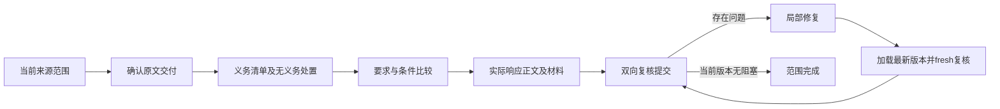

# Check 执行闭环改造方案

状态：代码级设计，可审阅；仅第 0 阶段缺陷修复与原型已实现。第 1—5 阶段尚未接入生产，不将方案写成已完成能力。没有旧版本迁移需求；后续修改当前检查点契约并明确拒绝不匹配版本，不增加兼容分支。

## 本阶段范围

本阶段仅处理“解析 → bidding要求提取 → 章节模板 → Check/repair”。知识库匹配、材料召回、knowledge工作流接入和联动验收属于下一阶段；本方案不新增接入，也不把knowledge单元测试通过解释为业务已接通。代码已依赖的knowledge::models通用HTTP/SSE或消息类型属于现有基础设施，不代表知识库业务接入。完整源码中已有的knowledge历史改动/通用修复保留其独立范围，不盲目回滚，也不计入当前真实端到端通过。

未来knowledge只通过明确的材料检索/证据返回接口与bidding交互；返回内容仍需来源身份、权限、版本和适用性复核，不得直接满足Check任务。本阶段仅记录这一边界，不实现检索、写库、匹配或填充联动。

## 1. 问题边界与代码依据

问题不是少一句提示词：宿主已经有证据、版本和交付约束，但没有统一安排“下一项必须完成的业务工作”。模型可以持续浏览合法目录，却不提交比较；结构合法的履行目标也不等于响应充分。读取完整、业务任务推进和验收完成必须分别证明。

| 现有位置 / 类型 / API | 已有能力，必须复用 | 缺口与本方案处理 |
| --- | --- | --- |
| `analysis/agent.rs::Checkpoint`、`analysis/outline_flow.rs::OutlineRun` | 检查点、TurnJournal、发现工作、草稿、repair事件、运行持久化 | 状态分散，缺少带依赖、版本和租约的 Check 任务账本；在 OutlineRun 增加一个当前契约字段，不另起数据库工作流 |
| `outline/discover.rs::DiscoverWork, ParsePack, PackAtom, RequirementRecord, ConditionSupport` | 整包来源、原生格、跨片关系、包版本、幂等提交、条件支持句柄 | 已提取要求不是全部源义务的清单；新增源范围处置和义务索引，保留原文和关联 |
| `outline/read_receipts.rs::Frame, queue, seal, confirm` | 精确工具字节、完整响应确认、发现版本和 Check epoch 隔离 | 回执是“读过”，不是“检查通过”；作为任务前置证据，不再从聊天历史推测完成 |
| `outline/tools.rs::Draft, CheckReads, check_read_slot_complete` | 源证据、结构回执、正文区间和语义结果分开保存 | 原进度指纹漏计有效读取；第0阶段已修复。仍缺按任务投影的完整状态与来源/目标双向对应 |
| `outline/claim_review.rs::ReviewUnit, DeclaredClaim, Observation, Decision, Comparison, build, validate` | 完整引用观察、要求描述主张覆盖、条件/否定判断、版本验证 | 主要从已提取要求出发；描述覆盖不能证明未提取源义务不存在。增加 source-first 任务，不重写现有比较器 |
| `outline/agent.rs::host_packet, submit_review, finish_check_repair_batch, reopen_discovery_pack` | 持久游标、独立复核、受控重开、fresh Check、幂等repair签名 | 当前宿主工作只是一个投影提示；reopen会清空整个Draft，比较优先于全部目标复核，修复粒度过大 |
| `analysis/agent/discover_coordinator.rs::Host, Provider, Scope, Pending, drive` 与 `discover_parallel.rs` | 单协调者、两个不可变在途请求、共享预留、乱序隔离、Received重放、未知发送保留 | 只接Discover。复用调度协议和日志语义扩展Check，不能把整个共享Checkpoint交给多个工作者写 |
| `outline/source_wire.rs`、`model_wire.rs`、`metadata_fragments.rs`、`discover_projection.rs::compact_request` | 来源/模型句柄、作用域、无损元数据分片、请求字典去重 | 缺可复用的规范来源投影缓存；不可缓存跨请求作用域的wire句柄或把缓存命中当阅读 |
| `analysis/agent.rs::read_projection_in_context, prepare_fitted_request` | 完整请求测量、候选缩页、历史整理、只拒绝快速路径 | 多次候选仍重建摘要/投影；需要按阶段计时、缓存和单调缩页，不用字节硬截断解决 |

## 2. 第0阶段：已实现的可验证原型

`analysis/agent/context.rs` 保留 `one_shot_progress_marker` 为业务完成标记，新增 `delivered_read_progress_marker` 与 `merged_read_ranges`：确认交付的新结构、来源区间和目标正文区间只进入 Progress 的 versions；不进入 completions。来源身份包括input digest、载体/单元格；结构回执保留pack前缀。区间排序合并，重叠、同页和A/B/A不产生新覆盖。pending frame、read_epoch和wire nonce不单独计功。Discover仍按真实包提交推进，Organize和Check共享已交付读取统计。

`outline/agent.rs::host_packet` 从持久Draft选择当前未复核要求，暴露比较阶段、真实target_refs和具体next_unread_slot（slot_id、chapter_id、text_bytes、read_outline参数）。比较后不跳到下一要求；目标正文未完整读取前保留任务。该投影不会签发回执、比较结果或完成状态。这是任务账本设计的最小原型，不是完整队列或并发Check。

已实现通用回归位于 `analysis/agent/context/tests.rs`：

- `delivered_check_pages_advance_reading_without_completing_semantic_work`：超过无进展阈值的有效新页、不同pack同名atom、A/B/A、重载和重复读取；读取不增加业务完成集合。
- `check_read_progress_requires_delivered_new_ranges_not_overlap_or_pending`：pending、区间包含/相邻扩展、正文区间重叠。
- `completed_wire_read_progress_rejects_stale_and_tampered_frames`：真实queue→seal→confirm边界，过期epoch/发现版本、工具字节变更、重放和包身份。
- `organize_new_delivered_evidence_is_reading_not_completion`：同类Organize缺陷覆盖。
- `check_task_retains_target_body_until_read_and_reviewed_after_reload`：清空历史、重载后仍指向具体未读正文；不自动复核。

本地路径（测试启动器清除服务配置及凭据；可使用本地HTTP替身）：

```sh
python3 scripts/run_local_tests.py -- cargo test -p bidding --lib delivered_check_pages
python3 scripts/run_local_tests.py -- cargo test -p bidding --lib check_read_progress
python3 scripts/run_local_tests.py -- cargo test -p bidding --lib completed_wire_read_progress
python3 scripts/run_local_tests.py -- cargo test -p bidding --lib check_task_retains
python3 scripts/run_local_tests.py -- cargo test -p bidding -p docparser -p knowledge --lib
python3 scripts/run_local_tests.py -- cargo clippy -p bidding --all-targets --all-features -- -D warnings
```

## 3. 任务账本：唯一调度依据

新增 `outline/check_work.rs`（拟议API，不冒充现有API）：

```rust
struct CheckScope {
    input_digest: String,
    discovery_revision: u64,
    pack_revisions: BTreeMap<String, u64>,
    requirement_version: Option<String>,
    target_version: Option<String>,
    check_epoch: u64,
}
struct CheckTask {
    id: TaskId, kind: CheckTaskKind, scope: CheckScope,
    dependencies: BTreeSet<TaskId>, status: TaskStatus,
}
enum CheckTaskKind {
    ReadSourceSlice, InventoryObligations, CompareRequirement,
    InspectResponseTarget, ReviewSourceCoverage, ReviewResponseSupport,
    RepairAffectedScope, FreshReview,
}
enum TaskStatus { Pending, Leased, Received, Committed, Blocked, Superseded }
struct CheckWork { tasks: BTreeMap<TaskId, CheckTask>, /* typed receipts and leases */ }
```

具体新增方法：`reconcile(input, discover, draft)`生成/失效任务；`next_ready(excluded)`只返回前置条件满足的工作；`claim(task_id, expected_scope)`签发宿主租约；`commit(task_id, lease, expected_scope, result)`原子验证并幂等提交；`invalidate_affected(changes)`沿依赖失效。任务ID由规范来源范围、任务种类和scope摘要产生，不能取模型自由文本。模型不直接set_status或修改required集合。

`OutlineRun.check_work`为唯一可恢复调度状态；checkpoint/journal仍负责存储。业务结果继续落在DiscoverWork/Draft，任务账本引用其版本和证据，避免维护两个互相矛盾的结果副本。`host_packet`只渲染当前任务和受限邻接依赖，不持久化聊天提示作为权威状态。断点重载由当前输入和实际结果reconcile，不根据上一句“已完成”恢复。

三个量分别计算：

| 量 | 增量来源 | 不能据此推断 |
| --- | --- | --- |
| ReadingProgress | 当前scope精确交付、去重后的来源/目标覆盖 | 主张正确、材料足够、复核完成 |
| BusinessProgress | 新的合法义务处置、比较、响应对应、问题解决与修复提交 | 全源无遗漏或全部完成 |
| Completion | 当前版本任务闭包已解决、全源正向覆盖、响应反向依据、无未决阻塞 | 不能用调用数、目录覆盖或比例阈值替代 |

跨scope结果只作审计和usage结算，不提交到当前任务。同一个来源作为跨章节条件支持可被明确引用，但不能借其他pack的完成回执关闭本pack任务。修复导致旧结果失效，不能通过增加epoch或nonce获得进展。

## 4. Check按有界来源范围增量完成

默认工作单元是现有PackAtom/原生格范围或其无损续片，不是整份目录。每个范围执行“读取→义务清单→对照要求/响应→提交”；完成本范围后才进入下一独立范围。优先级由宿主的未解决依赖确定，不把全目录扫描当必须先完成的前置任务。



PackAtom的previous/next_fragment_id、原生表格续表归属、heading_path和ConditionSupport继续构成依赖边。跨页未闭合的句段不能先标无义务；跨章节例外和项目选项作为关联读取任务，必须带来源和适用判断。部分OCR或缺页保留Blocked及缺失依据，不编造。

先实现**串行任务闭环**并用假模型端到端证明收敛，再接并发。第二步将discover_coordinator抽为通用 `agent_runtime/coordinator.rs`，保留Host/Provider/Scope/Pending语义；Discover使用适配层，新增 `check_parallel.rs::CheckHost`。初始复用现有并发资源数，不新增操作次数硬上限。

工作者只持不可变TaskInput，输出TaskResult及原始响应；一个协调者持有Checkpoint并按CAS校验串行commit。关联同一目标或待修复依赖的任务不并行写。响应乱序、取消、重复Received重放、未知发送的预算保留沿用现有协调器测试。并发不能共享模型聊天历史，也不能把A的原文回执转给B作为完成信用。

## 5. 双向完整性与响应充分性

新增 `outline/obligation_coverage.rs`，复用EvidenceRef、Claim Review和原生格，不另建PDF解析器。

- `SourceDisposition`覆盖每个源范围：contains_obligations / no_response_obligation / unresolved，并带已读证据和理由；不能只为已提取要求建立任务。无要求包也必须被复核。
- `SourceObligation`保存明确的主张、证据范围、适用条件、例外/替代关系和相邻依赖。模型作语义判断，宿主检查身份、范围、引用与必须字段；按标点切句不等于可靠原子义务。
- `ObligationLink`将源义务连到RequirementRecord及实际Fulfillment目标。一个概括性要求可关联多义务，但每个义务都必须有显式响应或有证据的适用处置，不能只连一个“按要求执行”的说明。
- `ResponseSupport`逐段核验source_copy、generated_explanation、editable_blank说明、人工任务及表格绑定：原文逐字复制、生成解释的依据、空位承担的业务内容、证据和章节归属分别验证。表格binding存在不等于表内材料或义务已响应。
- 保留 `validate_final_outline` 的结构校验，另加 `validate_scope_completeness` 与 `validate_response_support`（拟议API）。`finish_outline`必须同时满足三者，不能把更多source_copy当作更充分的响应。

金额、比例、期限、单位、上下限、主体、否定、例外和替代条件作为 `CriticalFacet` 的**原文锚定**字段保留。宿主可发现缺少锚点、数字/运算符不一致或被截断，并形成待核问题；不能凭正则匹配或数字相同宣布语义等价。单位换算、条件优先级和跨页替代关系需要明确证据与比较。通用夹具可用自造的60/30/10付款阶段、不同时间单位、至少/不超过、供应时而非投标时提交等对照；不写入私有文件内容。

`claim_review::validate`当前覆盖的是要求描述及其证据观察，须继续保留，同时由源义务清单检查“描述之外漏掉了什么”。反向检查还要阻止来源没有的交付物、资质、承诺或产品事实被添加到模板。

## 6. 修复后必须加载新版本，不能降低门槛

复用 `finish_check_repair_batch`、`reopen_discovery_pack`、`DiscoverWork::reopen_committed` 和幂等operation_id，但把整Draft清空替换为明确的 `AffectedScope`：改动源包、要求、目标与跨范围条件依赖都列入失效闭包。未受影响的内容可保留；相关旧阅读/比较/复核结果不得继续用于新版本完成。

拟议 `RepairRequest`记录问题、旧版本、允许改动范围、必保留义务和预期后置条件。提交采用CAS；旧工作者晚到结果保存审计而拒绝应用。修复后重新加载并校验Checkpoint中的当前版本，创建FreshReview任务，重新读取改动内容及受影响的关联证据，不以修复者自报“已修正”验收。

禁止为通过检查删除源义务、收缩required集合、改阈值或把所有问题转成人工任务。确需纠正误提取或适用性时，保留原记录、证据支持的修订与可审计处置；不得静默删除来改变完成分母。无法证明处置正确时保持Blocked/needs_review。修复尝试按稳定问题签名去重，不能通过换措辞无限重开。

## 7. 性能与预算：缓存规范数据，最终完整请求仍校验

新增 `outline/projection_cache.rs`（进程内可丢弃缓存，不作为持久阅读证明）：

| 缓存对象 | key / 失效 | 不缓存的内容 |
| --- | --- | --- |
| 冻结来源/原生格规范投影 | input_digest、parser/source schema、规范range | 账户凭据、请求wire句柄、阅读回执 |
| 包与条件支持投影 | input_digest、pack_revision、关联依赖版本 | 未确认的适用结论 |
| 草稿/目标摘要 | requirement revision、target content hash、摘要schema | stale summary、自动通过状态 |
| 候选页序列化与测量中间结果 | 规范页hash、tokenizer profile hash、tool schema hash | 最终请求准入结果跨历史复用 |

把 `read_projection_in_context` 的不变全量投影移出候选fit循环，页边界以缓存行字节/估计量快速缩小。既有单调缩页、UTF-8边界、无损元数据分片和只拒绝快速路径保留；来源剩余范围由游标完整保留。上下文最终决定仍在 `prepare_fitted_request` 对当前系统指令、工具schema、历史、host包、视觉载荷与输出预留整体测量，必须不超过131072。不能恢复固定字节分包、操作次数硬限额或请求max_tokens；token预留只服务准入和未知发送记账。

性能报告必须同时记录fixture/source hash、输入历史hash/字节/消息数、候选/最终页行数、原文/元数据字节、图片数量、冷/热缓存、fit次数、完整请求构建次数及分阶段耗时（投影、摘要、wire映射、序列化、token计数、最终准入、保存）。provider等待和本地CPU分别计时；不比较不同历史、页长下的单个秒数并宣称加速。

固定fixture冷/热至少各3次，报告中位数及范围；比较页内容、游标和全部续页重构hash，任一不一致即失败。目标：不变来源投影每key只构建一次；同候选不重复完整构建；相同工作负载本地准备中位数至少降低50%，且最坏值不回退。先建立基线再接受指标，不能把未经测量的目标当结果。

## 8. 分阶段改动清单与删除项

| 顺序 | 准确落点与新增API | 必须替换/删除的旧路径 | 本阶段退出条件 |
| --- | --- | --- | --- |
| 0 已完成 | context.rs读取标记；agent.rs当前要求/目标投影；5个通用回归 | 去掉“业务写入指纹就是全部进展”的单一用法；业务标记本身保留 | 红绿、三模块、严格lint；无真实复验声明 |
| 1 串行账本 | 新check_work.rs；OutlineRun.check_work；host_packet渲染next_ready；tools提交事务后reconcile | 用类型化任务替换check_work中临时first-unreviewed扫描和提示词驱动跳转；不再把transcript当待办状态 | 清空全部聊天历史、每一步重载，仍按依赖完成合成闭环；旧scope提交拒绝 |
| 2 双向源范围复核 | 新obligation_coverage.rs；扩展claim_review.rs和submit_review；新增source disposition工具schema | 删除“只有RequirementRecord才有审查任务”的调度假设；保留全源证据校验 | 未提取/误提取/数值/条件/替代/空包/目标不足反例全部被阻塞；正例完成 |
| 3 局部repair | agent.rs修复入口；AffectedScope失效闭包；DiscoverWork受控重开 | 替换reopen_discovery_pack中无条件Draft::default整草稿清空；不保留旧路径双轨兼容 | 修复无关范围不丢；相关旧证据不能复用通过；重载fresh复核完成才解阻塞 |
| 4 并发 | 通用agent_runtime/coordinator.rs；Discover适配；新check_parallel.rs；TurnJournal继续使用 | 抽取Discover专属调度外壳，禁止并行共享Checkpoint写入；不重造日志和预算 | 乱序/重复/取消/过期/CAS冲突/跨pack条件测试通过，单串行提交者 |
| 5 性能 | projection_cache.rs；read_projection_in_context、prepare_fitted_request、host_packet纯投影 | 删除候选循环内重复规范投影/同版本摘要构建；保留最终完整准入 | 同fixture语义与全部来源字节一致，达到测量目标；缓存失效矩阵通过 |

每个阶段都必须可独立审阅，先串行闭环再并发。阶段1与2的类型和任务处置协议应一并评审，不能先做并发来放大未收敛流程。最终不保留“旧Check聊天驱动+新任务账本”两套可选实现；切换当前契约后删除被替代逻辑和测试，保留仍适用的证据安全测试。

## 9. 验收矩阵与实施边界

已完成：第0阶段及上列5个回归。以下为未来阶段验收，不能标作已通过：

| 场景 | 可自动验证的结果 |
| --- | --- |
| 目录、正文、比较、提交分开 | 只读完目录或正文都不能finish；必须存在当前版本的比较和复核 |
| 全源遗漏 | 源范围含义务但无RequirementRecord，产生未覆盖任务，不把空集合当通过 |
| 正向/反向 | 缺比例、期限、主体或跨页替代条件阻塞；模板无依据追加承诺也阻塞 |
| target正文不足 | 只有“应提供材料”说明而无材料位置/响应，结构可合法但充分性不能通过 |
| 重载/历史裁剪 | 每个状态转换后serialize→reload→clear transcript，调度结果和作用域不变 |
| 跨pack与跨页 | 相同atom名不同pack不混账；关联条件可读但完成回执不可冒用；未闭合跨片保持pending |
| repair | 旧结果晚到拒绝；不能删要求降低分母；仅新版本fresh复核可完成 |
| 并发与取消 | 同scope重复提交幂等；冲突CAS拒绝；未知发送不释放预留；Received恢复不重发 |
| 预算与缓存 | 长Unicode/图片/工具schema纳入最终窗口；缓存命中不产生回执；来源重构逐字节相等 |
| 模型停滞 | 合法新范围算读取进展，重复请求不算；任务失败保留可诊断阻塞，不用不断加prompt掩盖 |

本地原型只能证明执行、证据和状态契约；不能证明模型召回、复杂条件解释、OCR或视觉理解充分。先用多种合成正反例和故障注入证明串行闭环，再做并发与性能。真实服务验证需要新的明确授权窗口；当前不调用、不推送。最终真实验收必须独立对照原文件与页图、统计未覆盖范围及遗漏/误提取，不能把模拟成功或599个本地测试解释为语义通过。

## 10. 目录职责调整：先明确边界，再小步移动

当前目录不需要推倒重建，但两个入口文件承担了过多工作：`analysis/agent.rs`同时持有Checkpoint、执行批次、分页fit、历史预算和完整请求组装；`outline/agent.rs`同时选择职责、注册工具、构建host投影、提交复核和驱动repair。`outline/tools.rs`混合树/槽写入、校验与分页读取。`analysis/agent/context.rs`同时处理上下文、持久工作状态和进展统计。仅继续往这些文件加prompt会扩大耦合。

以下是**目标目录，尚未完成搬迁**。第0阶段只在原文件修复，阶段性提交不混入大规模重命名。

| 职责边界 | 当前真实位置 | 处理与目标位置 |
| --- | --- | --- |
| 解析及冻结来源 | `services/docreader/parser/*`、`crates/docparser/src/*`、`bidding/outline/{parse,frozen,evidence}.rs` | 保留。docreader负责格式/OCR/布局；docparser负责结构契约；bidding将解析结果冻结为任务证据。解析层不生成Check任务、义务判定或模型预算 |
| 持久任务与进展 | `analysis/agent.rs::Checkpoint`、`analysis/outline_flow.rs::OutlineRun`、`analysis/agent/context.rs`、`agent_runtime/progress.rs` | 保留Checkpoint/OutlineRun为容器。新增`outline/check_work.rs`承载领域任务，读取覆盖规范化从context拆到`outline/read_progress.rs`；通用Progress仍在agent_runtime，不依赖Draft |
| 要求与章节组织 | `outline/discover.rs`、`chapters.rs`、`tools.rs`、`template.rs` | 保留领域类型与原子写入。先将只读分页从tools.rs拆到`outline/read_projection.rs`；树/绑定/槽写入与最终结构校验留在tools.rs，避免仅为文件变短增加层级 |
| 复核与repair | `outline/agent.rs`、`claim_review.rs`、`read_receipts.rs` | 保留claim_review和exact-wire回执。将submit_review与复核完整性拆到`outline/review.rs`，受控重开和失效闭包拆到`outline/repair.rs`；新增obligation_coverage.rs。agent.rs只负责职责选择、工具注册和分发 |
| 宿主工作投影 | `outline/agent.rs::host_packet` | 拆到`outline/host.rs`，仅从CheckWork/DiscoverWork/Draft生成视图，不能在渲染时修改状态、授予回执或调用模型 |
| 模型适配、预算和调度 | `agent_runtime/{chat,budget,driver,session,progress}.rs`、`analysis/agent.rs`、`analysis/agent/discover_coordinator.rs` | 保留通用协议与预算在现有agent_runtime；候选构建/缩页拆到`analysis/agent/request_fit.rs`；通用协调协议移至`agent_runtime/coordinator.rs`。Discover/Check领域适配器留在analysis/agent，不让通用运行时理解章节或义务 |
| 网络与模型消息基础类型 | `crates/knowledge/src/models/{http,sse,mod}.rs` 与bidding chat/request适配 | 暂保留现有依赖，区分HTTP/SSE与bidding工具契约。不得把bidding的Checkpoint、Task、repair搬进knowledge。只有出现第二个真实运行时消费者且依赖图清晰时再评估共享crate，本轮不新增crate |
| 缓存 | 当前规范投影分布在discover_projection、host_packet和请求fit | 新projection_cache.rs缓存规范不可变数据；wire编码、任务提交和回执仍走原验证边界。缓存可丢弃，不放进业务数据库 |
| 验收与故障注入 | `outline/acceptance.rs`、`analysis/agent/context/tests.rs`、`discover_parallel_tests.rs`、`docparser/tests`、`scripts/run_local_tests.py` | 保留现有回归入口；随模块拆分将相应**通用**测试同commit迁移到review/check_work/request_fit/coordinator的tests，不把私有PDF或真实调用产物放进仓库 |

依赖方向：解析契约 → FrozenInput/EvidenceRef → Discover/Organize/Check领域状态 → 领域工具和工作投影 → 运行时端口。运行时通过Host/Provider调用领域适配器；类型依赖上`agent_runtime/coordinator.rs`不得import `outline::Draft`或`analysis::Checkpoint`。模型HTTP层不得import领域模块。host视图可以读任务，不能成为任务的另一套存储。

bidding保留“招投标任务需要什么证据、何时允许提交/完成”的业务责任；模型传输、重试、并发排队、token测量不应散落在业务函数内。当前问题首先通过**现有crate内模块分工**解决，不能为了目录整齐增加跨crate序列化或多个任务服务。

移动顺序与依赖：

1. 先冻结第0阶段已测试修复和本方案，独立commit；无重命名，便于审阅和回退。
2. 增加串行CheckWork及领域测试；把host_packet改为纯投影后抽出host.rs。先建立状态所有权，再移动代码。
3. 在复用现有证据/比较器的前提下加入双向覆盖；将review.rs、repair.rs从agent.rs提取。同一commit迁移测试，行为变更与纯移动尽量分开。
4. 串行端到端收敛后，将协调器的通用状态机移动至agent_runtime/coordinator.rs；保留Discover适配层并增加Check适配层。删除旧discover_coordinator.rs的重复状态机，不留双实现。
5. 以测量支持request_fit.rs和projection_cache.rs拆分；将read_projection.rs从tools.rs分离。先做等价提取测试，再做缓存优化，不在搬目录时改变页内容。

删除范围：替换后的临时first-unreviewed调度扫描、依赖transcript的任务恢复、整Draft清空式repair、候选循环重复规范投影，以及通用协调器替换后的Discover专用调度实现。不会删除仍承担身份/证据/字节校验的read_receipts、model_wire、source_wire，也不根据文件大就删除测试。清理旧接口时同时移除调用方与旧测试，不保留“兼容旧发布版”的桥接代码。

## 11. Owner、接口与唯一完成门槛

Owner指唯一代码职责，不是新增服务或团队。以下未来拆分仍为planned；现有实现对应第1节代码表。

| Owner | Input → Output | 不变量与依赖 | 禁止职责 |
| --- | --- | --- | --- |
| 解析来源 owner（docreader/docparser） | 原文件与解析版本 → 原文、原生结构、跨页关联、稳定来源身份及失败状态 | 依赖格式/OCR工具；原文和坐标可回溯，失败显式 | 不判业务义务、适用性、响应充分性或复核通过 |
| bidding提取 owner（DiscoverWork） | 冻结来源/作用域 → 要求、证据、条件关联及无义务处置 | 依赖解析契约；全源义务不能因分包消失 | 不编章节、填投标人事实或完成Check |
| bidding组织 owner（Draft/chapters/tools） | 要求与规定格式 → 章节、表格绑定、三类槽位、履行目标 | 依赖提取版本；原文复制和归属校验，原子写入 | 不把绑定存在当充分响应，不自批复核 |
| bidding复核 owner（claim_review/review/obligation_coverage） | 新鲜来源、当前要求与实际目标 → 比较、双向覆盖判断、问题和复核结果 | 依赖完整读取与当前scope；不确定保持问题 | 不直接修改原文/章节，不替修复者判通过 |
| bidding修复 owner（repair） | 已授权问题、CAS版本与改动范围 → 带依据的新版本及受影响范围 | 保留义务和审计，失效相关旧结果 | 不删义务减分母，不自判通过；必须回到fresh复核 |
| bidding执行 owner（CheckWork + 领域运行适配） | 当前输入、任务依赖、业务提交与回执 → 持久任务、租约、覆盖进展、失效/取消/恢复及完成门槛 | 依赖领域验证器和通用运行时端口；唯一提交者 | 不编业务结论，不用聊天文本或调用数认定完成 |
| 公共LLM职责 owner（先在现有agent_runtime及既有models边界内） | 不含业务状态的请求/工具schema/预算profile → 完整响应、传输状态、usage、上下文准入与纯投影缓存 | 依赖网络/SDK/tokenizer；完整请求131072校验，未知发送保留占额 | 不理解招标章节/义务、批准repair或Check，不把缓存命中当证据 |
| knowledge owner（下一阶段） | 接口、权限和来源返回契约待评审 | 本阶段仅列边界；现有共享模型类型不等于知识库接入 | 本阶段不接入、不匹配、不写库，不计入端到端通过 |

唯一完成条件由bidding执行层调用当前版本的领域验证器合取判定：所有必需源范围有合法处置；所有义务具备要求/响应对应；所有生成内容有依据；实际目标正文已完整读取；比较和独立复核在当前scope提交；repair后fresh复核完成；无未决阻塞。只由这一门槛设置finished/done。模型只能提交证据和判断请求，不能直接改完成标志；目录100%、工具ok、无新增错误或预算用完都不是完成条件。阶段1接入账本时应由统一gate替换分散的完成路径，保留validate_final_outline等为gate内的验证器而非平行权威。

复核授权来源是宿主的Duty/tool registry、用户授权运行范围及当前CheckTask租约/CheckScope；必须携带正确input、版本、epoch和已交付回执。修复者收到的是限定写入授权，不因此获得复核完成授权。修复后重新调度fresh reviewer任务，不能复用修复阶段自述或旧epoch判断。

**实测预算与产品限制分开：** 私有验收的累计token、截止、运行授权和调用账本属于该次测试控制，不硬编码进产品调度。产品保留配置的上下文窗口、并发资源、取消、有限传输重试、未知发送记账和真实无进展保护；不恢复固定业务操作次数或provider max_tokens。无进展保护反映重复工作，不能作为降低语义完成门槛的理由。后续真实测试必须取得新的明确授权，不以产品支持运行就自动续测。

## 12. 文档单一事实源

- 本文件是当前改造设计、职责边界、状态（implemented/planned）与实施顺序的唯一主线；变更决策先更新此处，不再维护另一份相互竞争的总体方案。
- `docs/bidding/frozen-input.md`、`docs/design/evidence-runtime-contract.md`和`docs/bidding/outline.md`只维护已实现接口/数据与工具契约，并指向本设计的计划部分；schemas及Rust类型是机器校验契约，不复制另一份任务完成定义。
- 第8、10节是实施文件清单的唯一来源；其他路线图只链接，不重复列表。
- 本地测试与真实验收记录独立保存，写明版本、测试方式和未测项；验收记录不能修改设计规则。私有真实材料/输出只在私有证据包，不进入仓库。
- 旧总体方案改为导航入口；删除其中与当前scope冲突的knowledge支撑线、过时阶段规则和重复验收状态，不加迁移兼容说明掩盖双轨设计。

## 13. 项目文件集与关联感知执行包（planned）

验收对象必须是**逻辑项目文件集**，不是仅一个主文件。三种概念不可混称：

| 概念 / owner | 内容及用途 | 不能替代 |
| --- | --- | --- |
| 逻辑项目文件集 / bidding执行层 | 主文件和附件成员、文件角色、各文件版本、集合版本、关联和待确认状态；决定全项目验收范围 | 不是拼接后的大文本，也不是一次LLM请求 |
| 原生解析单元 / 解析层 | PDF页/块/表、Excel sheet/cell/merge、Word段落/表格、图片原图/区域，稳定来源与跨页结构 | 不判断主附件业务优先级，不直接等同一个义务 |
| LLM执行包 / bidding规划器 | 从原生单元按业务关联、依赖与完整请求token预算选取的可执行阅读范围 | 不改写来源身份或集合版本，不是一个文件必须一个包 |

流程是各格式原生解析 → 构建显式/推断跨文件引用图 → 关联感知分包。保留小章节合包、大章节拆包；引用附件的相关范围优先co-locate，放不下时建立显式依赖读取任务，不盲拼所有文件再按长度切。宿主负责全文件集覆盖及版本一致性。文件名只是候选关联线索，不能默认“主文件优先”或“附件优先”。

已有能力核对：`outline/frozen.rs::FrozenBuildInput`已包含document_set_id、documents和document_relations；FrozenInput保留document_id及整个冻结输入digest，不能当作已完成业务文件集关系管理。`document_relations: Vec<Value>`仍缺角色、关系置信度/确认状态、集合版本及依赖失效的类型化业务契约。

| 格式 | 当前代码依据与已有能力 | 尚未证明 / 不支持的边界 |
| --- | --- | --- |
| PDF | builtin registry的PDFParser；页、表格及来源契约路径已存在 | 当前真实验收对象仅PDF且Check未通过；不能据此宣称多文件或全视觉验收通过 |
| Excel | registry注册xlsx/xlsm/xls；excel_parser.py含SpreadsheetLocator、sheet/cell/merge和原生结构路径 | 跨sheet业务引用、与主文件联动、所有公式/格式语义和旧xls转换等价性未完成本方案验收 |
| Word | docx由Docx2Parser调用DocxParser并有Markitdown fallback；有段落/表格结构路径；doc走DocParser转换/提取路径 | fallback/旧doc是否保留等价稳定定位须逐路径验证；跨文件格式模板归属未完成业务验收 |
| 图片附件 | registry注册常见图片扩展；ImageParser保留原始图像数据、像素身份和ImageLocator；冻结阶段有独立OCR/视觉完整性记录 | 注册不代表OCR成功或语义可靠；区域引用和多附件视觉交叉核验仍需合成与后续授权实测 |
| 其他 | 部分格式只在其他解析引擎注册 | 不将扩展名列表宣称原生定位支持；不完整/不支持的来源必须显式阻塞而非丢弃 |

新增 `outline/source_set.rs`（拟议）：`SourceSetRevision`固定成员及角色；`SourceMember`包含document_id、document_revision、parser_version、role及可用性；`SourceRelation`区分explicit_reference与inferred_candidate，保留两端定位、置信/待确认状态及确认依据。推断候选必须由bidding的关联任务确认，解析器只提供结构与文字。将其纳入CheckScope、任务ID、缓存key和CAS提交。全局input_digest继续校验冻结内容，但不能替代清晰的source-set revision业务字段。

跨文件关系可将主文件条文、报价表、格式Word和图片证明连到同一SourceObligation/Requirement及模板目标。重复内容可以归并业务义务，但必须保留全部多源证据及适用条件；冲突保留待核问题，不擅自选择主或附件。主文件明确引用的附件缺失时生成MissingRequiredSource阻塞任务，不能因“当前文件已读完”finish。补充公告覆盖旧要求仍排除在本阶段，不通过文件时间/名字推断覆盖关系。

新增、替换、删除附件在设计上产生新的SourceSetRevision，沿关系和任务依赖闭包局部失效；重新冻结受影响来源，再重读、比较和fresh复核。旧工作者结果只能审计，不得提交到新集合。删除是设计场景，不授权现在删除任何用户原文件。未受影响结果可保留其来源版本证明，但进入新集合完成门槛前须经reconcile验证；不得混合新旧附件内容。

实施依赖：在第1阶段CheckScope/任务账本设计时纳入source_set.rs类型与缺失附件任务；第2阶段义务索引接跨文件关系；第3阶段repair使用集合差异失效；第4阶段并发CAS包含集合版本；第5阶段缓存按集合/文件/关联依赖失效。此次提交只记录设计，不声称这些新类型已经实现。

合成验收对象：一个自行生成的主PDF、报价Excel、格式Word和图片附件，不使用私有真实资料。验收矩阵：

| 场景 | 期望 |
| --- | --- |
| 主文件指向报价sheet及Word格式 | 同一义务保留多文件来源，并指向正确响应表/槽；不能仅凭标题猜测 |
| 跨文件同名表、不同sheet同名范围 | document/sheet/单元格身份隔离，不能错绑或互相授予读取信用 |
| 主文引用附件不存在 | 明确MissingRequiredSource，项目文件集未完成，不编造附件内容 |
| 跨sheet引用、Word跨页表、PDF续页与图片区域 | 关联连续可追溯，必要片段co-locate或依赖读取，残缺关系阻塞 |
| 附件重复/冲突 | 重复义务去重但多源保留；冲突不自动优先主文或较新文件名 |
| 替换或移除附件 | 新集合版本、受影响任务失效、无关范围保留证明，fresh复核后才能完成 |
| 两工作者读取不同集合版本 | 旧scope结果CAS拒绝，usage保留审计；不得混合提交 |
| 解析fallback或图像未完整OCR | 显式不完整状态，格式已注册不等于源范围完整 |

knowledge仍是下一阶段的待决接口，不因为多文件关联设计而提前接入。当前PDF真实结果不能充当这套多格式矩阵的实测证据。
