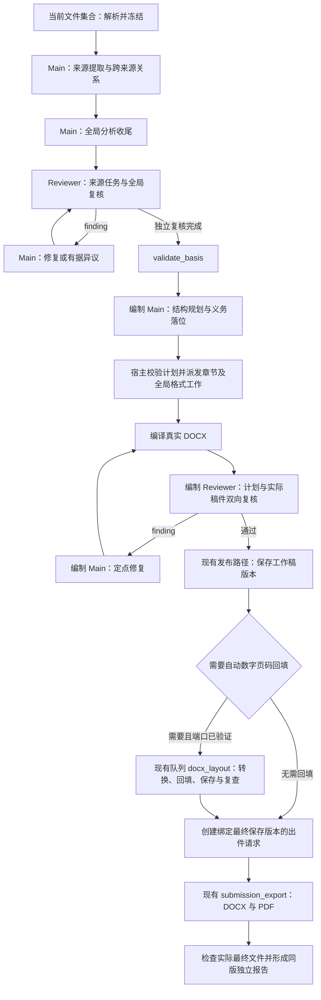

# 招标解析与投标模板生成：统一 Agent 实施方案

日期：2026-09-16。状态：方案已统一；已有能力、新增设计和真实验收分别登记于 §19，完整链路尚未验收。

本文是**终稿**（独立复核 + 正式编制 + 同版出件）的 Agent 实施方案。日常自动出稿以 [outline-then-template.md](outline-then-template.md) 为准（大纲→按章模板，20 分钟内发布草稿）。终稿另一次请求，库存为草稿的 `draft_plan`+Template，禁止重开 source_unit 抽取。两条路径不得混用同一套发布门。草稿 DOCX 不能销 32 项或同版三件套验收。装包 Rechecker（§4.5）只服务终稿，不能当小文件产品方案。业务边界以 [PRD](../../docs/bidding/prd.md)、[领域契约](../../docs/bidding/authoring.md) 和 [ONLYOFFICE 契约](../../docs/bidding/onlyoffice.md) 为准。实现状态以 §19 的证据为准；下文目标字段、工具和判定函数不得仅因写入方案就登记为已有能力。

**执行顺序：已证实语义反例 → 分阶段最小真实验证 → 正确模板与已保存同版三件套 → 自动页码回填及产品终检专项 → 复杂场景 → 106 页与32项验收。** 每个必要切片先验证再扩大；不用先完成全部架构改造才开始最小样本。最终交付目标不降低，自动化能力与实际文件验收分别记账。

模型、协议和预算从 `deploy/.env` 读取并冻结，禁止临时覆盖。当前运行使用 grok-4.6 / Chat / low，仅是配置快照，不是代码常量；Embedding 保持现有知识检索职责，不替代全文覆盖。用户已授权的解析内容、必要图片及模型候选外发范围持续有效，人工验收答案与诊断报告不得发送模型。原文件只读，新旧合同、费用和失败证据分开保留；本次文档统一不热切换正在运行的合同。

## 0. 目标、范围与成功标准

### 0.1 本期交付

从冻结的当前招标文件集合出发，形成经过独立复核的要求与格式依据，生成完整可编辑投标模板：

- 招标规定的目录、层级、顺序、章节、指定格式和附表。
- 招标侧固定文字、项目公共数据、表格行列、说明、签署与盖章位置。
- 有依据的响应、人员、报价、证明材料填写位置；投标方尚未提供的事实和金额留白。
- 招标未规定结构时，根据已提取义务提出本项目结构，不套通用目录。
- 同一最终保存版本的 DOCX、由该对象转换的 PDF，以及检查这两个实际文件的独立报告。

模板完整不等于投标响应齐备。未提供的投标方材料属于待填内容，不得伪造；招标来源真实不确定性进入报告，不得伪装成已经确定的要求。存在未落实的必需章节、执行阻塞或未检查项目时，不得宣称“完整模板验收通过”。

### 0.2 三类门分开

| 类别 | 规则 | 失败后行为 |
| --- | --- | --- |
| 自动生成验收门 | 分析独立复核、组成与义务覆盖、稿件独立复核、实际成品检查均完成 | 保留失败证据，不宣称本次自动生成成功，不推进全文验收 |
| 技术一致性门 | 输入、权限、版本、保存、摘要、转换、文件结构、引用真实性正确 | 拒绝伪成功或伪最新；保留可重试状态 |
| 业务风险提示 | 缺投标方材料、待确认条件、未填写报价等 | 进入报告；不因此禁止用户编辑或导出已有有效保存稿 |

`validate_basis` 继续作为本自动编制链的输入契约，不扩展为整个产品禁止人工编制/导出的闸门。来源不确定性经正确记录并独立核实后可以随分析传递，不能为通过门禁而删除。已有有效草稿的用户导出与本次自动生成验收分别记账。

### 0.3 保留与不做

保留 Rig、Chat、Journal v3 的 prepared/received/committed 协议、现有 Job/lease/对象发布路径、角色独立回执、`source_review::tasks()`、修复任务账本、DOCX 保存与 `submission_export` 身份。

不换模型，不新建 Agent 服务/队列/表，不新增 Planner Agent，不让模型管理 Job、预算或角色生命周期，不从旧内容块重建用户正式稿，不给样稿另接导出链。不恢复 turn1604，不以增加总预算替代修复。允许为不可重建状态扩展现有领域 checkpoint；按必要切片同步升级其合同及 SQL 校验，不先增加用不到的状态。

实现边界：确有缺口时扩展现有 Rule、AnalysisResult、Draft、请求账本与对象机制；不引入通用规则引擎、任意查询依赖语言、另一个调度服务或新的审核 Agent。冻结前回填确需可恢复执行时，在 §12.3 能力预检通过后实施现有队列内的 `docx_layout`，其有限状态见 §12.6；普通已保存同版导出不以该能力为前置。正式导出仍是原 `submission_export`，不改成可变来源请求。复用表/队列不代表改动很小，新增身份、状态和 SQL 合同按 §15 分项评审。

### 0.4 必须保留的合理设计与演进约束

合并不以缩短文档或尽早出文件为由删除必要设计。下面各项是持续保留的目标；实施顺序可以按证据调整，完成标准不得默默降低。

| 保留设计 | 解决的问题 | 对应实现/验收 |
| --- | --- | --- |
| 统一DocReader、冻结来源身份与完整表格几何，工具按位置/ID取证 | 重复解析漂移、附表错配、只读摘要遗漏固定内容 | §2/§7/§9，完整来源与实际附表对照 |
| 由招标文件决定目录、层级、顺序和条件模板，投标方未知事实留白 | 硬编码通用目录、虚构报价或材料、误删招标侧固定文字 | §0.1/§9/§10，实际模板逐项验收 |
| 宿主派发、模型解释语义；局部执行与全局成功分离 | 机械导航、单项阻塞拖死无关任务、误交接 | §1/§4，RT01/RT06/RT09/RT10 |
| 有界完整证据、角色隔离、实际交付后确认、三边界恢复 | 窗口过载、未读假通过、重复提交和费用丢失 | §3/§5–§7，RT02–RT05/RT11–RT16 |
| `.env` 配置冻结、Chat 单协议、JCS 同字节预约与发送 | 临时覆盖配置、协议与 SQL 合同不一致、重试费用无法追溯 | §0/§5/§15，冻结请求与实际发送合同核对 |
| Rule原子项、全局结论随产物交付、完整集合依赖 | 一条复合规则只落实一部分、对象新增后沿用旧通过 | §2/§9，B11/B13/B14 |
| 同一义务库存，规划与实际实现分开，章节身份一致 | 有目录无内容、游离章节、计划和实际稿件脱节 | §10，B01/B02/B07/B12 |
| 独立双向复核、有据异议、真实来源不确定性保留 | 漏提取、错误自批、为过门强造关系、删掉真实缺项 | §9/§11，B03–B09/B15–B19 |
| 最终保存版本、实际DOCX/PDF整本检查、恢复同一证据对象 | 编辑后继承旧批准、检查分母缩小、文件与报告错版 | §12/§13，O01–O17 |
| 自动回填与产品终检明确实现归属，质量/成本分别验收 | 转换成功冒充正确页码、本地报告冒充自动产品能力 | §12–§16，S4-B/S4-C/S5-B/S6 |

每次后续修订说明：保留什么、哪个真实反例要求改变什么、影响哪些合同、用什么验证。没有证据时保持已验证语义；复用现有模块，避免反复推倒重做。新增设计若必须调整，也须保持最终目标及相应验收覆盖；阶段性未完成只标未完成，不从最终目标中删除。S5-A是较早的完整文件质量证据，不替代S5-B产品自动能力及S6真实全文验收。

修订时直接更新本文的对应设计、§16验收项和§19状态，不另建并行方案。每个修订按以下步骤收敛：

1. **确认保留项**：已有实现符合目标且证据仍有效的，保留并复用；分别标明已验证机制和仍待验证的语义效果，不因一次模型失败否定全部设计。
2. **定位必要改动**：记录真实反例、根因证据和受影响合同；证据不足时标为待验证假设。优先补齐现有工具、领域规则或交接缺口，再判断是否需要替换机制。
3. **证明替换不退化**：替换实现方式时保留原验收断言及证据出处，补充等价性或更强保证；不能删除失败用例、缩小来源/输出检查全集或降低通过条件。设计合理不意味着实现不可调整，保留的是目标与保证。
4. **逐级验收后登记**：各切片先通过受影响的合同回归，再用独立真实运行验证语义；§19分别登记实现、验证和未完成项。最终仍须完成全部适用能力、106页/32项以及同版三件套验收。

## 1. 职责与调用关系

### 1.1 唯一职责归属

| 组件 | 负责 | 不负责 |
| --- | --- | --- |
| 文件处理与冻结 | 文件集合、解析复用、来源版本、文本/网格/原图与解析失败清单 | 判断投标义务、生成投标方事实 |
| 分析 Main | 解释原文，提取候选/关系/适用性，提出有依据的来源不确定性，修复或异议 | 选下一任务、签发阅读回执、批准自己的修复 |
| 分析 Reviewer | 独立来源遗漏、候选准确性、关系边界、全局一致性复核 | 修改 Main 候选、把读完当审查通过 |
| 分析适配器 | 工作派发、合法证据装包、回执验证、任务消耗、全局交接 | 用关键词决定语义关系或适用分支 |
| 编制 Main | 结构规划、义务落位、章节内容、模板选择、格式配置及修复 | 自行选工作、批准稿件、修改已发布对象 |
| 编制 Reviewer | 对计划、实际生成稿与来源进行双向检查，出 finding | 直接改稿或继承分析 Reviewer 的阅读资格 |
| 编制适配器/编译器 | 规划覆盖校验、派项、结构与格式约束、确定性编译、复核失效传播 | 默认替模型决定无规定目录、条件模板取舍 |
| `agent_runtime::drive` | 预约、调用、响应保存、SDK 工具协议与提交顺序 | 选择业务任务、判定语义完整性 |
| `Progress` | 新进展观察、停滞与额度计算 | 管理覆盖队列、决定角色交接 |
| DOCX 保存与出件 | 保存版本、定点页码更新、转换、最终检查、版本绑定发布 | 将旧 manifest 自动当作编辑后结论 |

### 1.2 主链与回路



图表示目标业务依赖，不表示所有阶段都已实现。早期最小文件验收通过已有出件入口取得真实文件，再做明确署名的独立审查；产品自动终检按 §13 另行实现并验收，不把本地报告冒充自动终检。

文件集合变化时重新冻结项目级依据并重新编制；未变文件可以复用文件级解析。仅投标稿变化时重新保存、排版和终检，不重跑招标解析，不自动把旧稿局部合并进新一轮。

### 1.3 共用协议，不强制共用业务状态机

分析和编制各自在适配器内实现 `advance_after_batch`。统一返回概念：继续当前项、安装下一项、切换角色/阶段、成功完成、无可执行项而受阻。无需为了这几个返回结果引入通用任务框架。

两个适配器共用提交时序、计费规则、回执约束和测试习惯；选项、局部完成、依赖版本、复核政策分别属于领域。取消“必须抽出同一 `install_next(kind)` 实现”的要求。不得在 `Progress`、`status()` 或错误码分支中夹带调度写入。

## 2. 冻结输入与分析完备性

### 2.1 输入契约

复用现有文件处理，不在本次重写解析器。冻结清单必须包含当前全部纳入文件、修订和摘要，解析结果或明确的 pending/failed/unresolved 状态，以及文件关系、澄清补遗、用户选择和公共数据的来源。

覆盖清单至少包括：每个 SourceUnit 的全部文本区间、每个网格区间、空来源、相关集合元数据，以及需要原图判断的版式问题。PDF 原页与 DOCX 派生渲染身份必须区分；源 DOCX 转出的 PDF 不能继承“上传 PDF 原件”的身份。

不能因为某文件解析失败就把它从全集分母移除；也不能把成功解析文件的每个片段都处置过，解释为全部输入文件已正确理解。

### 2.2 四类分析结果及全局约束

分析仍输出公共数据、编制规则、要求/证明/响应义务、模板与表格规范，另保留来源不确定性。每个 SourceUnit 恰好有合法 disposition；阅读、处置、语义正确分别验证。

补充明确的全局收尾对象，覆盖：

1. 文件集合与补遗适用关系、冲突及无法确定的优先关系。
2. 公共数据的一致来源和跨章节使用。
3. 投标组成、顺序、固定目录、格式及签章约束。
4. 跨来源待闭合引用、条件分支、响应/证明与指定模板关系。
5. 未规定结构和真实来源不确定性的区别。

宿主枚举检查对象及已保存依赖；模型给出语义结论和依据。不得只用 `review_gaps` 空证明不存在语义漏项。

### 2.3 将复合 Rule 拆为可检查项

现有 `Rule.text/scope/applicability` 保留，增加有界 `items` 数组，由分析 Main 使用现有 `put_record` 提交。每项包含宿主分配且修订时稳定的 `id`、`kind`、原文要求、grounds、适用条件及目标引用；kind 限于组成、顺序、格式、签署、提交提示。格式参数和顺序约束仅用该 kind 的固定字段表达，不执行自然语言条件或自定义脚本。

只拆解与投标稿组织或提交有关的约束；其他规则保留原记录，Reviewer 确认没有应生成的内容后允许 items 为空，不能把所有履约规则强制变成新增章节。不得用空数组掩盖原文明确要求的组成或签署。

目标引用使用已有记录/响应/证明/模板或同一规则的 item ID；尚未确定的目标显式 unresolved，不能伪造未来章节 ID。宿主从模板和已有 response/proof 直接枚举的义务继续复用原引用，不另复制一份。`rule_item:<record_id>:<item_id>` 仅是现有图内引用；`put_record` 返回宿主 ID，重放从同一基线得到相同 ID，删除或改动 item 使相关依赖失效。

新项提交空 ID，工具返回分配结果；修订只接受该规则当前已保存的显式 ID，不按文字相似度猜身份。宿主在现有 Analysis/checkpoint 的 `rule_item_sequences` 保留每条规则已分配序号，删除到空后仍不复用旧 ID，失败写入不消费序号。该账本参与完整产物摘要，但不进入全局语义 scope，避免账本变化制造无关语义失效。顺序和项间引用使用工具已经返回的 ID，不预测尚未分配的身份；无需新增表。

例如“投标函、授权书、报价表依次排列，三处分别签章”，应形成三个组成项、一个顺序项和三个签章项；不能用“这个 Rule 已关联一章”算七项均已落实。未指定模板的组成项以来源中的章节名称和自身 item ID 定位，编制计划再映射到生成节点。

Reviewer 从完整原文逐项核对拆解是否漏项、过拆或重复；可用现有 finding 的 record/JSON Pointer 指向 Rule.items，遗漏项也可只引用来源。宿主只验证字段、引用、区间和覆盖，不声称自动证明自然语言已经完全拆解。模板与 Rule 指向同一实际位置可以共同满足，但各义务分别保留检查结果。

### 2.4 分析验收必须随产物交付

新合同使用 `AnalysisResult.schema_version=2`；在现有 `Review` 增加 `contract_sha256` 和 `global_checks`，将 Reviewer 的全局结论随正式分析产物保存，不只留在运行 checkpoint。每项结论包含固定检查 key、检查范围/依赖摘要、结论、原文及记录引用；真实来源限制可用有依据的 `source_limited`，执行失败或未检查不能伪装成此状态。

宿主按合同的固定检查类别和实际输入生成预期库存，重算依赖版本，要求无缺失、重复、过期、未处理 finding 或执行 blocker；原有来源任务与候选复核门仍保留。`Review.analysis_sha256` 继续绑定完整 Analysis，外层绑定 FrozenInput；全局依赖按 §9.1 的语义投影计算，排除回执、检查结论、turn 和费用，避免读取或写检查本身使检查永远失效。

`run()` 从最终 checkpoint 投影这些字段，分析发布 SQL 校验投影与已提交检查一致。正式 AnalysisResult 的摘要覆盖新字段，沿现有要求集合产物保存并被编制输入冻结引用，不新建验收表。`validate_basis`、加载与重放校验同步要求 v2、匹配合同及完整有效的 global_checks；缺字段的 v1 结果不能自动升级为新版通过。独立无库 runner 可做合同回归，产品只能消费来自现有授权发布链的结果，不能接受客户端自行填写的 pass。

## 3. 持久化状态、身份与恢复

### 3.1 三层状态

| 层 | 唯一事实 | 恢复规则 |
| --- | --- | --- |
| 领域 checkpoint | 候选、关系、任务身份/消耗、计划、处置、复核结果、阅读回执 | 业务权威状态；不可由模型摘要替代 |
| TurnJournal v3 | 确切请求正文、完整响应、sequence、当前 SDK session | 重放同一请求/响应；不新增第二套预约协议 |
| transcript/SDK session | 模型当前可见的有界工作上下文 | 可以裁剪和重建；不得改变业务完成与历史费用 |

工作包正文是投影，工作身份和不可重建历史不是投影。持久化放入现有领域 checkpoint JSON，沿现有保存/租约/SQL 校验，不建外部队列表。

### 3.2 最小领域扩展

以下名称为目标逻辑结构，实施时在现有模块内落地，避免复制已有事实：

| 状态 | 权威存放位置 | 内容/约束 |
| --- | --- | --- |
| 分析图、disposition、coverage | 现有 `analysis` | 不复制到工作包账本 |
| 分析来源复核 | 现有 `source_review` | 保留 task、比较结论、依赖及 pending 算法 |
| 分析修复 | 现有 `repair.tasks/results` | 保留别名、历史费用、依赖尝试；不复制新账本 |
| 普通提取/跨引用/全局收尾派发 | 新增分析 checkpoint `dispatch` | 仅保存不能由图/coverage 重建的身份、拆分、延期、依赖和消耗 |
| 当前分析工作视图 | 现有 `main_work/reviewer_work` | 由权威任务投影；status、scope、watch 必须与其一致 |
| 编制结构 | 新增 `Draft.plan` | 有来源依据的计划项、层级顺序、义务落位和例外 |
| 编制派发 | 新增编制 checkpoint `dispatch` | 规划/章节/全局格式/修复项的活动身份与消耗 |
| 稿件复核结果 | 扩展现有编制 workspace | 按计划/章节/全局检查项保存依赖版本、结论、finding |
| 暂待确认阅读 | 两个领域各自的 `pending_delivery` | 替换分析 `pending_coverage` 快照语义，并补齐编制交付机制；见 §6 |
| 全局分析结论 | 运行中在现有分析 checkpoint，交付时进入 `AnalysisResult.review` | Main 与 Reviewer 分角色保存；正式产物携带 Reviewer 的当前结论及合同，见 §2.4 |

`dispatch` 最小记录：`active_key`、任务条目、拆分关系、未完成跨引用。条目含稳定 key、kind、来源/计划项引用、parent、`allowance_owner`、依赖摘要和状态。额度 owner 就是对应根任务条目，在该条目保存累计批数、累计 replan、watch 和已尝试依赖；子项只引用，不复制费用或 watch。不要把原文、候选全文或完整预装正文复制进去。

角色级 `Progress.watch` 是活动项额度 owner 的执行投影，批次结束先写回 owner，再加载下一项的 owner。`seen/completions` 沿用现有集合；候选、回执、复核版本的失效仍由领域校验判断。repair 继续使用自身原账本和既有额度合同，不再镜像一套费用。

整个分析 Driver 同时只能有一个活动项。`dispatch.active_key` 可以引用普通条目、既有 repair task 或 source_review task，不复制后两者内容；其 owner 与 `repair.tasks.active`、角色、work/watch 投影必须一致。切换前先结算并保存原 owner，随后再加载新 owner。prepared 的 repair 对齐只能同步已选中的同一 task；需要跨 owner 选项时必须在初始化投影或批末完成，不能在 prepare 偷换普通任务。

工作状态只表达调度：`ready / active / deferred / blocked / complete`。`complete` 必须携带所依赖的业务版本，版本失效后重新进入待办。业务图中的真实 unresolved 不等于执行 blocked。

### 3.3 稳定身份与拆包

- 初始工作 key 由冻结输入、工作类型、确定来源区间导出；区间优先用宿主生成的合法定位，不让模型拼 UTF-8 位置。
- 同一任务重试、改描述、补证、扩大上下文不更换额度归属 key。
- 拆包时保存父子和明确区间，父项不直接报完成；全部子项及共享跨引用闭合后才完成父项。
- 为解决容量产生的子批共享父项原有执行额度，不因新增子批得到新预算。确属不同独立义务的预定工作可以有独立额度，但不得把已耗尽任务改名重新创建。
- 合并重复任务保留原账本及累计消耗；已废止条目不得删除以掩盖费用。
- `deferred_sources` 是待办的兼容投影，不再只是换包时原样复制的字符串列表。源进入新包仅改变派发状态；只有其待办完成，才移除延期义务。
- 来源读完但跨引用未闭合，引用工作仍保留。未知目标用已有来源锚点记录待定位问题，不制造未保存 record ID；目标保存后再写正式关系。

普通派发的硬上限与停滞 watch 分开：owner 的 `spent_batches` 和 `spent_replans` 单调递增，上限在合同中冻结。子批完成只更新子批状态，不给共享 owner 的 `Progress.observe` 传会清空 watch 的 completion；业务 completion 可登记到原集合，但不退款。整个 owner 完成后归档额度快照，后来因依赖变化重开仍使用原消耗；只有真正独立的新工作使用新 owner。

有新证据的恢复可以按现有规则重启本次停滞窗口，但不得减少 owner 累计消耗或刷新硬上限；已无恢复额度则保留 blocked。同一 owner 的所有子批合计扣费，SQL 同时校验单调性、归属不变和上限。额度 owner 合并遵循既有重复任务费用继承规则，不能以重新命名、拆分或重建条目得到新上限。

### 3.4 初始化与旧合同

首个 prepared 保持空业务状态的现有原则：首包可以从冻结输入纯函数投影并放入请求，完整响应已保存后验证投影，再安装初始活动项。首轮费用归属由预约包 key 确定。不得为了派首包新增付费导航轮。

后续包由上一完整批次算出并随 committed checkpoint 保存。无 pending 的新合同恢复时只从 checkpoint 投影，不在 prepare 重选；已有 prepared/received 必须原样重放。

旧合同不热升级、不套默认新字段续跑。每个切片实际启用的 checkpoint 形状、Draft schema、提示、工具和调度算法版本同步纳入对应新合同；未实现能力不提前进入运行状态。Journal v3 本身与 prefix/suffix 计数保持不变。旧合同要么由兼容实现按原协议处理，要么明确拒绝恢复，不能静默改语义。

## 4. 局部执行、完成、阻塞与全局交接

### 4.1 拆开三个判断

| 判断 | 依据 | 允许无关旧 blocker 存在 |
| --- | --- | --- |
| `can_execute_item` | 当前角色、活动身份、有效依赖、合法范围、剩余额度 | 是 |
| `is_item_complete` | 当前项证据与业务输出齐备、版本有效、该项子批/依赖闭合 | 是 |
| `can_enter_next_phase` | 所有必需项完成、全局 gaps 清空、复核/修复条件满足、无执行 blocker | 否 |

将 `main_work::normal()` 的混合用途拆除：原严格判断可保留用于正常提取阶段识别，但不能同时控制预装确认、局部完成与全局交接。`evidence/select`、`confirm_work`、scope 校验、`finish` 必须一起更新。

`confirm_work` 验证已预约活动身份并确认该包，不能重新选任务；A 的 blocker 不得拒绝 B 的合法回执。B 完成也不能清掉 A 的 blocker。

### 4.2 调度优先级与停止

适配器每个批次结束执行：

```text
结算本批原活动项与业务版本
若本项完成：标记完成，移除被实际满足的延期义务
若本项额度耗尽：记录 blocked、依赖版本和原消耗
若本项仍可执行且无需等待：保持 active
否则选择可执行项：
  分析 Main：可执行修复 → 已具备目标的延期引用 → 未完成来源 → 全局收尾
  分析 Reviewer：既有 source_review 派发 → 全局复核
  编制 Main：计划依赖 → 可执行修复 → 已就绪章节/格式 → 最终编译
  编制 Reviewer：有效性已失效的必需复核项
若所有工作已满足：检查唯一全局政策后转换
若无可执行项且已有 ≥1 个 complete 源：分析 Main 进入 Reviewer（遗漏源保持未完成，不编造 disposition）
若无可执行项且 0 个 complete：记录受阻终态及原因，停止，不标 done
```

依赖优先于上述排序；修复上限耗尽不能阻止无关提取来源继续。排序在冻结合同下确定，不能靠模型选择或临时调高额度打破。

`execution_blocked` 只在**无可执行项且未成功完成**时为真。`done` 只表示本 Driver 的成功完成。取消、全局预算、传输/存储失败和无可执行项均可停止；不再声称 drive 只能因 done/取消/预算停止。沿现有终态错误封装附可区分原因，不用预算错误掩盖依赖循环或容量失败。

Reviewer 待办是尚未独立复核的 **pack**、候选和全局检查，不是 Main 的 blocked 根清单。已完成来源仍要独立复核，不能当「已无 Reviewer 工作」。导航中的 `current` 只展示真正安装的活动任务；没有活动任务时返回空，不回退展示被阻塞的首项。这些 Reviewer 待办全部不可执行时，在新请求准备和恢复 prepared 后的调用预约前停止；已经保存的完整 received 响应仍先验证、重放及提交。pack 待办为空不等于全局复核完成，仍须执行剩余候选/全局检查。不授权 Reviewer 修改候选或清除 finding。

### 4.3 Blocked 恢复

Blocked 不自动轮询重试。只有相关依赖发生实质变化、获得原先缺失证据或已验证的历史恢复条件，且仍有允许的恢复额度，才进入新尝试。保存已尝试依赖摘要；恢复不清累计批数或已花 replan。

A 阻塞后 B/C 可继续。B 的结果使 A 的引用目标可用时，重新评估 A；所有依赖均未变化则继续保留 blocker。若全部剩余任务彼此等待，输出具体等待环或未满足条件并停止，不靠虚构引用或无限重装解环。

同一来源中的独立子任务是否可执行，由已保存区间和依赖判断。无法证明独立时按依赖冲突处理，不凭 source_id 不同就宣称语义独立。

### 4.4 唯一交接政策

分析进入 Reviewer 的权威是 `continuation()` 三枝（Continue / EnterReview / Stop），`projection` / `after_batch` / `prepare` / `check_ready` 只问这一枝。禁止调用 `validate_basis` 来判断能否进入 Reviewer。`set_work_note complete` 与 `request_review` 不是交接条件。

```text
Continue(root)   仍有可执行 Main 包或可执行 repair
EnterReview      已有 ≥1 个 complete 源，且第一圈找不到可执行 Main 包：
                   五项 main_global_checks 未齐且全局根未耗尽 → 先 Continue(全局)
                   否则 EnterReview（含 blocked/exhausted 遗漏，不要求 host-closed 分类）
Stop             0 个 complete，且没有可执行包
```

严格 `enter()`：全包 complete、无 deferred、gaps 空、repair 清、`validate_inventory` 过。
省略 `enter_with_closed_omissions`：`continuation == EnterReview`。丢掉 Main `pending_coverage`（未交付读不能变 Reviewer 回执）。blocker 按包：complete 或已不可执行即可。遗漏源保持未读/无 disposition，Reviewer 当任务，不编造。

`projection()`：进行中的 reserved 请求仍返回当前 active（即使该根已 exhausted），否则 `confirm` 对不上。`check_ready` 在 EnterReview 时放行，只在 Stop 时报 `no_executable_main_tasks`。

每个成功应用的完整批次都重算就绪条件。含工具错误的批次可以保留原有逐工具成功结果并切走阻塞项，但不据此宣布阶段成功。

`request_review` 可保留兼容入口，仍是独占批次，只请求批末走相同政策，不在工具循环中提前切换角色。正常提示不要求调用它。Reviewer 完成后有 finding 则派修复。`AnalysisResult` 的形成条件见 §4.5.3：允许带明确遗漏，禁止把未复核源写成 `checked`。Main 修复说明不等于 Reviewer 批准。

### 4.5 分析工作包：禁止一源一会话

实测：约 2800 字 / 28 个 `source_units`（中位约 40 字）的 Main 抽取用了 **147 回合 / 27 个 disposition**（约 5.4 回合/源），然后因 1 个 blocked 根走 Stop（extract-4）。根因不是读正文，而是 **调度键 = 每个 source_unit 一根 + 一轮一组工具**。同样粒度下 106 页会先撞 §14.4 天花板，加 `max_turns` 不能当修法。

**派发键是 pack，不是单个 source_unit。** 宿主纯函数从 FrozenInput 装包，模型不选包、不拆包。

```text
表源（text 空白或 locator.table_ordinal 非空）：一源一包，进度看 form_cells + 该源 disposition
短正文：同一 document_id，按 ordinal 扫描；heading_path 变化则切包；累加直到
        源数达 pack_max_units 或 合计 text 达 pack_max_chars
若切完 packs ≥ 源数×0.8（几乎未合并）：忽略 heading，改为同文档连续 ordinal 累加到字数/源数上限
跨文档、正文与表、已保存 requires_template 依赖的两端：禁止装进同一包
pack_id = digest(sorted source_unit_revision_ids)
```

`Limits.pack_max_units` 默认 **1**（测试 `config()` 保持一源一根，避免 `two_sources` 被合并）。最小样稿与产品 `limits.json` **必须** 设 `pack_max_units≥6` 且 `pack_max_chars≥1200`；缺省按一源一根开跑视为合同错误，不是合法降级。

**一包的付费回合上限（硬）：**

| 条件 | 允许的模型回合 |
| --- | --- |
| 指派证据已在本请求（预装成功） | **第 1 回合必须写下本包全部 source_id 的 disposition**（可并行多条 `put_record`/`set_disposition`） |
| 第 1 回合缺 disposition / 工具错误 | 第 2 回合只补缺口 |
| 仍缺 | 第 3 回合；再缺则 **block 本包**，Continue 下一可执行包 |
| 证据未预装，必须先读 | 额外 +1 读回合，之后仍适用上表 |

只 `inspect_analysis` / 读无关源 **不重置** 本包 no-progress。连续无包进度达到 `max_no_progress_turns` → replan → 仍无写入则 block 本包。禁止为同一包空转超过上表。

包完成：包内每个 source_id 都有 disposition；表源另需 form_cells 覆盖。`set_work_note complete` 不是完成条件。

Reviewer 使用 **同一 pack_id 集合** 做独立复核（独立 = 不沿用 Main 结论，不是每个 source_unit 再开会话）。候选/全局检查另计。回合硬顶见 §4.5.2，不得把 Main 的 `dispatch.entries.spent_batches` 拿来当 Rechecker 额度。

最小样稿数字门（**仅约束 §4.5.2 落地后的新目录**，extract-6 只作对照）：Main **≤40** 回合交出 Rechecker 或源齐；Main+Reviewer 合计 **≤80** 回合应能形成 `analysis-result.json`（`review_rounds≥1`）。超过视为该新目录切片失败，不得靠加总顶宣称通过。106 页先跑真实装包计数，按包估回合；超 CEILING 则改装包或预检失败。

#### 4.5.1 翻车项关闭

| 风险 | 关闭方式 |
| --- | --- |
| 第 1 回合写不全 | 不换包。`pack_max_turns=3`：同一 pack owner 满 3 批仍缺 disposition 则 exhausted，Continue 下一可执行包。`inspect` 不算包进度。不新增选包；一批可多条 `put_record`/`set_disposition`。 |
| heading 过碎装不成包 | packs≥源数×0.8 则忽略 heading，按连续 ordinal 硬装。表永远单包。 |
| 一包装了不该在一起的条款 | 包完成=包内每个 source_id 都有 disposition，缺一条整包未完，不假完成。 |
| Rechecker 再按源开会话 | 同一 pack_id；指派 `source_scope` 为包。独立=不沿用 Main 结论。回合硬顶见 §4.5.2。 |
| Reviewer 把 Main blocked 当已无待办 | Reviewer 待办=尚未 `source_review` 的 **包** + 候选 + 全局检查。Main 钉死的包是「未复核/无 disposition」任务，不是跳过。Stop 仅当这些任务都不可执行。 |
| Rechecker 无回合硬顶，inspect/`complete_review_check` 各烧一轮 | §4.5.2：预装后禁止只 inspect；check 与 `put_source_review` 同批；满 3 批仍无包结账则 block 本包。 |
| 合集 `blocked_scope` 比单源更严 | 往包里加源时先试合集；合集会 blocked 则丢掉该成员，只派独立子集。禁止再抛 `work scope depends on a blocked root` 杀整次分析（extract-5）。 |
| extract-4/5 续跑验证装包 | 禁止。必须新目录。extract-6 仅作对照，不改其冻结合同。 |

#### 4.5.2 Rechecker 一包回合（extract-6 对照后收窄）

extract-6 已进入 Reviewer：约 15 个 Rechecker 回合才 5 条 `source_review`，其中 `complete_review_check` 远多于 `put_source_review`，`inspect_*` 仍扣总顶。Main 已有 `pack_max_turns=3`，Reviewer **没有** 对应计数。

**要做：**

- Rechecker 对当前 `source_scope` 自备 **包批次数**（不得复用 Main `dispatch.entries`）。`pack_max_turns=3` 记的是 **批次数**，不是「有 `complete_review_check` 就续命」。满 3 批仍无本包 `put_source_review`（包内应复核的 source_id 未结）→ block 本包，选下一可执行包。不编造 `checked`。
- 指派证据已在本请求：只 `inspect_analysis` / `inspect_review` / `read_review_task` **不算包进度**。
- 指派范围内的 `complete_review_check` **算 no-progress 意义上的包进度**（逐条独立核对），且必须能与 `put_source_review` 出现在 **同一 tool 组**。禁止改成「无进度」或删工具。check 不能延长 `pack_max_turns`。
- 换包时丢掉 Rechecker `pending_coverage`（未交付读不能变成下一包回执）。

**不要做：**

- 无条件「第 1 回合必须 `put_source_review`」。证据未预装（空表 form、pending 读）允许 **+1 读回合**，之后才适用 3 回合写顶。
- 用加 `max_turns` 掩盖 Rechecker 空转。
- 改 extract-6 冻结合同或续跑旧目录当新合同证据。验证 §4.5.2 必须 **extract-7 新目录**。

空表：预装 form/grid；禁止靠空 `read_source` 混回合。满 3 仍无 `put_source_review` 则遗漏，质量门失败，不假通过。

#### 4.5.3 带遗漏的 AnalysisResult（质量门与产物分开）

Rechecker 按 §4.5.2 耗尽若干包后，禁止再走「没有 28/28 条 `source_review` 就不写 `analysis-result.json`」——那会重复 extract-3 的死法，只是死在复核侧。

**可以形成 AnalysisResult v2 当且仅当：**

1. `review_rounds≥1`（对当时可执行的复核包做过一轮派发：结账或按硬顶 block）；且
2. **至少 1 个源**有独立 `source_review` 结果；且
3. 每个 `source_id` 要么有独立复核结果，要么有宿主记录的遗漏（`not_checked` / pack exhausted / Main host-closed），**禁止**写成 `checked`。

当 Rechecker 已无可以执行的包（剩余均 complete 或已按硬顶/blocked 不可执行），且全局检查已提交或全局根耗尽时，**宿主**将 `review_rounds` 加一并按上表尝试写 AnalysisResult；不得等模型再喊 complete。

**零条独立复核**（只有遗漏）→ 不写 AnalysisResult，与 Main 零 complete 一样 Stop。

有 finding 仍派 Main 修复；修复后再进 Rechecker 只针对 finding 范围，不把已 block 的空转包当新额度。

| 门 | 遗漏时 |
| --- | --- |
| 质量 / S5-A | **失败** |
| 成本 | 按是否超冻结 `max_turns` 单独记 |
| 最小样稿 `compose` / `validate_basis` | **接受**带遗漏的 v2，以便跑通主链；正式语义验收仍看质量门 |

## 5. 单批调用与原子提交

### 5.1 唯一时序

```text
1. 读取 committed 状态；若已有 pending，恢复其确切 body/response
2. 无 pending 时，纯函数投影工作包、证据和有界历史，构造 SDK 请求
3. reserve：保存确切请求、prepared checkpoint、调用尝试身份
4. 请求模型；同正文总计最多 3 次尝试，由现有 driver 独占重试
5. 完整有效响应 → journal.responded → 保存 received checkpoint
6. 从未应用工具的 received 基线验证本次交付，暂存确认增量
7. 确认本角色实际看到的证据，顺序执行工具，收集新 pending delivery
8. 校验本批最终业务状态；observe；向“调用开始时活动项”结算一次
9. 领域 advance_after_batch：局部完成、阻塞、下一项及角色转换
10. session.finish(本批完整工具结果)
11. 按策略重建/丢弃 session，规范化下轮 transcript
12. journal.committed；将业务结果、派发结果、消耗和 Journal 一起保存
```

步骤 6–11 是同一次未落盘提交的内存计算；不得单独写入中间领域状态。方案中“批末切包”均指步骤 9，**不是 committed 保存成功后再做一笔无 Journal 的状态写入**。

步骤 9 遇到无需模型的编译、覆盖校验和就绪转换，沿领域内的有界确定性流程直接执行，直到需要下一次语义判断或到达终态；不能把 `compile` 派给模型再等一句执行命令。每次确定性转换必须改变阶段/有效产物或停止，检测无变化循环；产生的编译输入、输出摘要和失败状态随本批提交，恢复时可按同一输入重算或复用已校验暂存对象。

可由模型修正的编译/覆盖错误保存为当前输入版本的领域反馈，随本批 committed 后派回具体计划项或章节，不返回会导致同一 received 响应无限重放的致命错误。对象/数据库等瞬时失败沿已有有界重试；同一输入的确定性失败不反复编译，只有相关输入改变后才重试。安全/身份错误仍立即拒绝。

编译或对象 I/O 沿现有暂存、摘要校验、幂等发布执行；未提交副产物不作为正式成功。模型工具不直接发送外部消息或调用任意 URL/SQL。

### 5.2 崩溃与预算

| 崩溃点 | 恢复行为 |
| --- | --- |
| prepared 已保存，尚无完整响应 | 使用原 body 和持久化尝试次数；不重新选包 |
| received 已保存，工具未执行/只在内存执行一部分 | 重放保存响应；不再预约/调用模型；从同一基线重新计算 |
| SDK 已 finish，committed 保存前 | 丢弃未保存内存变化，重放 received；不重复持久化扣费 |
| committed 已保存但 ACK 丢失 | 读取已提交 sequence，不重复工具、额度或发布 |

prepare 不收取完成批次额度；每个已提交批次只向原活动项收费一次。同一批后续写入可以使前面的 repair/复核结论失效，必须以批末状态结算。provider 实际尝试与本地批次额度分开记录，不把未知 token 用量计为零。

已 received 的响应优先完成重放，不因重新应用“下一次调用额度门”而卡死；仍验证其原预约、整个工具批容量和取消信号。成功提交后才判断是否可以预约下一次模型调用。

## 6. 证据交付与 pending 合并协议

### 6.1 放开互斥交付前先改增量合并

当前 `evidence_delivery::select` 和 `main_work::evidence` 在存在 `pending_coverage` 时跳过新预装，所以新包与旧 pending 不会按该路径同时确认；不能把潜在覆盖风险写成已发生的回执丢失。当前代价是交付互斥。只有需要支持同角色旧结果与新包同轮交付时，才将 pending 改为**带交付身份的增量**，同步两个领域的 SQL 形状校验，并先证明下述合并算法；不单独删除 early return，也不把此改造当作当前语义误判的修复。

每份 pending delivery 至少绑定：原角色、冻结输入、产生它的 Journal 批次和 tool_call_id、工作 key、返回载荷摘要、实际文本/网格区间、候选 ID+摘要或原图身份。生成工具结果只产生待交付记录，不立即赋予下一次判断资格。

### 6.2 确认算法

完整响应保存后，在任何工具写入之前：

1. 固定 received 基线 `S`，从保存的确切 body 检查实际包含哪些证据。
2. 用 `S` 重算预装包及其摘要，验证旧 pending 对应的工具结果确实在本次 body 中；此时不修改 coverage 或候选。
3. 生成只属于本角色的确认增量 `D`。被省略、截短到不足以支撑完整候选比较或未实际发送的内容不给对应回执。
4. 对 `S.coverage` 应用 `D`：同一冻结文本/网格身份合并区间；元数据按冻结集合区间；原图按准确身份；候选只确认 body 中实际交付的版本。
5. 若候选自工具结果生成后发生变化，旧版本可作为历史，但不满足当前候选 detail/复核门。禁止把旧 digest 覆盖为当前 digest 或保留成当前有效回执。
6. 消费已确认 pending；本批读取形成新的 pending。工具写入继续使相关候选/复核结论按版本失效。

新预装和旧工具结果都按同一基线验证，再合并一次。不能先 promote 旧快照再重算预装，也不能先确认新包再 replace 旧快照。

### 6.3 角色与权限

同角色换包允许交付上一包确切结果和下一包预装；确认旧结果只授予旧结果的阅读资格，不扩张新包写权限。写入范围由当前工作和实际依赖校验，工具名称在白名单内不意味着可以修改无关对象。

Main、分析 Reviewer、编制 Main、编制 Reviewer 的证据资格各自隔离；共用原文缓存不共用回执。编制 prefix 的预装也执行同一确认规则，不能仅将 grounds 写进 `local_work` 就当作已经独立阅读。

### 6.4 最后一批读结果与角色交接

新读结果不能在产生它的同批响应中被宣称已判断。若仍需语义判断，下一轮装入该结果并派发明确的关系/收尾/复核任务；它是有意义的判断调用，不是空 complete。

对于同一版本已经交付且不增加任何资格的重复读取，宿主可在批末证明其增量为空，取消无意义 pending；保留工具结果审计。这种情况无需增加一轮纯回执调用。

只要存在需要交付或判断的非空 pending，就不能跨角色。不得把待确认读取传给 Reviewer 并登记为 Main 已读，也不得为自动交接直接清空它。

## 7. Session、transcript 与上下文预算

### 7.1 消息布局

分析维持 `SESSION_PREFIX=2`、`ANALYSIS_SESSION_SUFFIX=1`；编制维持 prefix 2、suffix 0。分析动态包进入现有末尾用户包；编制进入现有第二条用户消息的 `local_work`。不按任务插入额外前后缀消息，不改变 SQL 中 session 形状。

工作包包括稳定工作 key、目的、已分派来源/计划项、精确引用、当前待办、预装证据清单及宿主接受动作。其身份绑定冻结输入、当前业务依赖和调度合同；不单凭任意 note 文本派发。

SDK session 是缓存。其历史不匹配新投影、角色切换或尺寸超限时，从宿主规范化 transcript 重建，不重置业务 turn、费用、watch 或回执。活动项未变且上下文一致时复用现有 session。

### 7.2 裁剪时机与可见性

本方案区分“修改持久化 transcript”与“从只读状态选择本次消息”：

- 批末步骤 11 规范化持久化 transcript，并随 committed 保存。
- prepare 在临时副本中做最终尺寸选择，不修改业务状态、持久化 transcript、coverage 或派发；预约保存后不再改 body。
- 迁移当前分析 `prepare_request`、编制 `request` 内原地裁剪逻辑为上述纯投影；sizing 探测也不能调度或消费额度。
- 工具结果必须保留对应 assistant 调用；以完整协议组裁剪，混合批中有必要证据时不能因为含 index 就丢整个批次。
- 尚待交付的有效证据必须装入本次请求或保留 pending。必要组超预算时先缩减新包；仍放不下则显式容量失败，不能伪确认。

coverage 记录历史交付，另由本次 body 派生 `visible_evidence`。当前判断需要的准确原文/候选若已不在上下文，宿主优先从冻结数据重装；装不下则允许精确补读。历史回执不能替代当前可见依据。

重装已读证据不授予额外“新进展”，但照实记录本次输入和读取成本。未读原文不能进入模型摘要后被当作已覆盖。允许丢弃可重建导航、已完成包历史和已失效候选全文，保留业务事实、依赖、未完成义务和审计身份。

### 7.3 容量控制

同时限制确切请求字节、估算输入 token、输出预留、图像成本、工具批返回和 checkpoint/SDK 尺寸。包内原文、候选、边界内容和工具 schema 都计入，不用源文本长度冒充完整上下文估算。

首次按解析结构、相邻来源、表题/表注进行确定性打包；模型发现语义跨引用后按需精确补读，需要改变工作或比较范围时再申请扩包。Reviewer对显式已知冻结来源的只读取证不要求改source_scope，Main仍遵守当前写入/读取工作范围。不能预设宿主已经知道全部复合义务。超预算拆分保持父子和延期关系；不可独立判断的最小证据组仍过大时，记录容量限制，不截断后给完整回执。

### 7.4 模型输入与结构化工具检索的边界

统一Python DocReader解析并冻结文档；Agent消费解析结果，必要时读取原页，不重复实现解析器。当前工作包直接提供能判断的关键原文、完整候选及控制条件，其他内容按冻结结构精确检索，不每轮重复发送全书或全部附表。

| 内容 | 默认交付 | 缺失时使用现有工具 |
| --- | --- | --- |
| 当前目标、待完成义务、合法位置 | 有界导航；本身不是证据 | source_index/collection_index分页 |
| 当前条款、控制条件、当前候选 | 判断所需完整值，字段grounds精确对应 | search_sources定位→read_source取全文范围；inspect_analysis默认查当前work，scope=collection跨集合定位后按ID取详情 |
| 指定附表与网格 | 当前相关完整小表，或明确范围的大表分包 | read_form返回真实行列、合并锚点、单元格文字及精确引用 |
| 表头/单位、标题、说明、签署、续页 | 与当前区域共同判断所需部分；归属由模型解释 | 按位置/邻接取原文与关联表，不把一张grid当整份附表 |
| 原页版式 | 需要时取精确页面身份，缓存复用但交付分角色 | read_source_view；图片核查排布，不替代可编辑正文/网格 |
| 历史成果与人工预期 | 不默认装入全部历史；人工预期永不交付 | 当前必要成果精确取回；审计在模型外进行 |

搜索保持冻结字面可复现；命中只是位置导航，不能证明已读、已关联或未命中即不存在。大表按可独立解释的区域读取，保留适用表头/单位/合并关系和未读部分，不逐格调用制造往返，不只取命中单元格便宣布附表完整。完整附表的正文/网格交错以及跨来源关系按 §9.2 和真实DOCX/PDF验证。

候选查询返回实际query_scope；局部total=0不能证明全文集合不存在目标。显式collection查询保留ID/来源过滤、分页和字节上限，不改变工作身份或授予已读；无显式过滤的集合查询（包括空结果）绑定全局候选依赖，避免新增对象后沿用旧否定结论。Reviewer可精确读取已知冻结text/grid/view作为当前任务的支持依据；实际内容必须进入下一请求，成功received后才确认本角色回执。它不扩张source_scope、不完成别的任务、不放开候选比较/写入权限。上下文压缩与图像恢复同时保留这些显式证据并计入预算，不能只取消读取守卫而裁掉实际内容。

当前工具具备结构化读取，不等于自动补齐所有控制条款、重复表头、表外说明和续页归属已验收；每项装配增强先在最小完整案例证明需要。不要新增另一套查询语言、解析服务、LLM摘要或向量Top-K覆盖判据，不硬编码附件编号、网络安全指标或样稿答案。

## 8. 模型工具、提示与冻结合同

### 8.1 每个实施切片同步升级，单次运行期间不变

工具与提示允许随必要实施切片升级，不要求所有 schema 字节永远不变，也不要求全部 S1–S4 做完才启用一份新合同。每个可运行切片必须将 Rust、SQL、提示和恢复校验一起验证；跨阶段互相依赖的字段不能拆成不兼容组合。新增持久化语义确实需要模型提交时，用最少的领域工具显式表达，避免塞入 `set_work_note.note` 或伪造 record 类型。

| 工具 | 角色与语义 | 限制 |
| --- | --- | --- |
| `put_analysis_check`（新增） | Main 提交全局收尾判断；Reviewer 独立提交对应复核判断 | 宿主给定检查 key；提交依赖版本、结论、原文依据、关联记录/finding；两角色独立存放 |
| `put_composition_plan_item`（新增） | 编制 Main 有界增改/删除一个计划项 | 创建 ID 由宿主分配；依赖现有义务/规则/模板；删除不能使覆盖静默消失 |
| `put_composition_review`（新增） | 编制 Reviewer 对指定检查项提交 clean/finding/source_limited 结论 | 绑定当前稿件/计划/输出依赖；finding 复用现有结构，ID 由宿主维护 |
| `read_output_evidence`（新增，只在出件终检合同） | Reviewer 有界读取实际最终 DOCX/PDF 证据单元及页面 | 只能读取冻结库存中的输出 ID；独立 output coverage，不冒充招标原文 |

其余业务写入优先复用现有工具。`set_work_note` 仅用于对宿主活动项提出具体扩包/拆包；保留原字段时要求 `status=active`，校验新旧 source_scope 差异与 deferred，不接受借改名/complete 选下一项。`set_composition_work` 只允许说明当前项范围，不能自行选章或刷新额度。没有必要解释的宿主元数据不要求模型再写 note。

分析 `request_review`、编制 `request_composition_review`、`submit_composition_review` 若保留兼容入口，均走同一批末政策；正常路径由业务结果驱动自动转换。稿件复核不要求最后重新提交所有历史 finding 才能聚合，避免整份列表超出单次输出预算。

工具名称可复用不代表提示和 schema 说明可以保持旧语义。一次性改 schema 描述时同步所有真实消费者，特别是编制复用的分析工具子集。运行期间 `body.tools` 固定为当前角色合同冻结的数组，不按包隐藏/添加工具。

### 8.2 宿主接受动作与字段反馈

`accepted_writes` 是当前工作包的宿主权限说明，不是第二套模型协议。调用工具必须同时满足角色广告、当前工作类型、对象范围及依赖版本校验。导航工具可用于补定位；`view=index` 与 search 命中不产生 detail 阅读回执。

提示、工具描述、`request_work_state`、`execution_packet`、错误反馈一起更新：宿主已派好任务，直接解释证据并写业务结果；缺证据给出具体目标；不教模型选下一包、改变生命周期或用 complete 触发交接。

被拒绝的操作返回具体字段、当前合法 ID/范围和可用补证动作，不再返回“select an independent source scope”。相关 finding 不限于当前单个 ID：宿主可装入当前依赖的合法关联 finding；模型不得自行遍历无关历史。

### 8.3 S0 必须冻结的差异

实现前列出并在实现后计算实际值：分析 Main/Reviewer prompt hash、tools/review tools hash、Rule.items 与 AnalysisResult v2、分析 config/runtime policy hash、编制 contract hash、Draft/Section/manifest schema、两侧 checkpoint/pending delivery 形状、调度算法版本，以及回填请求、出件终检合同和报告版本。

同步 SQL 的精确字段检查、首个空状态、prepared 等同性、received 不变性、committed 转换、单调消耗和 session 形状。不能只让 Rust 反序列化接受新字段，却让 SQL reserve/checkpoint_put 拒绝。

分析 Main 提取和修复继续共用冻结 Main schema；不引入按包变化的第三份修复 schema。`repair_task_host::schedule()` 现有 prepared 对齐例外在迁移期间保持原语义且不收费；新 `dispatch` 不借此扩大 prepare 写权限。若将原 repair 对齐迁至批末，必须另以初始化、旧反馈恢复和 SQL 反例证明等价，不能顺手关闭。

旧合同的兼容分支与新合同的单活动 owner 规则分开验证。新合同不得调用会跨 owner 改派的旧 `schedule()` 再声称 prepare 只读；将选择部分放到批末或初始化投影，prepare 仅验证/重建同一已选 repair 的允许投影，并在 SQL 中限制该例外。

## 9. 分析复核、修复与全局闭合

Reviewer 的来源任务继续由 `source_review::tasks()` 生成，包含每个文本/网格片段和空来源，不能改成 Main 邻接包的别名。宿主预装当前完整候选组、原文和必要边界；候选关系应包含准确端点，表格应包含表题、表注和需要的原图。

复核分三层：

1. 原文到结果：是否漏义务、漏表格片段、漏条件、错把来源限制当提取完成。
2. 结果到原文：字段、引用、适用性、关系、边界是否有足够证据。
3. 全局检查：文件集合、补遗、公共数据、组成顺序、未闭合引用是否一致。

现有 `complete_review_check`、`put_source_review` 和 finding 工具继续承担前两层；新增全局检查结果覆盖第三层。所有检查有当前依赖摘要，不用“读过全部页”替代判断。

修复在批末以整个图的最终版本判断有效性。修复或异议由 Main 写入，Reviewer 独立裁定；错误 finding 允许有据撤回，不为满足宿主期望强造关系。改变公共规则可能影响多处检查，按实际依赖传播，不无条件使全部复核失效，也不能为了省调用省掉真实全局影响。

每次准备形成 `AnalysisResult`，必须同时检查来源任务、候选比较、全局检查、finding、修复状态和执行 blocker。`validate_basis` 在此之后调用；它不是独立复核的替代，也不承担初始交接。

### 9.1 依赖包含对象内容和检查全集

只保留两种依赖：指定对象的 `ID → 内容摘要`，以及有限命名集合的摘要。集合由领域代码直接枚举，使用规范排序的 ID、内容摘要及适用性计算；涉及顺序时额外包含 parent/order。允许空集合，空集合后来新增成员也必须使旧结论失效。不建可配置查询语言或通用依赖数据库。

| 检查 | 必须绑定的集合 |
| --- | --- |
| 来源遗漏/无外部关系 | 当前来源/范围内完整候选与关系集合，以及有影响的规则 |
| 全局分析闭合 | 冻结文件关系、公共数据、全部 Rule.items、跨引用与未解决项集合 |
| 计划完整性 | 全部适用义务引用、计划节点及例外集合 |
| 目录顺序/无额外章节 | 当前全部章节 ID、parent/order、相关规则和实际稿件结构 |
| 最终稿无遗漏/无额外内容 | §13.2 的整本证据库存及冻结分析义务集合 |

“没有遗漏/没有额外内容”等否定结论必须绑定检查全集，不能只记录实际命中的对象。新增、删除、适用性改变和顺序改变均重算集合摘要；宿主逐项比较即可，当前规模无需增量图框架。集合变更只使绑定它的结论失效，局部未受影响的内容检查继续保留。

### 9.2 已完整交付仍误判：必须直接修复的语义比较

api-v4 的真实 prepared body、模型判断及成功回执证明：turn258 已同时交付评分声明、字段 grounds 和真正评分条款，仍将错误引用判为正确；turn265/271/280 已交付完整模板区域和原文，仍认可包含固定标签的文本 `bidder_blank`。这是字段依据及输出效果的语义误判，不能归因为缺上下文，也不能声称换派发器、增加 global_checks 或多跑一轮必然解决。证据见[真实请求交付核对](../../artifacts/minimal-bid-fixture/diagnostics/semantic-audit-api-v4-delivery.md)及[候选图审计](../../artifacts/minimal-bid-fixture/diagnostics/semantic-audit-api-v4-review2.md)；这些诊断不进入模型来源。

| 失败类型 | 必要修复与复核输入 | 可验证成功条件 |
| --- | --- | --- |
| 声明在全文正确，但自身 grounds 错误 | 将字段值与它实际引用的原文精确并列；分别判断声明和字段证据，不用其他字段的自由文本引用代替 grounds | 错引用产生字段 finding；修复后的同一声明引用正确控制条款；不按具体分值或条款号硬编码 |
| 文字/整格/部分格 blank 吞掉固定标签 | 在现有有界证据工具/包中并列原文字节、被替换范围及实际初始生成文本，复用编译器的真实分组/连续文本/CRLF语义；`instruction` 不覆盖 `role`/范围 | 固定名称、单位、签署及日期文字在实际 DOCX/PDF 保留，只有有据待填值被替换；不能只看区域合法或说明写了“保留” |
| 父记录存在，但归属错误 | 有 parent 的模板进入既有 relationship_checks；比较当前父子及组成原文。Template.parent 本身是结构关系，不强迫重复 Contains | 错归属以 `/data/parent` 报告；真实来源歧义可有据 SourceLimited；当前父候选及原文未独立交付不得判 resolved |
| 附表说明、签署已提取但未入模板 | 从完整附表原文与相邻/续页内容独立枚举应保留区域及次序，再比对模板和实际稿件；现有 regions 不能决定检查分母 | 表前/表后说明、共同签署及交错顺序在稿件中有实际位置；仅保存在 requirement 不等于模板内容落实 |
| 已有端点仍称“待提取/待连边” | 将 unresolved 声明与当前目标、检索范围和关系一起比较，区分图工作未完成与原文真实缺项 | 过期未决产生 finding 并完成修复/复验；真实歧义继续保留，不用缺边直接证明来源缺失 |

优先增强现有比较合同、证据投影及精确错误反馈，不新增逐字段持久状态机。原文字节投影必须遵守本角色实际交付及逐区间覆盖；Main仍受工作scope约束，Reviewer可使用§7中已精确读取的跨来源支持证据，投影不得扩大任务或写入权限。待交付内容可以随本次请求装包，但不能提前确认为已读。超预算明确分页，不能为附加解释挤掉完整候选后仍称交付完整。只解释保留/替换范围时复用编译语义；若展示精确输出字符串，复用现有 renderer 的连续文本/CRLF 与 grid blank 逻辑，不另写模拟器。原文和计算投影不自动授予 clean 结论。

上述五类应先用固定反例验证宿主合同，再用新合同真实模型对照其发现与修复能力。人工预期只在模型外评分，记录未发现、错误 finding 和修复后再次漏检；不能只展示一次成功。最终仍须实际文件审查，同供应商同模型不同角色不具备统计意义上的独立性。

## 10. 编制结构规划、覆盖与生成

### 10.1 保留现有编制 Agent，增加明确的规划工作

编制有五种宿主工作：`plan`、`compose_section`、`presentation`、`repair`、`compile`。前四种需要语义判断时调用现有编制 Main，确定性编译由宿主触发，不为“请编译/请交接”单独付费。规则确定可直接验证的部分不用模型重复确认。

`Draft.plan` 是该轮新稿的生成依据，不是编辑器外部正文树。正式稿发布后，用户在 ONLYOFFICE 的修改以实际 DOCX 为准；计划和 manifest 只作溯源与检查输入，不能后台重放覆盖用户稿。

### 10.2 三类结构决策

| 来源情况 | 编制行为 |
| --- | --- |
| 有指定目录、组成、顺序或附表 | 忠实规划，保留原层级、名称、顺序、条件与子表关系 |
| 未规定结构，但义务明确 | 编制 Main 按实际义务提议结构，记录组织依据；这不是来源 unresolved |
| 来源冲突、缺页、引用不明 | 保留明确待确认项，避免假定条件；能生成的部分继续，不能称完整义务已落实 |

结构优先级沿 PRD：固定目录 → 组成与顺序 → 固定模板 → 要求单独呈现的评分章节 → 其他必要响应/证明位置 → 有依据的组织建议。业务分类不直接成为可见章节。

### 10.3 计划项与完整性矩阵

每个计划项包含宿主 ID、类型（章节/presentation/报告提示）、parent/order/title/placement、依据类型（原文规定或组织建议）、grounds、义务引用、预期内容/模板 region、适用条件及例外说明。采用最简单的身份映射：**章节计划项的宿主 ID 直接作为 `Section.id`**，不另设一套 plan-to-section 表。`put_section` 只能创建/更新当前已存在的章节计划 ID；标题层级来自该计划，写入不能另造游离章节。

完整性只用一个义务库存、两个独立谓词，不保存两个会漂移的布尔状态：

| 阶段 | 判定 | 边界 |
| --- | --- | --- |
| `plan_complete` | 每项义务绑定计划 ID+预期内容类型，或有据例外；层级、顺序、适用条件合法 | 不要求 Section 存在、DOCX 已编译或已有实际页码 |
| `implementation_complete` | 对应 Section/presentation/报告项已实现，编译和实际稿件检查确认每项落位 | 不接受只有计划引用、空内容或旧 manifest 就宣告完成 |

矩阵从冻结分析与当前计划/稿件派生，至少覆盖：

| 义务/规则 | 计划目标 | 实现证据 |
| --- | --- | --- |
| 必需组成、固定章节、顺序 | 章节计划 ID、parent/order | 实际标题、层级与顺序 |
| 响应/证明义务 | 指定章节、预期空表/字段/材料位置 | DOCX 中可编辑内容或正确待填位置 |
| 指定模板、说明与签署 | 模板 region 与目标章节 | 实际表格、固定说明与签署空位 |
| 条件/可选模板 | 有据选用或不适用说明 | 被选模板完整落位，未选模板有有效例外 |
| 字体、页面、页眉页脚、编号、暗标 | presentation 规则项 | OOXML 属性与必要的实际页面检查 |
| 装订、密封、递交要求 | 报告提示项 | 独立报告中真实保留提示 |
| 来源不确定性 | 独立报告项及需要的空位 | 报告保留限制，不假装已完成明确义务 |

`required_references/account` 统一枚举现有 template/response/proof 引用和 §2.3 的 Rule.items。计划和实现都对同一库存逐项处理；一处内容可以满足多项有据义务，但不能以一个 Rule 命中代表其全部 items 完成。

编译 manifest 增加 `plan_sha256`，现有 `section_id → bookmark/region` 映射承接实际位置，因此链路为 `义务引用 → 计划/Section 同一 ID → manifest 位置 → 实际 DOCX`。删除/变更计划项立即使相应 Section、manifest 或检查不再满足当前版本；只能重编译后恢复实现证据，不能伪造旧位置。

顺序项不能只比较计划标签或父标题。组成项已有具体目标时，使用实际模板/内容落点；没有具体目标时使用已生成章节位置。同一章内不同内容块可以证明相对顺序，共用一个书签不能证明块内次序。签署项的被签对象不冒充签署位置；有据省略经既有 omission 合同校验后不再参与输出排序，普通缺失不能跳过。宿主验证这些确定性位置关系，Reviewer 仍检查拆项、目标选择和条件判断是否符合原文。

计划分批写入；`plan_complete` 成立即派节。空正文允许完成规划，但此时 `implementation_complete=false`。正文反向检查继续发现无依据新增或错误重复；合法公共数据重复填写按其多个目标分别检查。

进入编译只要求可编译的章节和配置齐备，进入 Reviewer 只要求本次编译成功且检查输入可读取；两者都不以 `implementation_complete` 为前置。该谓词在实际稿件独立检查后用于生成验收，避免“先通过复核才能开始复核”。报告提示先保存在稿件的来源报告投影中供复核，最终报告按同一义务引用接纳并重新核对，不等待正式出件才能完成章节生成。

### 10.4 派节与局部完成

每包带当前计划项、完整 grounds、模板 region、必要父级/相邻约束、当前节及义务实现情况、合法写入范围。模型不必调用全局 index 才知道写哪一节。

节完成先检查该计划项所需内容、模板绑定、格式和留白的可验证结构，语义正确性由独立稿件复核确定；一次成功 `put_section` 不自动等于整节完成，也不等于独立通过。全局 presentation 完成与章节完成分别判断。创建/修改/删除计划项或条件选择，必须使受影响章节和检查失效并重新派发。

招标固定文字不能改写成投标方事实；不得把招标附图当投标方证明。表格、合并单元格、单位、说明、签署位置通过真实 DOCX 验证。无法表示的原格式显式记录能力限制，不用泛化空表替代后声称已还原。

## 11. 稿件独立复核与修复

编译完成得到冻结的 draft/docx/manifest 摘要后，宿主派发编制 Reviewer 工作。复核库存包含计划、每节实际渲染块与表格单元、全局 presentation、omission/relation omission、公共数据、完整性矩阵和来源报告。不能仅遍历现有章节，否则漏掉“应存在但未生成”的章节。

每项复核同时提供原文依据和实际生成内容。Reviewer 逐项提交 `put_composition_review`，绑定该项依赖；宿主聚合，不要求一次读取整份稿件或一轮提交全部 finding。

双向检查包括：

- 从招标组成/义务逐项查实际稿件，发现缺节、错位、漏表、条件选择错误。
- 从实际稿件反查依据，发现无依据新增、重复、固定文字篡改、虚构响应。
- 全局检查目录、顺序、公共数据、格式和正文/报告边界。

有 finding 时宿主派编制 Main 修复；Main 不可写 Reviewer 的 clean 结论。修复后重编译，保留未受影响且依赖仍一致的局部结论；目录、顺序、分页或全局样式变化使相应全局结论失效。渲染内容变化必须重查实际输出，不能仅检查 draft JSON。

生成复核全部有效且无未处理 finding/执行 blocker 后，走现有 `docx_composition/postgres` 暂存、校验和发布。发布后的任何编辑或页码回填形成新版本；旧稿件复核仅证明旧版本，最终出件仍需 §13 的实际文件检查。

## 12. 保存版本、页码定位与回填

### 12.1 三个不同 session

模型 SDK session、后端 Job/lease、ONLYOFFICE 编辑 session 分别承担模型上下文、任务执行权、打开文档编辑态。它们的重启不互相授予权限或证明保存完成。

新生成未编辑稿已有确切不可变版本时，不伪造 forcesave。打开编辑后产生修改，必须等待现有 save/forcesave 回调及 receipt，确认新 version/sha；命令发送成功或浏览器显示已保存都不能替代服务器版本。

### 12.2 页码适用范围

- 目录和内部章节引用：目标存在时更新并验证实际位置。
- 已实际插入的证明材料：按稳定目标锚点计算、回填和核验。
- 未提供材料的模板空位：证明页码留白，报告 `not_applicable` 或待填写；不得指向空章冒充真实证明。
- 不同分页环境的桌面 Word 不在“任意环境分页相同”的承诺范围；验收记录实际转换引擎版本、字体集合及相关设置摘要。

### 12.3 两项能力必须先独立验证

Conversion 不自动提供 DOCX 锚点到实际 PDF 页码的映射；forcesave 不执行内容编辑。S0/S4 必须分别验证以下端口，未验证前标为实现前置，不能写成已有能力：

| 端口 | 输入与输出 | 必须证明 |
| --- | --- | --- |
| 页码定位 | 确切保存 DOCX、由其产生的 PDF、稳定目标锚点清单 → 目标/页码/定位证据 | 重复文字、跨页表格、多个目标、锚点删除/重复时能唯一定位或明确失败；不得只搜索一段相同文字 |
| 定点回填 | 编辑 session、基线版本、目标锚点和期望旧值 → 定点修改与真实保存 receipt | 不重建整稿、不覆盖并发人工编辑、失效目标拒绝、命令可幂等验证 |

定点回填优先接入经许可且经实测的官方编辑器插件接口，复用现有 editor save 回调。不把外部 Automation Connector 假定为已采购能力，也不假定官方插件天然支持精确页码查询。接口必须在固定部署版本上用真实文档证明；若当前部署无法完成目标定位或安全回填，则这项能力阻塞，保留端口和失败证据，不实现基于猜测的页码。

此处是明确的能力验证依赖，不是要求用户重新批准整个运行时方案。基础解析、规划、生成和已保存同版转换可以继续开发；稳定数字页码的验收不得因此伪通过。

### 12.4 工作稿转换与并发保护

扩展现有 `onlyoffice_conversion` 的受限源类型：导出源仍绑定 export request，工作稿源绑定 workspace/round/保存 version/sha 与专用 audience。复用签名、受信下载、有界流量和转换代码；不伪造 export request_id，不让 URL 读取 live current，不单独复制 Conversion 实现。

每次回填绑定基线版本、目标锚点、期望旧内容、映射摘要和幂等操作 ID。编辑器侧目标校验及服务端保存版本校验必须共同成立；仅保存完成后的 CAS 不能撤回已经误写的实时编辑，不能当作唯一并发保护。采用支持互斥/原子目标校验的编辑操作；无法证明时停止自动回填，提示该工作稿仍需处理。

round 变化、用户同期修改目标或文档结构时，本次回填请求以来源变化结束；如继续出件，从新保存基线创建新准备请求，不能在旧冻结输入内偷换来源。仅编辑 session 重开而保存版本未变时，可重新验证目标后恢复同一操作。旧轮回调不得回滚当前稿。后台 headless 能力与需编辑 session 的能力分别验收，不能把有人打开浏览器的探针称为无人值守闭环。

### 12.5 有界稳定循环

```text
确认保存版本 Vn 与 DOCX sha
→ 使用工作稿源转换得到 Pn，记录转换环境
→ 计算目录/实际材料目标映射 Mn
→ 若数字引用与 Mn 一致且目标验证通过：结束回填
→ 否则对 Vn 的确切目标定点更新
→ 等保存 receipt 得到 Vn+1
→ 再转换、再定位，检查数字引用与 Mn+1
```

稳定依据是引用位置、实际目标、页码映射和目录显示一致，不是“DOCX sha 不变”。在冻结出件策略中设置有限迭代上限并记录重复映射/振荡，不能无限循环或中途加帽。

达到上限仍不稳定时，按 PRD 清除或降级未确认数字引用，保存并重新验证实际输出；报告保留原因。冻结操作预算预留一次降级保存和验证，降级不重新开启稳定循环；这一步失败或超时就结束为技术失败。能安全生成有效文件时可导出草稿，但该用例的“稳定回填能力验收”失败。若无法安全清除错误数字或文件损坏，则技术失败，不能交付伪确定引用。

### 12.6 回填与出件的可恢复状态

确定采用现有异步请求/队列中的 **`docx_layout` 准备操作**。它不是 Agent，不调用模型，不另建服务或队列。用户出件动作先确认当前稿已保存，再由 API 创建该请求；自动样稿链通过同一入口调用，不由已结束的编制 Job 私自继续编辑文档。

冻结输入为 workspace/round/基线保存 version/sha、分析产物身份、发起用户和回填/终检策略版本、迭代与等待上限。请求身份使用现有 `bid_async_request_snapshot_artifacts`；扩展现有 `bid_submission_export_request_identities` 允许 `request_kind=docx_layout`，其 source 只表示初始基线，始终不可变。共享表必须在所有查询、转换 source 和发布函数校验 kind，layout 请求永远不能直接发布三件套。

进度使用现有 checkpoint 存储增加 `layout_checkpoint` 类型，保存单调 revision、当前保存版本、迭代、映射摘要、待编辑操作 ID/期望旧值、receipt、稳定/降级结果及最终 export_request_id。这是无模型的有限状态，不伪造 Journal 模型回合：

| 状态 | 执行者与转移 |
| --- | --- |
| `measure` | worker 验证保存对象，转换并定位；匹配则进入 ready，否则保存编辑意图 |
| `await_editor` | 必须使用插件而当前编辑器不可用时等待；UI 明示，重开后只唤醒原请求 |
| `await_save` | 插件执行指定幂等操作，既有 callback 保存版本；worker 按操作/receipt 核验后进入下一次 measure |
| `ready` | 已稳定或安全降级；在同一数据库事务中创建正式导出请求并将 layout 标记成功 |
| `failed` | 来源变化、超限、身份错误或无法安全处理；保留诊断，不能自动出件 |

worker 复用现有 fenced owner/lease；等待编辑器或回调时保存 checkpoint 并释放执行权，不占用线程循环等待。既有保存回调或经授权的 UI 恢复动作通过原 outbox 唤醒同一请求，重复唤醒幂等；用同队列的一次有界超时唤醒结束逾期等待，不建立无限轮询。布局总截止时间、迭代和操作次数保存在请求/检查点，claim 重试不刷新。

阶段唤醒携带预期 checkpoint revision 和 operation_id，已消费或无新结果的重复事件直接返回，不增加 claim/操作次数。请求截止唤醒按不可变 deadline 校验，不因阶段 revision 已更新而被丢弃；已终态则幂等返回。正常阶段唤醒所需的 run attempt 上限由冻结迭代上限和有限恢复次数推导，不能套用旧导出的仅故障重试次数而中途耗尽；每次实际执行仍走 owner fencing，不能并发更新同一检查点。

编辑前保存意图，命令带稳定 operation_id；receipt 未到时先查询原操作结果，不能重放为新插入。callback 不直接改派任务，只保存文档并发出唤醒。无法确定命令是否执行时进入明确待核验/失败，不能盲写。新的保存版本必须来自同一 round、对应操作、合法基线及目标校验，不能只看到 current 变了就认领为本次结果。

ready 的原子事务重新校验权限、项目状态、当前版本和待保存状态，用现有创建导出逻辑冻结该最终版本，并以 layout request ID 派生固定幂等键；提交后 ACK 丢失返回同一 export_request_id。CAS 失败不创建导出、不覆盖新稿。正式导出创建时包含 layout 的最终映射/降级证据及检查合同，之后 layout 不再写稿。

无页码需要更新时 measure 可以直接 ready，不要求打开编辑器。选择插件路径的自动化验收必须包含实际编辑 session 的创建/保持与恢复；否则只能称交互辅助流程通过，不能承诺无人值守。

## 13. 同版出件与真正的最终检查报告

### 13.1 冻结与转换

只有最终保存版本进入 `submission_export::FrozenSource`。保留现有 round/version/docx sha/object_ref/文档集合/要求集合身份，worker 不读取当前稿替代冻结对象。分析结果摘要由该轮冻结依据解析并在请求时固定，不能在终检时查询“最新分析”。

正式出件请求扩展现有冻结封装：保存确切 AnalysisResult v2 的产物 ID/sha、检查合同、layout 结果引用；SQL 从 round 绑定的已发布要求集合验证分析身份。无符合新版合同的分析时，普通草稿导出可明确标记依据不可用，不能启动声称通过的新版语义终检。

`FrozenSource` 的版本/对象键保持原义；新增身份统一放在不可变 `frozen_context`，包含 analysis_identity、execution_contract、layout_result 及必要发起身份。两种新请求合同的 `frozen_input_sha256` 均为 `{source, context}` 的规范摘要，其中 context 即该字段；同步 typed identity 的校验、创建/加载/幂等与所有消费者，不能继续混用“只摘要 source”。layout 的 source 为初始基线，context 为其冻结策略，layout_result 为空。旧请求保持旧合同，不能重算其历史 hash。

正式 PDF 仍由 `submission_export` 对该对象调用现有 `convert_pdf`，转换失败无旧 blocks render 兜底。第一份被成功验证并持久化接纳的 PDF 成为本请求唯一终检对象；恢复后不得重新转换成不同 PDF 替换它。工作稿 PDF 只作布局验证输入，不直接冒充已发布正式 PDF。

正式转换之后重新检查目标页码和引用，与稳定循环结果比较；同一 DOCX sha 不足以证明两次渲染页码一致。不一致时不能发布通过报告；回到工作稿产生新保存版本和新出件请求，或按安全降级规则重新出件，绝不修改已冻结/已发布对象字节。

### 13.2 实际最终文件的证据适配

复用统一 DocReader 解析确切最终 DOCX 和 PDF，配合 OOXML 部件枚举检查解析覆盖；不把 `document::verify` 按生成书签读取的结果当作整本库存，不另写通用文档解析器。冻结 parser/render 版本及解析配置，并将以下库存保存为出件请求的不可变证据 manifest：

终检使用同一服务的显式保真 profile。普通入库解析会清理重复页眉页脚等内容，不能直接作为最终文件的完整检查库存。服务须返回匹配的 profile、原文件摘要、解析配置、逐单元映射和图片摘要；不支持该 profile 的旧服务明确失败，不静默退回普通解析。正文、网格仍用既有结构化数据通道，manifest只保存身份与覆盖信息。

| 范围 | 必须枚举 |
| --- | --- |
| DOCX | 全部正文段落/表格、各节及其使用的页眉页脚、脚注/尾注、图片/文本框等存在的内容载体、书签与目录/引用域 |
| PDF | 全部页面、可提取文本/表格及页面图像身份；空页也保留 |
| 映射异常 | 原书签缺失/重复、不能对应旧计划的新增内容、解析未支持的部件及范围 |

每个单元使用输出命名空间 `{file_sha256, part_or_page, ordinal, kind, content_sha256}` 和定位信息。所有正文内容都从文件本身枚举；旧 manifest 只帮助匹配，不能决定扫描分母。书签外新增段落必须出现，缺失书签表示旧映射失效，不能把整段正文排除。对不支持的内容载体显式登记 `not_checked` 并指向实际页面补查；无法补查时对应验收不通过。

依义务、结构、单元/页面做有界工作包，不把每个单元强制变成单独模型轮。宿主检查字节身份、结构、确定性文字/表格约束；模型处理需要语义或视觉判断的项。整本“无额外内容”检查绑定完整库存摘要，并对每个未匹配内容单元给出有据处置，不能只查看已知计划节点。

终检适配器使用既有 Reviewer 循环，通过只读 `read_output_evidence` 获取正文/网格，通过 `read_output_view` 获取确切输出单元绑定的图片，并复用 `put_composition_review` 的逐检查项结果结构。工具在新终检合同中冻结；输出证据写入独立 `output_coverage`，招标依据继续使用本角色的 tender coverage，两种命名空间不能互换。原文或最终稿内容都不提升为系统指令。可复用小型检查函数，不复用编制 workspace 中的“稿件已批准”标志。

图片字节复用既有对象存储，manifest仅记录摘要、对象引用、媒体类型和尺寸；读取时重新校验真实字节。文本工具结果或图片元数据不能授予视觉已读，只有包含确切图片的冻结请求进入received后才确认独立视觉回执。原招标图片从已冻结分析的source_views读取，与输出图片分开计收据。图片编码大小计入读取与请求预算，裁剪不能丢弃尚未交付的工具/图片组；received恢复复用原请求，不再取图或调用模型。已交付图片只能解除其对应image_region的待视觉检查状态，不能使相邻文本框、域或其他未支持载体自动通过。

检查分母同时包括实际文件单元和编制阶段共用的冻结义务库存。`read_review_obligations`只提供分页导航，不授予候选详情或来源已读资格。义务通过须指向已读的实际文件位置；判定整项遗漏前须完成整本库存检索。明确不适用只适用于有冻结依据的义务，不能用来跳过实际已有内容。问题、来源限制和无法检查的原因保留原文说明，由宿主分配内容绑定的ID；恢复时重算分母、身份和回执，不能只检查结论数量或缓存的`done`。这些门保留双向复核设计，不替代模型对语义正确性的判断。

### 13.3 终检执行与恢复

仍由现有 `SubmissionExportJobV2` 承载，不新增审核 Job 或 Agent 服务，但**明确升级其执行协议**：

- owner claim/lock/heartbeat 的请求白名单加入 `submission_export`；布局操作加入 `docx_layout`。各请求仍有独立合同与 owner fencing，不能相互使用 owner token。
- 现有 checkpoint 表新增 `export_review_checkpoint` 阶段，call attempts 新增 `export_review` 及对应 schema 合同；复用 Journal v3 的预约/received/committed 校验。`layout_checkpoint` 用独立的无模型状态校验，不冒充模型回合。
- 模型、提示、tools、资源限额、检查与解析版本随正式出件请求冻结。单轮 transport 最多三次，已 received 优先重放，全局检查预算不因 Job 恢复重置。
- 现有 worker 的非 Agent 超时/失败分支改为可区分：shutdown/lease 丢失/允许重试的服务故障保留检查点和证据；总截止时间/额度耗尽按冻结策略发布 `not_checked` 草稿报告或明确失败；身份与文件损坏直接失败。不能一律转成 `RENDERER_FAILED` 并清理所有对象。

确定性阶段复用 `bid_async_stage_receipts`：conversion 回执固定正式 PDF，render_snapshot 回执固定上述整本证据 manifest；每阶段第一次有效接纳后不可替换。stage receipt 由当前 owner 在验证对象后提交，孤儿转换文件可清理，不把不同重试输出混入同一终检。

PDF、证据 manifest 及必要页面对象先沿 ObjectRegistry 提交为请求临时持有对象，采用明确的 request owner 引用，并与阶段回执在同笔事务绑定；只有该事务成功才解除本地 staging cleanup。暂停/恢复不能删除仍被活跃请求引用的对象。若已固定对象丢失或摘要错误，报技术失败，不重新生成不同内容继续原检查。

发布时现有事务验证 DOCX/PDF/报告与这些回执一致，为同一对象建立正式输出 owner 后释放临时 owner；报告引用的证据 manifest 和必要页面对象一并转为报告持有，按报告的保留周期清理，不能发布后留下失效证据链接。扩展原 publish 使其接纳已被本请求持有的对象，不能再次把已消费 staging 当新上传。失败/取消/过期在 fenced 终态后释放临时引用，保留诊断与摘要；清理由既有 retention 执行。对象引用、阶段回执、检查点和最终发布的权限/事务边界列入 S4 SQL 反例。

终检完成才发布，或者按已冻结策略发布明确未检查的有效草稿。实际文件从确定性阶段进入只读模型终检后不再变更；模型只写检查结果，不编辑 FrozenSource。

### 13.4 最终报告内容

确定性检查由宿主执行；语义判断才调用 Reviewer。报告至少包含：

| 字段组 | 内容 |
| --- | --- |
| 依据 | 文件集合/要求集合身份、确切 AnalysisResult 摘要、检查合同版本 |
| 稿件 | round/version/docx sha、PDF sha、长度及对象/产物身份 |
| 环境 | 转换引擎及字体/设置身份、页码定位策略版本 |
| 要求覆盖 | 每项要求/组成的实际位置、缺失或有据例外 |
| 固定内容 | 固定文字、表格行列/合并/单位、表外说明、签署位置检查 |
| 留白边界 | 自动模板是否保留应有空位、有无自动虚构响应；用户后续填入的内容按实际稿检查，没有材料依据时不自动认定真伪 |
| 全局版式与引用 | 目录顺序、页码、目标锚点、暗标等适用规则 |
| 风险与限制 | 来源不确定、材料未提供、无法检查/不适用项及原因 |

每项结果区分 `pass / fail / needs_review / not_checked / not_applicable`，附对象定位和证据。技术检查通过不能覆盖语义/版式 `not_checked`；缺少材料不等于模板结构失败；错误固定内容也不能藏在一般待填提示里。

终检必须检查实际解析出的正文和表格、必要的 PDF 页面，并从义务到稿件、从稿件到来源双向核对。原 composition manifest 仅辅助定位，不能自动批准编辑后稿件；分析 digest+两份文件 sha 仅证明绑定，不证明内容正确。

### 13.5 发布、失败与下载

三件套复用现有出件请求、暂存对象、发布事务和 `assessment-report` 下载入口。报告明确完成或明确标出未检查项后再发布该请求的终态；不能先发布成功报告再补检查。

业务发现可随有效文件发布，状态为需处理；技术保存/摘要/转换错误不得发布伪成功。模型终检不可用时允许按冻结策略发布明确 `not_checked` 的有效草稿和报告，但自动完整模板验收失败。重复 Job、ACK 丢失、转换重试和清理仍遵循既有幂等/对象生命周期。

下载始终标明所冻结保存版本。冻结后用户继续编辑不改变旧三件套；旧报告也不随 live current 改写。检查报告独立下载，不插入正式投标正文。

## 14. 成本、可观测性与全文容量

### 14.1 调用原因与实际结果分别记录

预约前记录 `call_reason`：来源提取、跨引用定位/判断、分析全局收尾、独立复核、修复/异议、结构规划、章节编制、格式决策、稿件复核、最终成品检查。字段修正、上下文裁剪后必要补读属于原任务的有界恢复，单独标明原因。

批末记录实际收益：新增有效语义结果、依赖闭合、有效复核、已落实义务、重复/拒绝操作、补证是否被下一判断使用。HTTP 重试是同一逻辑调用的 attempt，不虚增业务完成数。

纯宿主派发、宣告 complete、无必要的全局 index 不应消耗正常模型轮；发现这些调用应记录并修复原因，但不再规定“出现一次即全次试验失败”。同版本必要重装也不一概判错。只有写入了当前有效业务变化才计有效写收益，不能靠反复改描述或删后重建刷进展。

### 14.2 指标与预算

按分析 Main/Reviewer/修复、编制规划/生成/复核、出件终检分别记录：预约/完成/重试调用数、输入输出与未知用量、工作包大小、有效完成数、错误率、重复补读原因、耗时、恢复次数和失败原因。

准备、received 重放、调度本身不增加逻辑模型轮。每项预算有冻结归属，全局预算沿现有累计账本；不因 session 重建、角色切换、拆包或新轮实验而把历史实验成本抹掉。

质量门与成本门分别验收。运行前固定各阶段最大调用/耗时与无效导航比例阈值，记录选择依据；失败后不能改阈值再称原试验通过。不得将“复杂包通常 2–4 轮”当作未经验证的普适上限。

### 14.3 全文预估

全文运行前从实际冻结清单重新计数，不把旧报告的 148 来源/42 网格当作永远成立。离线运行真实装包算法，估算文本、网格、候选增量、Reviewer 单元、结构规划、编制、复核、修复预留和终检的总容量。

必须包含 schema、元数据、原图、当前协议组及输出预留。报告典型/最坏单包大小、不可拆包、预测工作量、估计假设及实测对照；不承诺仅靠源页数准确预测模型调用。若超冻结资源预算，先改装包或明确容量边界，不直接开全文加总帽。

### 14.4 分析回合预算（开跑冻结）

分析 `max_turns` / `max_physical_calls` 按 **§4.5 冻结后的 pack 数** 估算，不按文件字节、页数，也不按未装包的 `source_units` 个数。表包与正文包分开计；`structured_forms` 已对应表源则不再另加。`documents` 只加很小的跨文档开销。测试 `pack_max_units=1` 时 packs=源数，不缩放测试 `max_turns`。

```text
prose_packs, table_packs = pack(FrozenInput)   // §4.5
turns = OVERHEAD(32) + prose_packs×3 + table_packs×4 + max(docs,1)×8
turns = max(turns, operator_floor, 64)
if estimated > 2048 且操作员未给出 ≥ estimated 的覆盖值 → 拒绝开跑（成本预检失败，不静默截断）
physical = max(operator_physical, turns + turns/8, 64)
reviewer_reserve = (prose_packs+table_packs)×3  // 计入 Limits；Main 花到阈值必须 EnterReview
```

`at_least_for` / `budget::apply` **必须按 pack() 后的包数估算**，不得再用未装包的 `source_units.len()`（当前实现仍按 22 正文+6 表估到 416，与已启用的装包不一致，属合同债，extract-7 前改掉）。测试 `pack_max_units=1` 时 packs=源数，不缩放测试 `max_turns`。

最小样稿装包后应落在约 8～14 包、估约 70～90 回合（含复核预留）。§4.5 的 ≤40/≤80 **只约束 §4.5.2+§4.5.3 落地后的新目录**；extract-6 对照跑超时不视为方案数字门失败。操作员 JSON 是地板。写入 `run-contract` 后冻结。质量门见 §4.5.3。106 页用同一装包函数计数再估；超 CEILING 先改装包。

## 15. 实施分步、改动落点与依赖

所有阶段都保持单一现有产品主链。测试断言先写，代码与提示/SQL 同步落地；不单独合入“禁止模型选包”而缺宿主派发。

| 步骤 | 工作与主要位置 | 前置 | 完成证据 |
| --- | --- | --- | --- |
| S0 差异确认与反例基线 | 对照 §19 复用现状；固定 §9.2 反例、字段/SQL 差异、质量与成本门；页码两端口单独预检 | 无 | 根因到措施/断言的对应表，能力未知明确列出；不重复开发已验证接线 |
| S1 最小语义修复与必要派发/交付切片 | 优先 §9.2；只有已复现的阻塞/互斥成本需要时才启用 dispatch、增量 pending 及局部/全局门分离 | S0 对应切片完成 | 各切片合同反例及最小真实分析对照；证明误判发现/修复，不只证明状态可提交 |
| S2 必要上下文与重放改造 | 共享 driver/session 与两侧请求投影；实际触及的派发、交付、裁剪合同一起整合 | 依赖 S1 改动时集成启用；未触及部分复用 | prepared/received/committed、回执与消耗验证；随后同源最小真实运行，不等待全部 S3/S4 |
| S3 分析闭合与编制 | 分为分析全局结果/Rule.items、计划库存、章节实现、稿件复核切片；复用已有图/编译器/发布 | 每个切片的输入合同可用 | 先验证分析，再真实编制；无固定目录、条件、附表交错和字段反例逐项有证据 |
| S4-A 已保存同版出件及独立文件验收 | 复用现有保存、ONLYOFFICE转换、submission_export及下载，检查实际DOCX/PDF并绑定独立报告 | 已有接口可先验证；语义验收需通过的实际最小稿 | 真实保存/重开、同版文件和逐项检查；明确技术报告与独立审查身份，不冒充自动终检 |
| S5-A 最小完整样稿基线 | 从空候选到正式API发布出件，用现有minimal和隔离身份；§9.2纳入M01–M18检查 | 必要S1/S2/S3切片及S4-A；不等待自动材料页码回填/产品终检全部建成 | 修复后连续两次独立合同正确完成；DOCX/PDF/报告同版且实际已查；未验自动化能力单列 |
| S4-B 自动页码回填 | 端口实测成功后实施docx_layout、定点编辑、回调恢复及CAS；普通目录刷新不能充当材料页码定位证明 | S0页码端口预检、有效保存稿；不阻塞S5-A | §12/O03–O07/O12–O13的独立能力证据，未知或失败不得标通过 |
| S4-C 可恢复产品自动终检 | 升级出件owner/Journal、冻结实际PDF和整本库存、output coverage、对象保留与发布 | S4-A有效产物及S3相关依据合同；layout有适用结果才引用 | 编辑后整本双向审查、同一PDF恢复、未检查不通过；不以本地collector替代产品能力 |
| S5-B 最小产品自动全链 | 使用S4-B适用能力及S4-C，通过同一产品入口重复最小验收 | S5-A及上述自动化专项 | 两次独立新合同完成全部适用产品能力；不适用页码用例另以专门样本验证 |
| S6 复杂与全文 | 代表性场景各两次独立成功，随后106页/32项及三件套 | S5-B、代表场景质量/成本门和全文容量预检 | 分析、编制、保真、同版出件、自动终检与成本分别有证据；最小通过不外推全文 |

S1若启用跨项派发，必须一起修改 `confirm_work` 和局部完成守卫，不只修改预装选择。涉及repair的切片须在charge/schedule之间保留原任务身份，不能由 `exhausted=false` 掩盖没有装入下一来源；独立语义反例修复不因此强制修改无关调度。

S2 若触及共享 driver，只加入协议层确有必要的提交/恢复支持；不要把 `source_scope`、章节和业务检查放进去。`Progress::handoff_exhausted` 不承载覆盖清单；终止调用点使用领域的可执行性结果。

只在切片触及相互依赖的 S1/S2 协议时，要求该组合整体验证后才启用；独立语义修复不被整套调度重构阻塞。禁止启用“新 pending 形状 + 不兼容裁剪”或“新选包拒绝 + 旧调度”的中间组合。每个可运行切片立即做最小真实验证，不等全部阶段完成。

S3 编制拒绝 `set_composition_work` 自行选章与宿主派发/resume 必须同提交。更新 `reviewed_artifact`、Draft/manifest 兼容检查及发布 SQL，不能只在 prompt 增加规划。

**S5-A 的最低合同不能省略：** 按本统一方案宣布最小完整样稿验收时，必须具备当前有效的来源/候选独立复核、§2.4 的 AnalysisResult v2 全局结论及发布/编制校验、适用的 Rule.items 原子义务、§10 的同一义务库存与 Draft.plan、实际章节落实和§11稿件独立复核。规则不适用可以有据为空，不能因尚未实现而跳过。延期的是自动材料页码回填和产品出件终检自动化，不是上述内容完整性。现有旧合同可以先生成诊断样稿，作为新设计的反例与接线证据；这类产物不能关闭B11–B19或S5-A，即使文件已成功导出。S5-A最终报告仍须独立检查真实DOCX/PDF并绑定版本，S5-B再证明对应产品自动能力。

S4-A 的独立实际文件报告、S4-B 的自动回填和 S4-C 的产品自动终检分别验收。最终报告不是 composition manifest 重命名或只加三个 sha；外部独立报告不能冒充自动产品能力。页码端口未实测成功不能关闭 S4-B；正确模板、同版导出及独立文件检查无需等待该端口，不假设已采购 Automation API。

### 15.1 各切片内部必须同步的合同改动

这些是目标差异清单，不要求所有行同批实施。每行先标出现有复用点、实际缺口、失败反例、Rust/SQL/API影响和验收入口；仅在对应能力启用前整体落地。复用表、队列仍可能涉及较大的权限/事务/恢复升级，不以“没有新表”代替必要性判断。没有明确不可重建状态或业务证据的字段不增加；migration/baseline变更说明必须指向具体合同需要。

| 范围 | 必要改动 | 不引入 |
| --- | --- | --- |
| 分析 → 编制 | Rule.items、AnalysisResult v2/Review 全局结论；更新 schema、run 投影、分析发布 SQL、加载和 validate_basis | 独立验收表、旁路 pass 字段 |
| 计划 → 正文 | Draft.plan；Section.id 复用章节计划 ID；manifest 增加 plan 摘要；plan/implementation 两个派生谓词 | plan-to-section 表、另一份完成状态账本 |
| 复核依赖 | 有限领域集合的规范摘要及对象版本，含空集合/顺序 | 通用查询 DSL、依赖图服务 |
| 额度 | 根条目唯一持有累计费用和 watch，子项引用；单调/上限 SQL 校验 | 子批独立预算池、额外收费流程 |
| 回填任务 | 同队列新增 docx_layout 的请求 kind/Job 分发；既有 export identity 表允许该 kind，新增 layout_checkpoint；API 创建/恢复、callback 唤醒、lease 和 CAS 完成 | 新队列、Agent 服务、布局专用表 |
| 请求冻结 | identity 表增加一份不可变 `frozen_context`，含分析身份、execution_contract、layout_result 及必要发起身份；两种新合同的 frozen hash 统一为 `{source, context}` 的规范摘要 | 修改 FrozenSource 版本对象键、重算旧请求 hash |
| 出件终检 | 既有 owner/lease 与 Journal 支持 export_review；复用阶段回执固定 PDF/证据库存；增加只读输出证据工具及 output coverage | 新 Reviewer 服务、另一个审核 Job |
| 对象与发布 | ObjectRegistry 请求临时 owner、阶段回执原子绑定、正式 owner 交接；同步清理与 publisher | 重复上传已经持有的 PDF、失败时无条件删证据 |

`frozen_context` 内 layout_result 在 layout 请求中为空，在正式导出请求中为准备结果的不可变引用；不是请求运行中可更新字段。§13.1 所列逻辑字段统一封装于此，避免实现时出现两种 hash 算法。新 kind 必须同步 request kind 枚举、typed projection 完整性触发器、外键/摘要校验、Job registry、授权、状态查询和 retained object 清理；layout 与 export 即使共用 identity 表，发布和 source 路由必须显式检查 kind。

报告新结果状态同步 SQL 枚举和 API/UI 展示，特别是 `needs_review/not_applicable`，不能让 Rust 生成后被现有 publish 拒绝。SQL 同时核对每个必需检查 key 及证据版本，不能只校验 checks 是非空数组。S0按实际要启用的切片计算hash并列出代码落点；未实现字段不混入旧运行合同。关键归属明确，但每次改动仍须以对应缺口和验收证明必要性。

## 16. 验证矩阵

以下是实施必须满足的验收用例，不表示当前已经执行或通过。故障注入先验证状态与事务，再用真实文件验证语义和文档效果。

### 16.1 运行时、状态与证据

本节RT01–RT17仅指运行时回归；B/O是本方案业务和出件用例。它们与真实全文32项语义断言中的R编号分别记账，不可交叉销项。

| ID | 用例 | 必须成立 |
| --- | --- | --- |
| RT01 | A 阻塞，B/C 独立且可完成 | B/C 可预装、确认、写入、完成并推进；A blocker 仍在；不误报全局成功 |
| RT02 | A 的工具结果 pending，与 B 预装同轮发送 | 从同一基线确认增量，两份回执均保留，无旧快照覆盖 |
| RT03 | RT02 在 prepared、received、SDK finish 后崩溃 | body 不变，已保存响应不重调模型，提交消耗只计一次 |
| RT04 | 旧 pending 候选被同批后续写入改变 | 旧 digest 不满足当前 detail/复核门；原文回执不被误删 |
| RT05 | 工具结果未装入 body、原图被省略、候选不完整 | 对应阅读资格不确认；无隐式跨角色回执 |
| RT06 | 最后缺口由关系、元数据或 repair 消除 | 唯一门禁自动交接，无额外 complete/request_review 轮 |
| RT07 | 扩包、拆包、延期、返回父包、重启 | 待办不消失，稳定 key 与累计额度不重置 |
| RT08 | A 依赖未变/真实变化/来回变换 | 未变拒绝重试；变化按有界历史恢复；不能 A/B/A 无限刷新 |
| RT09 | repair 任务耗尽但仍有独立提取来源 | 修复失败保留，来源继续；不存在双活动项或错扣费用 |
| RT10 | 全部剩余工作 blocked 或依赖成环；另有已完成来源 | 有 ≥1 complete：EnterReview（遗漏保持未完成）；0 complete：预约前停止、不标 done；仍有独立可执行包则 Continue；检查未齐可先全局收尾。extract-4 形状（27 disposition / 1 blocked / 五项检查）必须进 Reviewer，禁止 `no_executable_main_tasks` |
| RT11 | 清空 session，裁掉已读原文，后续任务需要该原文 | 精确重装或合法补读；coverage 不当作可见原文；额度不重置 |
| RT12 | 混合 assistant/tool 批含 index 与必要证据 | 裁剪不留孤立 tool，不丢待交付内容；超容量明确失败 |
| RT13 | prepared/received 被注入状态、hash 或 body 变更 | SQL 拒绝；纯 projection 不改变业务字段；新 schema 全程冻结 |
| RT14 | 首轮空 checkpoint 与已有 repair prepare 对齐 | 初始投影可恢复；不增加付费导航；不破坏原 repair 合同 |
| RT15 | 全局预算用完或下一调用已execution_blocked时，已有完整received响应 | 先验证原响应并安全重放提交一次，再检查下一调用门；prepared无响应仍受预算/执行门限制，禁止新的未授权预约；取消与身份/正文损坏不得绕过校验 |
| RT16 | 父项拆为多个子批，子批依次完成，父项重开/重命名 | 子批不重置共享 watch 或累计费用；原 owner 消耗继承，合计达到冻结上限后不能继续预约 |
| RT17 | 本批写入导致确定性编译/覆盖失败，随后重放 received | 失败反馈与修复任务可提交，只结算一次；无相关输入变化不重复编译，不死循环重放同一错误 |

### 16.2 语义、规划与真实稿件

| ID | 用例 | 必须成立 |
| --- | --- | --- |
| B01 | 无固定目录，但响应/证明义务清楚 | 生成有依据的结构，不全记 unresolved、不套固定三章 |
| B02 | 指定目录+条件附表+评分追加章节 | 保留顺序/层级；分支选用有据；遗漏可被矩阵发现 |
| B03 | 表格跨页，标题/表注/签署在别处 | 输出完整指定格式及表外内容，不只保留网格 |
| B04 | 前包引用后包、多个文件及补遗冲突 | 未知目标有待办；目标形成后闭合；冲突不静默拼接 |
| B05 | 来源未解析、空来源、纯 grid、原图不可用 | 全部计入覆盖与报告；不得靠减少分母通过 |
| B06 | 错误 finding 与 Main 有据异议 | Reviewer 独立裁定，不强造关系、不自行批准 |
| B07 | 删除一个应有章节/改顺序/漏全局格式 | 计划矩阵及全局复核失败，即使其余章节都存在 |
| B08 | 新增无依据章、重复模板、虚构投标方事实 | 反向溯源和留白检查发现错误 |
| B09 | 改全局规则或局部章节后重新复核 | 真实受影响结论失效，未变局部不强制全量重读 |
| B10 | 保存的模板包含表格、说明、签署和留白 | 实际 DOCX 重开及实际 PDF 检查通过，不能仅靠 manifest |
| B11 | 缺少/过期/伪造 global_checks、错误合同或旧 v1 分析 | 发布、加载和 validate_basis 均拒绝新版通过资格；有效 v2 结论随正式产物完整保存 |
| B12 | 计划完整但正文为空；创建游离章节；复核尚未开始 | 可完成规划并派节，不能通过实现验收；Section 使用计划 ID；编译及进入复核不等待复核通过 |
| B13 | 三个组成按序且分别签章，其中一项组成或签章未落实 | 七个原子义务分别进入库存；即使原 Rule 已关联章节也不能漏项通过；无关履约规则不强制生成章 |
| B14 | 空集合新增成员、删除/重排章节、规则项变为适用 | 相关全集检查均失效；无关且依赖未变的局部检查保留，重新检查不因回执变化再次失效 |
| B15 | 值在全文成立，但字段 grounds 引到无关技术段 | 在完整交付真实控制条款时仍须发现错引用，修复字段自身依据；不接受只说全文有该数值 |
| B16 | instruction说保留标签，文本/整格/部分格blank范围实际包含标签 | 比较真实替换范围并形成finding；修复后实际DOCX/PDF保留全部固定文字，不用关键词自动裁决 |
| B17 | 有效父ID但原文归属不同；另有真实父级歧义 | 前者显式父级复核发现，后者有据保留；不强造Contains，不要求猜父节点 |
| B18 | 说明/共同签署在requirements中但不在模板regions | 从原文独立枚举义务与顺序；实际稿件缺失/错位被发现，不能因已有regions均通过而放行 |
| B19 | 目标已存在但unresolved仍称未提取/待连边 | 区分未完成提取与真实缺源；模型需发现并修复过期记录，不能把缺边直接判SourceLimited |

### 16.3 保存、页码、输出与报告

| ID | 用例 | 必须成立 |
| --- | --- | --- |
| O01 | 用户编辑后 forcesave 尚未回调 | 不静默导出旧稿称最新；receipt 绑定确切版本 |
| O02 | 重复/乱序/旧轮保存回调、回填中断及 ACK 丢失 | 不回滚当前稿、不重复回填/发布、不丢已保存版本、不重置迭代上限 |
| O03 | 目标重复文字、跨页表格、锚点删除/重复 | 唯一定位或明确失败；不猜页码 |
| O04 | 回填期间用户改目标、结构、round/session | 目标与版本保护生效，不覆盖人工内容 |
| O05 | 回填引起换页或映射振荡 | 有界再算再保存；不稳定清除错误数字并明示，稳定能力不算通过 |
| O06 | 模板尚无真实证明材料 | 页码留白，不把空章当证明，不要求不存在目标稳定 |
| O07 | 稳定后正式再转 PDF 导致分页差异 | 最终映射核对发现；不发布通过报告、不改冻结对象 |
| O08 | 编制复核后人工删除固定文字/表格单元 | 最终实际文件检查发现，旧 manifest 不继承批准 |
| O09 | PDF 转换失败、来源/报告摘要错配 | 技术失败，无旧块渲染兜底，无假三件套 |
| O10 | 冻结后继续编辑，重复导出 Job | 原出件对象/报告保持版本一致，幂等且可重放 |
| O11 | 终检服务失败或必需项未检查 | 报告明确 not_checked，自动验收失败；不能默认为 pass |
| O12 | 无人值守运行与需打开编辑器的路径 | 分别实测并标明能力边界，不以交互探针替代后台验收 |
| O13 | layout 中断/浏览器关闭、重复唤醒、deadline 到达、ready 提交后丢 ACK | 保存意图与 receipt 可恢复；重复事件不耗预算；截止唤醒不失效；最终只创建一个 export，来源变化则 CAS 拒绝 |
| O14 | 终检 received 后 shutdown/lease 丢失，暂停期间执行清理 | 恢复重放原响应且费用不重计，继续使用已固定 PDF/证据；活跃对象不被清理，丢失/损坏不能靠重转掩盖 |
| O15 | 书签外增段、页眉/文本框增内容、删除书签、PDF 含空页 | 整本库存仍包含这些单元/异常；无法解析的范围明确未检查；不能靠旧 manifest 缩小分母后通过 |
| O16 | layout 调发布/导出 source 路由、跨请求 owner、修改 frozen_context 或缺报告检查项 | kind/权限/fencing/摘要校验拒绝；SQL 接受合法 needs_review/not_applicable，拒绝缺 key 或错版本的报告 |
| O17 | 阶段对象接纳/发布事务前后崩溃，随后重试或终态清理 | 回执与 owner 原子一致，无重复消费 staging；报告及引用证据有正式 owner，失败对象按 retention 释放 |

### 16.4 真实验收证据

原始样稿只读，保存摘要，使用独立副本和隔离 PG/对象/工作空间。最小样本从空候选运行两次独立合同；人工验收答案、外部审查清单和历史诊断不得注入模型冒充来源。Agent自行生成的候选/finding/异议可按既有角色合同传递，但不等于来源或批准。

分析/编制无库 runner 可定位问题，不能替代正式发布和出件身份。证据至少保存冻结输入、合同摘要、调用账本、关键恢复 checkpoint、分析与复核结果、计划及覆盖矩阵、发布版本、save receipt、转换环境、实际 DOCX/PDF/报告、检查明细和失败项。

最小源若没有需要稳定回填的真实引用，O06 可以通过，但不能证明 O03/O05；另用独立真实文档用例验证目标定位与稳定数字回填。两次最小全链成功只证明接线和该样本，不证明 106 页语义完整。

进入 106 页前完成复杂用例、容量预检及成本阈值冻结。全文按32项语义验收索引逐项评定（历史位置 `artifacts/bid-full-sample/acceptance-index.json`，当前工作区缺失，全文启动前必须从原归档恢复并核验；可读的问题说明见[真实招标验收复核](../../docs/bidding/real-tender-acceptance-review.md)，不得用说明替代精确索引），分别报告分析通过、编制通过、文档保真通过、同版出件通过和成本通过；任何一项未测必须写未测。

## 17. 设计问题到修复的对应

### 17.1 调度与业务闭环问题

| 问题或目标能力 | 本文处理 |
| --- | --- |
| 保留 blocker 后 confirm_work/finish 仍被 normal 拒绝 | §4 拆执行/局部完成/全局交接，S1 同时修改全部调用点 |
| 当前pending与预装互斥，放开互斥可能出现快照覆盖 | §6先完成增量合并再放开；不将潜在风险写成已发生回执丢失 |
| 声称包是投影，却没有保存拆分/延期/历史消耗 | §3 现有 checkpoint 最小扩展和单一权威字段 |
| 强制分析与编制同一 install_next 状态机 | §1.3 共用协议，各领域维护业务完成与派发 |
| committed 后切包与 execute_turn 内切包矛盾 | §5 精确 12 步，领域结果和 Journal 同笔提交 |
| 最后缺口非 disposition 时没有自动交接 | §4.4 每批最终状态统一判断，不依赖工具名称触发 |
| 无可执行项仍空转，或修复耗尽提前杀整个 Main | §4.2/§4.4：0 complete 才 Stop；有产物则 EnterReview |
| 2800 字 / 28 源烧 100+ Main 回合 | §4.5 按节装包 + 一包 1～3 回合；limits 必须启用装包 |
| extract-4：27/28 完成仍 `no_executable_main_tasks` | §4.4 不要求 host-closed 分类；blocked ≠ 可执行 |
| 清 session 当成清上下文，已读当作仍可见 | §7 三层状态、精确重装、纯投影与协议组裁剪 |
| 无固定目录时缺语义规划 | §10 现有编制 Agent 的 plan 工作与双向完整性矩阵 |
| 按来源完成不能保证全局关系及多文件一致 | §2/§9 全局收尾与独立全局检查、版本失效 |
| 编制只派章节，遗漏格式/例外/稿件复核恢复 | §10/§11 独立工作类型、逐项复核、修复再编译 |
| Conversion 被误认为页码映射与安全编辑能力 | §12 两个实测端口、版本/目标并发保护、有界稳定循环 |
| 页码验收与 PRD 草稿导出政策冲突 | §0/§12 区分能力验收、技术门与业务提示；缺材料页码留白 |
| 最终三 sha 绑定被当作终检 | §13 实际稿件双向检查、冻结分析身份、最终 PDF 页码复核 |
| 一次重复 inspect 就判全试验失败 | §14 调用原因与实际收益分开，按冻结成本门评估 |

### 17.2 跨阶段完整性问题

| 本轮问题 | 修订位置与决定 | 验证 |
| --- | --- | --- |
| 分析全局通过只存在 checkpoint，产物/编制入口不校验 | §2.4、§9：AnalysisResult v2 携带独立结论，发布/加载/validate_basis 同时校验 | B11 |
| 计划覆盖要求实际内容，规划和生成形成循环 | §10.3–§11：共用义务库存，规划/实现分开派生；计划 ID 即 Section ID，进入复核不等待验收 | B12、RT17 |
| 自由文本 Rule 无法逐项约束组成、顺序、签署 | §2.3、§10.3：有界 Rule.items，复用既有引用，按原子义务覆盖 | B13 |
| 冻结前回填缺少请求和恢复归属 | §12.6：同队列 docx_layout，意图/receipt、有限等待、CAS 与原子创建正式请求 | O13、O16 |
| 旧 export worker 无法安全恢复模型终检 | §13.1、§13.3、§15.1：冻结 context、owner/Journal、阶段回执、临时对象与发布交接同步改造 | O14、O16、O17 |
| 仅按生成书签检查会漏掉用户编辑后的实际内容 | §13.2：从最终 DOCX/PDF 枚举整本库存，独立 output coverage | O15 |
| 子批完成会重置父级 ProgressWatch 额度 | §3.2–§3.3：根项唯一持有累计消耗和 watch，子批引用，完成不退款 | RT07、RT16 |
| 只绑定已知对象会漏掉集合新增/删除/重排 | §9.1：有限命名集合摘要，包含空集合、适用性及顺序 | B14 |
| 同批先写后删仍可能被当作局部完成，或父章节仅存在但已与计划不符 | §5、§10–§11：以批末实际状态判断当前项，先记旧项消耗再安装下一项；父项须与当前计划一致 | RT06、B12；局部换项回归见§19.1，不替代全局覆盖验收 |
| 两个编辑会话读取相同旧值后，竞争写入均返回成功 | §12：保留不覆盖人工编辑的保证；单会话工具内检查不足以证明跨会话互斥，正式接线前验证写入隔离和版本保护 | O04、O13；实际反例见§19.1的编辑实测 |

## 18. 实施依据与当前能力边界

方案复用位置：

- [共享调用循环](../../crates/bidding/src/agent_runtime/driver.rs)、[SDK session](../../crates/bidding/src/agent_runtime/session.rs)、[Progress](../../crates/bidding/src/agent_runtime/progress.rs)。
- [分析运行时](../../crates/bidding/src/tender_analysis/agent.rs)、[Main 工作包](../../crates/bidding/src/tender_analysis/agent/main_work.rs)、[预装交付](../../crates/bidding/src/tender_analysis/agent/evidence_delivery.rs)、[交接](../../crates/bidding/src/tender_analysis/agent/main_handoff.rs)、[修复派发](../../crates/bidding/src/tender_analysis/agent/repair_task_host.rs)。
- [来源独立复核](../../crates/bidding/src/tender_analysis/source_review/mod.rs)、[编制输入与 Draft](../../crates/bidding/src/docx_composition/mod.rs)、[编制工具](../../crates/bidding/src/docx_composition/tools.rs)、[编译覆盖](../../crates/bidding/src/docx_composition/compiler.rs)、[编制发布](../../crates/bidding/src/docx_composition/postgres.rs)。
- [DOCX 版本](../../crates/bidding/src/docx_round.rs)、[ONLYOFFICE 转换](../../crates/bidding/src/onlyoffice_conversion.rs)、[同版出件](../../crates/bidding/src/submission_export.rs)、[SQL 合同](../../migrations/bidding_v2_baseline.sql)。

历史调用成本审查与三件套接线核查原位于 `artifacts/bid-full-sample/loop-repair/repair-history/scope-completion/` 下的 `call-cost-audit-20260916.md`、`triad-output-readiness-20260916.md`。当前工作区缺少这两份归档，本节保留历史出处，不将其冒充本轮可复验的证据或新方案节省比例；现状以实际代码和新验收产物为准。

本文统一设计与可验证实施约束。§19登记现有状态；新增派发字段、增量回执、结构计划、全局复核交付、页码端口和产品最终语义报告，必须按阶段实现、测试和真实验收后，才能登记为产品能力。


## 19. 当前能力、真实验收与下一步

本节是统一进度入口；其他导航文档只链接本节，不复制随运行变化的数字。快照时间：2026-09-16；实时运行不自动改写既有验收结论。

### 19.1 已实现与验证边界

| 能力 | 当前证据 | 尚不能据此宣称 |
| --- | --- | --- |
| Rig 0.42/Chat、JCS同字节预约、Journal三边界与既有任务账本 | 已在现有提取/编制接入；历史费用、错误与合同保留 | 换SDK已解决语义误判或全文性能 |
| Main/Reviewer有界证据预装、received才确认、完整候选组、Main正常包推进 | 真实PG prepared/received/committed×两角色共6种恢复验证；[日志](../../artifacts/minimal-bid-fixture/implementation/main-preload-pg-run.log) | 新dispatch/增量pending/全部全局交接政策已实现 |
| 统一DocReader解析 | 保留DOCX列宽修复；终检使用同一Python服务的保真profile，保留正文/网格/适用story和全部PDF页/图片身份，删除Rust重复正文解析；新增纯图片与混合绘图区分及真实像素校验。默认DOCX分片失败改为整文回退或明确失败，线程内进程池改spawn并删除无用Manager；[后续回归180通过/13跳过](../../artifacts/minimal-bid-fixture/implementation/docx-worker-recovery-20260916/docx-failover-verification.json) | 长期运行稳定性、全部域/版式或真实模板语义已通过 |
| 既有独立来源复核与Main修复异议 | api-v4完成5轮复核并发布分析，外部语义审计仍失败；见§19.2 | 模型clean或finding清零等于正确 |
| 显式父模板专项复核 | 当前源码新增9项回归；库388通过/39既有忽略，严格Clippy与fmt通过；[合同核验](../../artifacts/minimal-bid-fixture/implementation/parent-review-contract.json) | api-v4已使用该新合同，或新合同已真实语义验收 |
| 正式保存版本→DOCX/PDF/技术报告 | 实际API→worker→发布/下载集成通过，转换器模拟；[证据](../../artifacts/bid-export-http-contract/20260916/README.md) | 最小真实标书三件套或产品语义终检已通过 |
| 实际文件独立报告工具 | 本地collector绑定真实版本和观察；脚本18项+4子测试；[汇总](../../artifacts/minimal-bid-fixture/implementation/current-verification.json) | 自动产品Reviewer已检查编辑后的整本DOCX/PDF |
| Rule.items/分析全局结果v2 | 当前scope、角色独立已读证据、真实finding、固定检查库存以及交接/完成/发布校验已接入；补宿主ID高水位、合法引用及received重放7项回归；Rust/SQL全局结论正反例已通过独立PG验证 | 主模型与Reviewer已正确理解真实来源 |
| Draft.plan、义务库存与逐项稿件复核 | 计划与实际落实、逐项当前稿件/已读证据、finding保留及派项已接入；支持格式/报告项、父子章节及过期复核重派。实际顺序与间接目标定位8项回归通过；PG编制恢复/原子发布含9类计划反例通过 | 全部§3–§6调度协议、新合同最小样稿或真实稿件已验收 |
| 字段依据与留白作用投影 | 文本投影复用真实renderer的连续区域/CRLF逻辑，返回生成片段与删除区间；实际DOCX XML对照5项通过。跨来源依据仍逐字节/单元格验证本角色交付，12项semantic_compare回归通过；[对照记录](../../artifacts/minimal-bid-fixture/implementation/api-v5-20260916/text-blank-preview-verification.json) | 模型已发现全部语义错误，或局部文本一致等于整本DOCX语义/版式验收 |
| 集合候选导航与Reviewer支持证据 | inspect_analysis显式区分work/collection/过滤查询，保留边界与全局依赖；Reviewer跨来源text/grid/view不扩大任务权限，精确图片随压缩/恢复保留。5项支持证据回归及本轮PG18项通过；[证据](../../artifacts/minimal-bid-fixture/implementation/reviewer-evidence-repair-20260916/support-reads.md) | 当前v5已使用新合同，或机械障碍修复已解决模型反复错误判断 |
| docx_layout | 现有账本追加/重放/owner/预算/终态与跨阶段隔离已有PG证据；实际8.3.3-18部署两次合成文档只读书签定位与同源6页PDF一致，见[端口预检](../../artifacts/minimal-bid-fixture/diagnostics/layout-port-preflight-20260916/README.md)。后续[编辑实测](../../artifacts/minimal-bid-fixture/diagnostics/layout-port-preflight-20260916/EDIT-RESULT.md)证明单会话定点修改可保存，但双会话同旧值两次写均返回成功，实际保存只保留后者，公开callCommand旧值检查不能充当跨会话CAS。显示页码、安全隔离写入、API/worker/callback接线、稳定循环及ready原子创建export仍未闭合，见[专项差距审计](../../artifacts/minimal-bid-fixture/diagnostics/layout-plan-gap-20260916.md) | 物理页索引等于分节显示页码，或只读定位/单次编辑成功等于并发安全回填和无人值守恢复 |
| export_review | 复用编制义务库存，检查实际输出和缺失义务两类分母；42项定向检查通过，含新增输出/原图独立received交付、真实像素身份、读取预算和恢复；[本轮记录](../../artifacts/minimal-bid-fixture/implementation/s4-export-visual-20260916/verification.json) | 真实模型视觉判断、自动页码/域检查或真实文件完整语义已验收 |
| submission_export冻结与恢复 | 已接入请求冻结模型/预算、全链owner续租、固定PDF/render_snapshot复用、失败分类和完整报告投影校验；图片与snapshot同事务持有，发布后manifest和报告继续持有图片，PDF复用原render对象；[PG18项](../../artifacts/minimal-bid-fixture/implementation/s4-export-visual-20260916/postgres-verification.json) | 转换成功、checkpoint.done或明确not_checked报告等于完整验收 |
| 新dispatch与增量pending_delivery | 编制批末自动编译/交接、编译失败反馈和pending交付已有回归；终检亦按received确认。后续[编制局部换项切片](../../artifacts/minimal-bid-fixture/implementation/composition-local-handoff-20260916/verification.json)已有92项编制测试通过（1项忽略），含12项定向回归，覆盖批末状态、父子依赖、旧项计费及恢复；该切片PG联合验证仍待完成。分析Main派发正在整合，编制普通任务根owner、写范围约束及跨blocked/repair派发仍有缺口，现有pending快照不能当作同轮增量合并；[调度差距审计](../../artifacts/minimal-bid-fixture/diagnostics/dispatch-plan-gap-20260916.md)保留修复前基线 | 当前各局部实现已等同完整§3–§6调度协议，或局部回归关闭RT01/RT09/RT16；v6已使用后续源码 |

[修复前代码对照](../../artifacts/minimal-bid-fixture/diagnostics/unified-plan-code-mapping.md)保留发现时状态；以上逐项状态记录本轮修复。新增源码门禁不替代宿主派发、输入/发布SQL、真实模型及实际文件的联合验收。

上一切片[合同回归记录](../../artifacts/minimal-bid-fixture/implementation/unified-agent-contracts-20260916/final-verification.json)：bidding库466通过/39项既有忽略，严格全目标Clippy、fmt与diff检查通过；全新隔离库安装当前三份baseline，16项PG检查通过，3项外部服务测试明确未纳入。Rule身份7项、实际顺序8项定向回归及原失败反例均归档。本轮没有新增模型调用，`.env`与最小招标原件摘要未变；这些结果不关闭S5-A/S5-B/S6。

上一S4切片[核验记录](../../artifacts/minimal-bid-fixture/implementation/s4-export-contracts-20260916/verification.json)：bidding库497通过/39项既有忽略，最终export_review定向32通过；worker库38通过，但其依环境提前返回的数据库用例不算真实集成验收。bidding/docparser/worker严格全目标Clippy、全局fmt和diff检查通过。全新隔离库安装该切片baseline，18项PG合同回归全部通过，3项真实外部集成明确未纳入；phase6正式出件SQL场景另行通过，不等于整个phase0/6 wrapper通过。该切片未新增真实模型调用；这些历史结果不替代后续改动的验证。

当前图片证据切片[核验记录](../../artifacts/minimal-bid-fixture/implementation/s4-export-visual-20260916/verification.json)：bidding库507通过/39项既有忽略，export_review定向42通过，严格全目标Clippy和fmt通过；隔离新baseline的PG18项通过。当时Python171通过/13跳过，但日志暴露默认DOCX并行子进程段错误及可能接受部分结果的风险，不能把退出码0当成解析稳定性证明。新终检profile的10项独立检查通过。图片真实字节、原/输出图独立交付与持久化已验证，视觉语义尚未实测；`.env`及最小原件摘要未变，当前仍无验收通过的同版三件套。

随后[DOCX进程恢复修复](../../artifacts/minimal-bid-fixture/implementation/docx-worker-recovery-20260916/docx-failover.md)保留统一解析和既有格式范围：任一分片失败不得接纳幸存片段，使用既有整文串行回退；回退失败显式报错，合法空文本和图片结构仍保留。删除仅由父进程使用的Manager，以标准spawn启动worker，避免继承多线程RPC的原生库状态。9项定向回归通过（含真实线程/RPC成功路径），全量180通过/13跳过，本次未再出现原生段错误或线程内fork警告；没有原生回溯证明旧崩溃仅由fork导致，不外推为长期无故障。私有api-v5服务未热改。

本轮[Reviewer证据修复联合验证](../../artifacts/minimal-bid-fixture/implementation/reviewer-evidence-repair-20260916/verification.json)：bidding库520通过/39项既有忽略，bidding/docparser/worker严格全目标Clippy、全局fmt与diff检查通过。初跑7项因沙箱禁止本机监听失败，允许回环端口后完整复跑通过；不隐藏初跑日志。PG18项本轮重跑通过，其执行早于最后的跨来源投影整合，具体源码摘要独立保留，不冒充最终全链集成。此次保留任务权限、角色独立回执、received确认及原编译语义，只修复集合导航歧义、支持证据交付/投影不一致和文本留白效果不可见；未修改.env或原件，未热改v5，也未新增该合同的真实模型验收。

随后[恢复与重复交付切片](../../artifacts/minimal-bid-fixture/implementation/runtime-replay-delivery-20260916/verification.json)关闭两个精确反例：共享driver先验证并重放已保存的完整received响应，再应用下一调用的预算/执行阻塞门；prepared、取消、损坏正文/角色/session仍拒绝。编制批末只在本角色coverage及inspected与当前已确认资格完全一致时取消空pending，保留读取成本与工具结果；新旧混合证据、新图片及另一角色资格仍需received确认。driver9项、编制批次10项及全库526项通过（39项既有忽略），严格Clippy/fmt通过；全新隔离baseline库4项分析/编制恢复与发布检查通过。为冻结新的恢复语义，runtime adapter升为`rig-chat-0.42.0/4`，baseline三处版本锁同步，Journal仍v3，无新表或migration文件；旧v5服务/数据库保持其原合同。上述合同验证不关闭完整dispatch、页码自动化或真实样稿验收。

父级合同检查保证必需判断和证据存在，不保证模型判断正确。该源码变更不热注入旧api-v4服务。§9.2中的留白作用投影及字段依据对照已有宿主实现和定向回归；独立模型比较、修复效果及实际文件回归尚未验收，不能以更明确的提示或局部测试宣称语义问题已解决。

### 19.2 最小真实样本与完整样本

最小源：`testdata/bid/minimal/source/minimal-security-tender.docx`，SHA256 `d743182e1f67ad7f453127562fdda92dd0c2c1c898aefd4800e27c09a66c8a85`。统一解析为28个来源、6张schema v3网格；[M01–M18人工矩阵](../../artifacts/minimal-bid-fixture/expected/acceptance-matrix.md)独立保存，绝不发送模型。v1因空条件合同错位停止、v2因供应商工具schema输出异常停止、v3因冻结列宽错误停止；原输入、费用及失败轨迹保留，不退款。

api-v4使用真实API上传/解析/冻结和`deploy/.env`生产预算，不导入旧候选。分析在15:30:57 UTC发布：turn424、5轮独立复核、48条记录、18条关系、28项处置、0条finding，物理模型调用428次；[完成回执](../../artifacts/minimal-bid-fixture/implementation/api-v4-analysis-completed.json)。这是宿主完成，分析质量仍为`needs_review`。最终[独立语义审计](../../artifacts/minimal-bid-fixture/diagnostics/api-v4-final-semantic.md)确认丙的错误父级、旧未决记录、评分grounds与部分固定标签留白问题仍在；乙1签署与说明一/二等已有改善，保留这些有效修复。

随后编制在turn99失败：`AGENT_OUTPUT_INVALID`，109次物理调用中99次有合法工具输出、9次纯文本零工具、1次传输失败。最后一轮3次HTTP200/SSE正常结束却均无工具调用，耗尽该轮预约上限；不是180秒超时或全局预算用尽。[编制失败诊断](../../artifacts/minimal-bid-fixture/diagnostics/api-v4-composition-failure.md)保存请求及SQL恢复证据。局部工作完成后缺少明确全局下一步是已观察到的编排缺口，但不足以单独证明供应商零工具输出的原因；失败正文及usage未保存，相关结论保留证据边界。

此合同已终止，不能清预约/清预算继续冒充恢复。修复后采用新合同、空候选重新验收；当前尚无该样本验收通过的DOCX/PDF/报告三件套。
同一api-v4请求自动经历attempt1→2及2→3。前者保留已提交状态，后者在prepared边界重发同一正文；工具/读取没有重复提交，但产生额外物理模型尝试，不能说供应商零重复成本。[prepared交接证据](../../artifacts/minimal-bid-fixture/implementation/api-v4-attempt-handoff-2-3.json)。此前完整样本3826次、最小v1/v2/诊断/v3合计89次，即api-v4之前累计3915次；本轮分析428次加编制109次，已知累计4452次物理调用，不重置历史。

api-v5使用独立基础设施、空候选和私有源码快照重新上传同一最小原件，统一解析完成后进入首次独立Reviewer，现已失败终止；模型/Chat/预算来自未改动的`.env`且与数据库冻结值核对一致。[终态记录](../../artifacts/minimal-bid-fixture/implementation/api-v5-20260916/terminal-summary.json)确认2026-09-16 22:34:53 UTC在attempt2、turn249以`AGENT_TURN_BUDGET_EXCEEDED`结束，250次物理调用、787次工具调用、17条finding、0轮完整复核；连同此前4452次，已知历史累计4702次物理调用。Main修复和编制未开始，没有生成DOCX/PDF/报告。原检查点、费用、数据库与对象均保留，不能清预算续跑或热改旧合同。源文件是仓库脚本生成的纯合成夹具，人工M01–M18答案不外发；[既有出件交接](../../artifacts/minimal-bid-fixture/implementation/api-v5-20260916/export-handoff.md)仅说明后续接线方式，不证明本次已取得文件。

终止前最后已核实的有效来源判断为26/28，已保存27项；终态JSON没有重新计算有效分母，不把已保存数量当作有效完成数量。[实际turn238诊断](../../artifacts/minimal-bid-fixture/implementation/api-v5-20260916/blocked-source-diagnosis.json)显示剩余两项均被未变化依赖阻塞，`active_task=null`，导航却回退展示首个blocked项；读取要求真实active，切换又拒绝相同依赖，独立工作检查还把已完成来源当作可执行来源，形成无效循环。§4.2据此补明真正待办集合、实际活动身份和预约前停止要求；停止更准确并不证明最初的语义阻塞已解决。当前源码已有对应修复，新增7项定向回归通过，覆盖导航、新请求/恢复prepared拒绝预约、完整received优先提交、独立任务继续、依赖变化不退款、来源完成后全局复核及错误清单拒绝；[联合验证](../../artifacts/minimal-bid-fixture/implementation/reviewer-blocked-20260916/verification.json)记录库533通过/39既有忽略、严格Clippy及fmt/diff通过。[实际turn238离线核验](../../artifacts/minimal-bid-fixture/implementation/reviewer-blocked-20260916/actual-turn238-offline.md)证明26/28有效、2项blocked时不再新预约，合成完整received仍只提交一次；仅在内存适配新合同，旧/3合同直接加载被拒，不冒充原运行恢复。新合同真实语义与文件验收尚待完成，不能计为完整dispatch已完成。

attempt1→2保留同一checkpoint及待执行正文，观察到的是SQL fence后的自动接续，不能推定为软时限让出。Reviewer独立发现固定标签被留白删除，属于有效发现，但尚未修复；附表映射判断曾反复误挂内容finding，后将内容finding保留在外层并清空mapping finding列表，成功保存findings判断，见[提交证据](../../artifacts/minimal-bid-fixture/implementation/api-v5-20260916/mapping-judgment-saved-after-loop.json)。保留这些正确发现与协议进展，不能放宽映射证据或清除finding以促成发布。

api-v6已完成独立源码冻结和隔离启动，2026-09-16 23:05:54 UTC发起首个真实调用；[冻结请求核对](../../artifacts/minimal-bid-fixture/implementation/api-v6-20260916/frozen-request-audit.json)确认`.env`未变、启动配置与数据库冻结值一致，使用空候选和原最小源，历史4702次调用单独保留。23:28:08 UTC观察仍在Main，turn55、56次物理调用，64条记录、8条关系和28项来源处置，尚无完整独立复核或三件套；后续观察见[运行状态](../../artifacts/minimal-bid-fixture/implementation/api-v6-20260916/progress.json)。本次快照包含Reviewer阻塞修复，但早于正在整合的Main派发、编制局部换项及Rule条件schema修订，不热更新，也不能将其结果归到后续合同。

完整106页旧终态仍保留在 `artifacts/bid-full-sample/real-run-v19-repair-scope-resume5`：turn1604、424候选、177关系、104处置、2待处理、3执行阻塞、0轮完整独立复核、累计3826/4000物理调用。该终态不自动恢复，也不作为最小新合同种子。真实全文、32项及完整同版DOCX/PDF/报告均未验收。

### 19.3 根因基线与执行门

历史v19的1604完整回合全部为Main，1104回合无业务写尝试，3475次工具中674次失败；六段累计约3.96小时、模型回合平均6.18秒、请求正文P95约107KB。以上为历史记录的诊断数字；原始调用成本审查归档当前缺失，须恢复后复核（见§18）。不能将本次慢笼统归于全文上下文或Reviewer重读；当前最小样本另证明完整交付后仍有错误比较。性能尚未可用，正确性优先，但每个试验同时记录无效往返及成本，不以继续加预算替代根因修复。

1. 先完成§9.2已证实反例的最小修复与独立真实对照，保留当前运行旧合同和终态证据。
2. 按§15每个必要切片做最小真实验证，尽早取得S5-A正确模板及同版三件套，报告必须检查实际文件。
3. 自动回填和产品终检各自实施/验收，不能将人工或本地独立报告称为该产品能力已完成。
4. 最小及专项门通过后再进入真实复杂场景和全文；每项未测就标未测，不给无依据的整体完成百分比。
