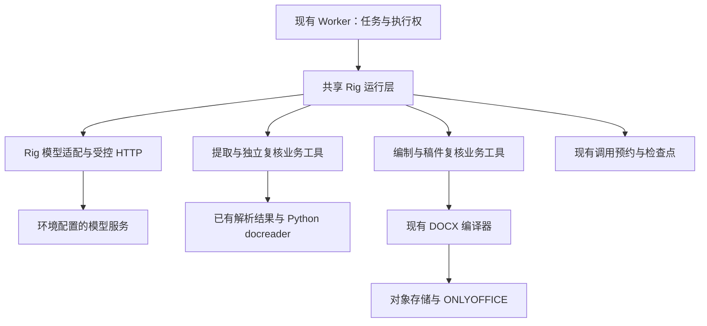

# 投标提取与 Agent 运行时实施方案：Chat Completions、Rig 与有界复核

2026-09-11 UTC 当前进展：real-run-v14已使用当前已验证程序及.env的grok-4.6＋Chat＋low启动完整106页空候选提取与独立复核，来源、原图、预算均已核对，不导入旧检查点或人工答案。连续技术第55–63页此前已完成两轮局部复核（50条记录、0发现）；标签清空、未勾选条件负例均已闭环。复杂附表和跨范围关系的整体语义、完整32项及同版DOCX/PDF/报告仍待验收。未改配置、新增migration或修改生产逻辑；223项库测试、20项合同及fmt/Clippy/编译证据保留。 详见[实施门槛](#55-本次修复的实施门槛)。

本次恢复验证及失败边界见[验证记录](../../artifacts/bid-full-sample/loop-repair/replan-context/verification.json)。旧17种查询回归继续作为前一缓存修复的证据；本次针对真实恢复状态回放，不将离线成功等同于模型语义正确。

前序原图验证：195项库测试（11项忽略）、20项合同、7项隔离 PostgreSQL恢复、bidding 全目标严格 Clippy、workspace fmt与样稿编译通过。真实请求离线投影保留当前10份焦点候选、全部解析来源范围及1张当前原图，请求365383字节；12份非焦点候选按预算淘汰，因此该投影的“全部候选均保留”断言失败记录仍保留，不以较弱结论替换它。原混合批次回归的全部解析及候选证据保留断言继续通过。证据：[当前原图与导航验证](../../artifacts/bid-full-sample/loop-repair/active-review-image/verification.json)、[续接/类别验证](../../artifacts/bid-full-sample/loop-repair/boundary-target/verification.json)。保留原预约字节、检查点和计数，模型始终重读 `deploy/.env`，显式预算保持原值。未新增表、migration、配置项或操作业务数据库。

补充跨来源导航回归：原文任务要求复核关系另一端，但工作导航只数当前来源候选，曾错误显示剩余0项。现让待交付候选、剩余比较和宿主指派引用同时纳入源任务依赖；明确扩展原文访问范围的约束保留。回归同时验证端点内容改变后，原来源判断及本地候选比较均失效。188项库测试、严格 Clippy、fmt、编译及7项隔离 PostgreSQL通过；未改工具/提示词、共享合同或SQL。证据：[跨来源修复](../../artifacts/bid-full-sample/loop-repair/cross-source-navigation/verification.json)、[兼容续跑核验](../../artifacts/bid-full-sample/loop-repair/source-review-resume1/startup-verification.json)。

混合图片批次裁剪补充：第60→61轮原请求显示14个焦点候选随旧大图批次被一起淘汰，随后重复取回。现对已交付、图片载荷自身超出历史预算的批次，仅将独立图片消息换为明确的历史省略标记，保留同批工具调用/结果和候选；最新待交付批次、原图缓存、阅读回执和预算不变。188项库测试、严格 Clippy、fmt和编译通过；真实请求离线回放保留15个当前候选版本及全部当前解析证据，请求92956字节，最新工具批次原样保留。证据：[裁剪修复及回放](../../artifacts/bid-full-sample/loop-repair/mixed-image-retention/verification.json)。两组恢复均核对了原预约正文与累计计数；这只证明证据保留，不能替代模型的比较和漏项判断。

下列早期运行记录保留用于追溯，不覆盖上面的当前状态。

**此前修复记录：本地功能验证通过，独立复核已完成局部比较，未完成最终提交，运行已停止；完整验收尚未通过。** 已分离来源权限与局部焦点，自动维护成果/未解决引用，主提取、独立复核、编制和稿件复核共用进展与有界恢复策略。默认连续无进展6轮、焦点24轮、重规划2次；记录局部执行阻塞后允许转向独立范围，连续6轮仍未交接则在工具提交边界停止。重启、重复读取、笔记改写和任务改名不能刷新额度；有效局部写入可以完成当前动作。执行失败单独保存并阻止最终发布，不冒充来源缺项。候选当前版本参与窗口保留；各 reviewer 保留自己的冻结原文回执，修改后的候选/稿件仍按摘要核查。旧手抄引用输入及编制 `remember` 路径已删除，未新增 migration，既有 baseline 同步检查点与预算 JSON。

验证：最新176项库测试（11项忽略）、20项合同、1项真实检查点离线提交诊断、严格 Clippy、workspace fmt及样稿编译通过；既有6项隔离 PostgreSQL结果保留，本次未改SQL。首次3来源短测在21轮停止，11条记录、0关系，发生一次超时后重试成功；第二次 v2 在32轮停止，29条记录、12条关系、2个来源处置，四组重点引用由真实Agent产生，但独立复核未开始。v2请求42214–353819字节，含必要原页图片，无503或超时。轨迹还暴露无响应要求被迫指定渠道、同类型合规属性的不同条件被拒绝、工作引用格式说明不足；均已修复并验证。未新增 migration，未修改实际 `.env` 或旧检查点，未执行暂存操作。包含全部修复的 `response-contract-trial` 已以新身份、空候选重测第11、16、17页的3处来源，模型与预算仍来自 `deploy/.env`；启动合同已核对，结果待验。该试验在34轮保留32条记录、21条关系后，进一步定位到重复读取会触发无实际缺口的 pending_delivery 阻塞。已删除这条冗余判断，尚未交付的原文/候选仍按真实缺口阻止交接；172项库测试、20项合同及Clippy/格式/编译通过，SQL未因本项调整。`response-contract-resume1` 已在第101轮由无进展/交接保护停止：主提取完成，41条记录、21条关系、3项来源处置；独立复核收到65个候选当前版本后仍重复读取，两次重规划无效，0轮复核、1项执行阻塞。已保留终态和计数，未将空缺口等同于语义通过。现补充复核专用完成指引与按实际缺口生成的下一动作：有问题逐项保存、无问题完成原范围后提交空草稿；执行阻塞仍禁止提交。173项库测试、20项合同及Clippy/格式通过，无新工具/配置/migration；提示词已改变，`reviewer-completion-trial` 已以新身份、空候选复测；启动核验确认实际配置、工具和预算未变，旧终态未改。该试验在第85轮到达诊断时限并取消：主提取41条记录、28条关系、3项来源处置；reviewer完成一个局部范围、收到72个候选当前版本，仍未提交最终结论。除精确读取位置反馈、局部复核排除不相关待办外，现新增 complete_review_check，在既有进展账本中记录当前候选的无问题比较；重复版本/改写结论不能续额度，来源、当前版本、执行阻塞及最终全局门槛保持不变。176项库测试、20项合同、3项.env启动测试及Clippy/格式/编译通过，无新表、migration、检查点字段或环境变量。新工具/提示词采用新身份：clean-review-trial 在补充明确授权后实跑656.16秒，停于第25轮：独立收到72个候选当前版本，完成41个记录版本的局部比较，46次重复比较被去重；28条关系和3项来源处置仍未形成比较结论，0轮最终复核。定位到当前焦点已完成但执行反馈仍要求比较该焦点，已增加焦点剩余数和转向未完成引用的派生反馈；176项库测试、20项合同、Clippy/格式/编译通过。clean-review-resume1 保留原检查点、预约正文及计数兼容续跑，在第40轮完成全部72个局部比较，但此后反复读取，0次完成范围、0次提交复核，第58轮进入执行阻塞，第64轮耗尽交接额度后停止。只读第54轮检查点副本的正式工具调用均通过，证明当时接口可用；离线副本不作为真实复核结果。最终结束行为仍未解决，本轮后续复杂附表及完整样稿重测未启动。此前自动审批拒绝已由用户补充明确授权解除。旧运行、原始来源和计数未改。复杂附表、完整106页独立复核、32项语义发现及完整 DOCX/PDF仍未通过。证据：[验证记录](../../artifacts/bid-full-sample/loop-repair/verification.json)、[v2真实轨迹](../../artifacts/bid-full-sample/loop-repair/source-scope-trial-v2/result.json)、[上一实跑启动核验](../../artifacts/bid-full-sample/loop-repair/reviewer-completion-trial/startup-verification.json)。

更新日期：2026-09-10。用户已批准本方案并授权实施；方案与文档已统一，当前推进实施与分项验收；本次按用户复核收敛为提取/复核修复先行、Journal 独立升级、Rig 单协议接入。明确仅使用 Chat Completions，删除 Responses 实施范围。P0/P1 已部分实现，P3 当前驱动恢复验收通过，P4 接缝已验证、共享宿主 I/O 驱动及 Rig Chat 请求序列化/流解析已接提取/编制，AgentRun 多轮步进和有界会话已接入并通过隔离验收；完整真实验收未通过。阶段编号仅属于本方案，不替代平台任务或 ONLYOFFICE 的 O0–O4。

v9 已在第45轮检查点停止：运行1043.91秒，34条记录、10个来源处置、0关系，独立复核未开始；第25–44轮仅查询已有候选，连续20轮没有新增成果或来源覆盖。后半段未观察到503，重复候选全文查询多次因无法与当前原文共存而失败。已保留全部请求及检查点，目录/详情取回修复已通过离线及隔离验收；不能视为真实语义或整稿验收通过。用户对 `.env` 目的地的具体外发授权持续有效。证据：`artifacts/bid-full-sample/real-run-v9/terminal.json`、`stagnation-report.json`。

v10 已停止：运行387.94秒，第24轮检查点保存7条记录、8个来源处置、7张已交付原页，0关系；第5轮后没有新增成果，反复读取12个活动来源。目录查询未再复现 v9 的候选共存错误，但完整持续产出仍失败。原文工具返回完整单元格；活动范围只能扩大不能拆小，未充分实现方案的分次处理要求，显式待处理来源与安全拆分已通过离线和隔离验收，真实持续产出尚待复验。证据：`artifacts/bid-full-sample/real-run-v10/terminal.json`、`diagnostic-checkpoint.json`。本轮未生成可验收的提取结果或整稿。

v11 已保存第48轮检查点后停止，耗时1421.51秒，35条记录、12个来源处置、0关系、0轮独立复核。期间仍有写入，不能归类为连续空转；停止原因是已复现旧索引挤掉原文网格，需以新合同验证修复。第33→34轮离线重放由仅保留2张网格改为保留全部4张，请求107508→95213字节，最新工具结果保持原样。库149项、合同20项、隔离 PostgreSQL 5项及 Clippy/格式通过，未调整预算或新增 migration。证据：`artifacts/bid-full-sample/real-run-v11/terminal.json`、`artifacts/bid-full-sample/navigation-history/verification.json`。

v12 已人工停止并保留第152轮检查点：耗时2975.47秒，54条记录、6条关系、20个来源处置，独立复核未开始；最后47个完成轮次没有新增记录，期间仍有读取和导航。导航裁剪改善了原文保留，但未解决完整持续产出。终态见 `artifacts/bid-full-sample/real-run-v12/terminal.json` 和 `diagnostic-checkpoint.json`。

v13 已获明确外发授权并启动，向 `https://ai.zleiwork.cn` 发送同一招标文件的解析文本、网格及必要原页图片，模型和预算只读 `deploy/.env`。归档程序包含候选详情回执及字段校验反馈；启动核对确认供应商、预算、二进制、冻结来源和新提示词/工具合同一致。真实持续提取、独立复核及完整 DOCX/PDF 尚未通过，32项发现保持开放。证据：`artifacts/bid-full-sample/real-run-v13/startup-verification.json`。第104–129轮状态保留在 `artifacts/bid-full-sample/real-run-v13-resume1/progress-snapshot.json`；第129轮后由兼容恢复目录 v13-resume2 续跑，新增15条记录后再次出现重复核查，现已停稳于第164轮，详见下方字节定位修复记录。

2026-09-10 补充：主提取及 reviewer 各自保存完整候选详情的已交付摘要，目录 `detail_received` 显示本角色是否收到当前版本；它不是语义通过标志，修改后失效，同批尚待交付及另一角色的回执不能冒充已收到。交接反馈明确保留已有引用不需重新取回全文。151项库测试、20项合同、5项隔离 PostgreSQL 测试及 Clippy/格式通过，无新增 migration；v12 已停止，新提示词/工具合同由 v13 真实复验。证据：`artifacts/bid-full-sample/candidate-receipts/verification.json`。

2026-09-10 字段校验反馈已补齐：复用原 `ok/error` 封装及语义校验器，以 `INVALID_FIELD <JSON Pointer>: <constraint>` 指明记录、引文、模板单元格及关系的失败位置和约束，失败写入保持原子性。反序列化错误定位到所属容器，不声称每个嵌套 Serde 错误都能定位叶子字段；原文未给出的单位等仍允许为空。153项库测试（9项默认忽略）、20项合同、5项隔离 PostgreSQL、严格 Clippy、workspace fmt 及样稿编译通过，无新增 migration。证据：`artifacts/bid-full-sample/validation-fields/verification.json`。

2026-09-10 原页历史淘汰修复：v13 第68→69轮确认超大旧图片组会先挤掉较早的完整网格，随后自身也被淘汰。现按冻结历史预算优先淘汰必然放不下的已交付图片组，保留较小原文组；离线回放从0张完整网格改为保留2张及相关正文，154项库测试、20项合同、5项隔离 PostgreSQL、Clippy/格式及样稿编译通过。最终修复未改变提示词、工具、来源或预算合同。v13 原实例停稳于第104轮后，以归档修复程序从同一检查点恢复，保留52条记录和105次累计调用；恢复记录见 `artifacts/bid-full-sample/real-run-v13-resume1/startup-verification.json`。证据：`artifacts/bid-full-sample/image-history/verification.json`。

2026-09-10 正文字节定位修复：`read_source` 在保留原文及起止范围的同时返回逐行 `line_spans`，中文与原换行均按真实 UTF-8 字节定位，完整结果按原工具预算分页；兼容恢复仅给已交付历史补充确定性位置，不改已预约请求和阅读回执。真实第120→121轮离线回放保留两页58行完整正文及附表，请求116767字节；157项库测试（9项默认忽略）、20项合同、5项隔离 PostgreSQL、Clippy/格式及样稿编译通过，无新增 migration。v13-resume1 停稳于第129轮，52条记录、0关系、20个来源处置、0轮独立复核，累计131次调用。原状态已逐字节复制到 v13-resume2，生产合同校验通过；自动审批首次拒绝后，用户针对具体目的地和载荷再次明确回复“继续,允许”，现已从第129轮恢复，原预约正文保持不变并累计第二次调用；启动核验见 `artifacts/bid-full-sample/real-run-v13-resume2/startup-verification.json`。第130轮实际请求已验证包含两页58个逐行位置；随后新增15条记录，达到67条。第136轮后连续28个完成轮次无新增记录、关系或来源处置，期间73次候选详情/目录查询、29次搜索，未尝试写入关系。原文持续保留，但候选详情在有界窗口内反复取回；该相关性尚不能单独证明模型循环的根因。恢复实例运行777.78秒后安全停于第164轮，保留67条记录、0关系、20个来源处置及167次累计调用；未进入独立复核。逐行位置已验证可用，整体持续提取仍未通过，不能继续以相同正文重试或放宽预算冒充修复。证据见 `artifacts/bid-full-sample/real-run-v13-resume2/repeated-inspection-observation.json`、`terminal.json` 和 `line-spans-request-verification.json`。证据：`artifacts/bid-full-sample/source-line-spans/verification.json`、`artifacts/bid-full-sample/real-run-v13-resume2/preflight-verification.json`。32项语义发现及完整 DOCX/PDF 验收仍开放。

2026-09-10 停滞进一步定位：四组简单引用的双方完整详情在7个真实请求中同时可见，生产关系工具的离线内存副本验证全部通过，单组详情仅1116–1288字节；不能再将零关系简单归因于窗口装不下。28轮内257份详情只有25个版本，工作笔记与17项缺口不变。当前缺口是局部任务推进和停滞恢复，候选历史保护不足会加重重复，但不是充分解释；模型内部选择原因仍不可由轨迹证明。详见[定位报告](../../docs/bidding/agent-loop-diagnosis.md)。本次未修改生产逻辑或新增外发，修复方向尚待短范围真实验证。

产品目标以 [PRD](../../docs/bidding/prd.md) 为准；领域身份以[领域契约](../../docs/bidding/authoring.md)为准；编辑与出件以 [ONLYOFFICE 契约](../../docs/bidding/onlyoffice.md)及其[接入顺序](onlyoffice-integration.md)为准。本文件是本次投标 Agent 改造的统一实施入口，进展记录在[执行台账](../implementation-tasks.md)。历史实现、失败和局部验证不能当作本方案已通过。

## 1. 目标、选型和本期范围

### 2026-09-10 已批准的停滞修复实施补充

用户已批准完整修复方案并要求实施。此次先以已归档的28轮重复查询及四组可写关系作为回归，再完成下列工作；工程保护通过不等于真实提取或整稿验收通过。

1. 扩展现有工作状态，分别表达允许读取的来源范围和当前定位/提取/关联/复核/交接焦点，使用冻结来源范围及真实成果引用；由 Agent 选择内容，不按样稿或行业关键词分配答案。 `locate` 可先声明空焦点或有效的待读文本位置，不产生阅读回执；网格/图片引文及正式记录仍须本角色收到证据。`complete` 以来源覆盖、成果和独立检查为准，不额外要求一个新的活动焦点。
2. 运行层自动维护已有成果与未解决成果引用，删除要求模型反复抄写全部 `output_refs/pending_refs` 的工具输入。完成仍要求真实成果、来源处置及独立复核，不以自动记账代替接受。
3. 按新增已交付覆盖、成果/关系版本、来源处置、复核发现、已独立核查的无问题候选版本和有效交接判断进展。重复读字节、调用次数、笔记改写及任务改名不算进展。统一配置新增默认值：`max_no_progress_turns=6`、`max_focus_turns=24`、`max_focus_replans=2`；冻结展开后的有效配置，不修改实际模型或提高原有预算。
4. 停滞时在已提交边界保存状态并生成精简恢复上下文，有限次重新规划；额度耗尽保存局部执行阻塞，继续其他独立范围。用户明确选择此策略。来源真实缺项与模型执行失败分别保存；后者不能冒充来源问题或通过结果。重启、换焦点及重复查询不能清零消耗。
5. 上下文清点完整候选版本并保护当前焦点所需原文与候选；按完整协议组删除旧导航、重复版本和已完成内容。待交付结果及阅读回执不变，必要内容超预算时拆分或分页。
6. 主提取、独立复核、编制及稿件复核应用同一进展判断机制，各角色保持自己的工作状态与覆盖。保留复合条款、完整附表、混合单元格、跨页连续性和要求到模板位置的验收要求。
7. 保持 Rig 0.42.0、Chat 和三阶段 Journal；工作状态只在工具提交边界更新。同步现有 baseline 的检查点字段/初值校验及隔离测试，不新增表或独立 migration，不操作现有数据库。新工具/提示词/有效配置按新摘要、新运行验收，不修改旧检查点冒充兼容恢复。
8. 顺序：离线故障回放 → 局部任务/恢复 → 当前证据保留/独立复核 → 四组引用短范围真跑 → 复杂附表真跑 → 完整106页提取/32项复验 → 全部章节模板和同版 DOCX/PDF/报告。投标方事实继续待填，来源缺口按原质量规则明确报告，执行阻塞禁止通过发布。

借鉴来源：Pi `prepareNextTurn`/`transformContext` 与完整工具组裁剪；OpenCode 重复工具检测（本项目扩展为业务状态检测，不增加人工权限询问）；LangGraph 按状态条件路由；Rig 发布版 `AgentRun` 手动步进。保留原运行层，不增加另一套 SDK、进程或任务队列。定位证据及边界见[停滞报告](../../docs/bidding/agent-loop-diagnosis.md)。

当前实施状态：功能修复通过本地及隔离数据库验证；`reviewer-completion-trial` 在第85轮到诊断时限，独立复核未完成。新增局部无问题比较后，`clean-review-trial` 已完成41个记录的局部比较，但第25轮仍未完成关系复核；完成焦点反馈修复后，`clean-review-resume1` 已完成72个局部结果，但第58轮进入执行阻塞，最终提交仍未完成。短范围关系产出已有证据，完整106页提取、独立复核、32项语义发现及完整 DOCX/PDF 验收仍开放。

项目最终目标：**依据真实招标文件规定的投标要求，生成包含目录、全部应有章节、指定格式、附表及固定内容的完整可编辑投标模板，并输出同一版本的 DOCX、PDF和检查报告。**

本期填入招标侧已经明确的项目已知信息、固定声明、填写说明、表格结构、原条款和签署提示。投标方公司资料、人员、产品选型、实际响应、价格和证明材料保留待填位置，后续完成。不得恢复通用“商务、技术、报价”结构，不得把招标文件自身目录直接当作投标目录。

本文件本次交付是可独立验收的招标提取/复核修复及运行时替换。完整模板由现有 `docx_composition` 消费修正分析，编辑与出件继续归 O1-S/O2；不能把上面的项目目标扩成运行时全链重写。

### 1.1 技术选择

- 锁定 `rig = "=0.42.0"`，关联 Rig 包在锁文件中固定到已验证发布版本。
- 发布包职责已核对：`rig-core` 提供模型/协议合同，`rig-agent` 提供 `AgentRun`；正式共享驱动应使用同版本官方 `rig` facade 的 `agent` feature。生产已使用 `rig = "=0.42.0"` facade 的 `agent/reqwest/rustls` features，Chat 请求序列化、流解析和 AgentRun 多轮步进均已接入提取与编制；本地恢复验收通过，实际供应商下的完整语义及整稿验收仍开放。
- 投标提取、独立复核、模板编制和稿件复核最终复用同一运行层；协议只使用 Chat Completions，不引入双协议配置、Responses 客户端或加密推理状态适配。先在现有驱动修复提取和复核，再验证 Rig 替换，不把 SDK 作为语义修复前置。
- Rust 业务模块继续负责来源、要求、附表关系、业务校验和发布；文件解析继续使用统一 Python `docreader` service。
- 复用现有 Worker、执行权、数据库检查点、对象注册和 ONLYOFFICE，不引入 Node runner、第二套队列、Agent 会话数据库或 Pi/Rig 双运行模式。
- Embedding 配置与索引一致性归知识库独立任务，本次仅说明模型职责，不改索引或向量化。
- 已完成的官方 S3 SDK 替换保留，补齐证据归档；不重复实施。

选择 Rig 是因为它提供 Rust 多轮状态机及模型协议封装，有望减少自维护代码；接入既有预算和恢复边界仍须通过小范围验证，不能把 SDK 能力等同于集成已成立。Pi 保留为研究备选，本次不维护双实现。SDK 选型不证明模型供应商可用，也不保证语义正确或速度倍数。

### 1.2 官方案例采用方式

案例及源码按 0.42.0 发布对应提交 `d5a34986a1ad57f1e9c5984b82f8d7438ffc717e` 核对，不直接采用 `main` 中发布版尚未包含的接口。

| 官方案例或实现 | 本项目采用方式 |
| --- | --- |
| [agent_run_stepping](https://github.com/0xPlaygrounds/rig/tree/d5a34986a1ad57f1e9c5984b82f8d7438ffc717e/examples/agent_run_stepping) | 使用 `AgentRun` 状态机，在模型和工具 I/O 边界接入持久化。 |
| [request_hook](https://github.com/0xPlaygrounds/rig/tree/d5a34986a1ad57f1e9c5984b82f8d7438ffc717e/examples/request_hook) | 借鉴逐轮准备请求机制；手动步进时由驱动层明确执行，不假定高层 hooks 自动生效。 |
| [agent_with_memory](https://github.com/0xPlaygrounds/rig/tree/d5a34986a1ad57f1e9c5984b82f8d7438ffc717e/examples/agent_with_memory) | 复用窗口策略，业务恢复不依赖进程内会话记忆。 |
| [agent_evaluator_optimizer](https://github.com/0xPlaygrounds/rig/tree/d5a34986a1ad57f1e9c5984b82f8d7438ffc717e/examples/agent_evaluator_optimizer) | 独立复核、反馈修订、统一预算上限；复核者自己读取原文。 |
| [agent_orchestrator](https://github.com/0xPlaygrounds/rig/tree/d5a34986a1ad57f1e9c5984b82f8d7438ffc717e/examples/agent_orchestrator) | 按真实来源组织工作单元，不照搬固定任务数量和任务类型。 |
| [openai_streaming_per_call_usage](https://github.com/0xPlaygrounds/rig/tree/d5a34986a1ad57f1e9c5984b82f8d7438ffc717e/examples/openai_streaming_per_call_usage) | 区分单次请求用量和整个运行的累计用量。 |
| [tool_result_outcomes](https://github.com/0xPlaygrounds/rig/tree/d5a34986a1ad57f1e9c5984b82f8d7438ffc717e/examples/tool_result_outcomes) | 工具返回错误事实，运行层决定停止或反馈，不能让模型绕过持久化失败。 |

`AgentRun` 本身仍会累积历史，序列化格式没有跨版本稳定保证。`CompactingMemory` 的水位和摘要是进程内状态，摘要处于保留窗口预算之外；默认 `TemplateCompactor` 不是语义总结模型。因此本方案单独控制发送窗口和活动 SDK 状态，默认不增加 LLM 总结调用。

OpenAI 官方文档页面在此次核查中返回 HTTP 403；上述能力依据 Rig 发布版源码，Rig 与实际供应商的接缝兼容性须在 P4 验证，P0 复用当前 Chat Completions 路径。

### 1.3 实施风险复核与范围收敛

2026-09-09 再次核对工作区及已读取的 Rig 发布版源码后，确认原顺序把提取修复与 SDK/双协议改造绑得过紧。以下约束替代初稿中的双协议前置顺序；用户已明确只使用 Chat Completions。不因保存了方案便声称风险已解决。

| 风险 | 已核对事实 | 修订决定与验证边界 |
| --- | --- | --- |
| 供应商与协议 | `authoring_runtime.rs` 只接受 `openai_chat_completions_sse`；提取及编制 SQL 预约都校验 `messages`、首条 system、`max_tokens` 与 required tools。现有代理已实际走过 Chat Completions，但最新完整运行因503终止。 | 只接入原 Chat Completions，不新增协议选项；不能为适配 SDK 放宽冻结校验，也不由503推断具体供应商故障原因。 |
| HTTP 预约接缝 | 当前已 JCS 规范化、预约并原样发送，传输层不另重试。Rig 0.42.0 的 `HttpClientExt::send_streaming(Request<T>)` 接受 `T: Into<Bytes>`，`CompletionsClient<H>` 支持注入该客户端。 | SDK 构造完整请求后只做通用 JSON 的 JCS 规范化，不另写 provider 字段序列化器。取得执行权后预约同一字节再委托 HTTP；必须用捕获服务验证字节一致、预约失败零发送、失败/取消与重复恢复。接口存在不等于该接缝已通过。 |
| 双协议矩阵 | 四种业务角色共同依赖模型/工具传输；原计划把两协议、图片、推理状态全部放在首批。 | 只验 Chat Completions。协议契约测共享适配一次，各角色测各自工具权限和业务效果，不机械相乘；删除双协议和加密推理适配任务。 |
| Journal 与 SDK 绑定 | 旧合同的 `checkpoint_put` 将 `state.turn` 写为 `batch_ordinal`，要求每次前进一轮；提取、编制和数据库回归依赖此约定。 | P3 单独升级既有 Journal，同轮多边界恢复必须有独立红/绿证据；不以引入 Rig 为改 baseline 的充分理由，不新增 Agent 表或 migration 文件。 |
| Tokenizer 与本次瓶颈 | 仓库尚未接 Rig `TokenCounter`；发布版虽提供接口与启发式计数，也不能提供经证实的 grok 精确 tokenizer。v5 最大约784 KB，没有触及2 MB上限。 | P0 先改上下文选取和主动交接，不能只降低上限或加入 token 计数。首期按显式配置做保守估算、余量及字节保护，标明估算，不引入 tokenizer 选型工程。 |
| 工具合同 | 旧版 `inspect_analysis` 的 schema/实现只接受 `kind/offset/limit`，不能按记录 ID 精确取回；这会增加扫描和重复读取。 | P0 明确修改现有工具的查询能力、schema、提示词与测试，更新 `tools_sha256` 和冻结合同，使用新运行身份。复用工具框架不等于冻结工具功能不准改。 |

Rig 的价值还包括共享多轮驱动与减少自维护协议代码，但不自动解决上下文、附表关系、独立复核或供应商503。若 P4 接缝需要 fork SDK、复制 provider 序列化或绕过预约，则停止该接入切片并报告，不拖住已验证的提取修复与真实样稿工作；现有运行层在切换前继续承担执行，切换后删除旧循环，不长期保留两套模式。

## 2. 模型、配置、通信和目录

### 2.1 模型职责

以下是保存方案时读取 `deploy/.env` 的配置快照，不是代码常量，也不证明运行进程已重新加载。

| 能力 | 当前配置 | 本期用途 |
| --- | --- | --- |
| 生成及工具调用 | `grok-4.6` | 提取、关系核对、独立复核、模板编制和稿件复核。 |
| Embedding | `text-embedding-3-small` | 知识库向量索引与语义检索，独立 `/embeddings` 接口。 |
| 知识库图片理解 | `grok-4.6` | 现有知识库图片处理。 |
| 招标原页核查 | 投标 Agent 当前配置的模型 | 原页工具提供图片，Agent 结合正文和网格核查。 |

不同 Agent 角色共用生成模型，独立性来自上下文、阅读覆盖和工具权限。不新增隐藏复核、摘要、重排或备用模型。招标全文提取不以向量 Top-K 召回代替完整核查。

### 2.2 配置及冻结

- 所有新运行的模型名、地址、凭据和可调参数来自 `deploy/.env` 对应配置；禁止命令行临时换模型。
- 保留 `KNOWLEDGEBRAIN_*` 和现有 `LLM_*`、`EMBEDDING_*` 别名；同一配置的别名同时存在但值冲突时明确报错。
- 协议沿用并校验 `openai_chat_completions_sse`，这是明确的接口合同，不是按模型名称猜测；只使用这一种协议，不新增 `KB_AUTHORING_PROTOCOL` 或 `KNOWLEDGEBRAIN_CHAT_PROTOCOL` 配置开关。
- 输出上限与超时已改为 `KB_AUTHORING_MAX_OUTPUT_TOKENS`、`KB_AUTHORING_TIMEOUT_MS`，按用户要求在环境模板与 Compose 提供8192 tokens、180000 ms默认值，本地 `.env` 仅补缺失项。Rust 读取并冻结正整数，不保留另一套常量。提取预算新增总 token 上限、每图预留和余量，默认分别为131072、16384、4096；估算按完整请求 UTF-8 文本字节与图片预留计算，同时保留字节上限。这是应用预算，不声称已验证模型的实际窗口。
- 已读取并冻结 `KNOWLEDGEBRAIN_CHAT_REASONING_EFFORT`，提取/复核和编制/稿件复核请求实际发送配置值；未显式配置时省略。SQL 预约校验该参数与冻结配置一致。这里只扩展现有 baseline 的请求字段校验，无新增 migration 或表；未操作现有数据库。
- 记录脱敏有效配置与合同摘要，检查最终序列化请求是否实际采用。配置文件变化不等于进程加载，新运行须验证有效摘要。
- 旧运行按冻结合同恢复；模型、协议、提示词或工具合同变化时不得修改旧检查点冒充同一次运行。

### 2.3 Chat Completions 接入

显式使用 Rig `CompletionsClient`；不可误用 SDK 默认的另一协议客户端。继续 HTTP SSE、自定义工具、`tool_choice=required` 及现有图片输入。冻结模型名、输出预算、消息、工具与参数；必要协议字段由明确合同规定，可调参数从环境读取。

仅启用现有业务工具，不开放任意搜索、文件解析或代码执行。完整流、结束原因及工具参数校验通过后才能提交该轮工具；异常 EOF、长度截断、不完整参数或失败响应不能触发业务写入。共享传输测试覆盖工具往返、图片、usage 缺失、错误、取消及预约/发送字节一致；各角色只重复其业务权限与成果测试。

### 2.4 Embedding 职责边界

Embedding 继续使用知识库的既有独立 `/embeddings` 封装，当前1024维约束不变；招标全文提取不消费向量 Top-K。配置快照仅说明系统有哪些模型，不把索引模型一致性、重新索引或检索改造加入本次 P0–P4。该独立事项见[知识库计划](../knowledge-base/README.md#模型与索引一致性独立事项)。

### 2.5 通信与目录



Rust 模块进程内异步调用；Python 使用现有 service 接口，不新增 RPC 或队列。当前目录如下。`agent_runtime/driver.rs` 已替换提取/编制两处外层 I/O 循环，`session.rs` 持有活动 AgentRun；业务范围、证据与预算投影继续留在领域模块。

```text
crates/bidding/src/
├── agent_runtime.rs   # 共享 Journal 与版本合同
├── agent_runtime/
│   ├── progress.rs     # 四角色共用的版本进展、局部额度、执行阻塞
│   ├── driver.rs       # 预约、响应、工具提交三个 I/O 边界
│   ├── session.rs      # AgentRun 多轮状态、工具权限和有界会话
│   ├── chat.rs         # Rig 原字节发送、流解析、取消与传输限制
│   └── chat/request.rs # Rig 请求序列化与无网络正文捕获
├── authoring_runtime.rs
├── tender_analysis/    # 来源、提取、关系、独立复核
└── docx_composition/   # 编制、编译、稿件复核、发布
```

复用现有工具 schema 的管理方式、参数校验和执行函数；不为套 SDK 重写全部业务工具，但提取修复必须扩展 `inspect_analysis` 的记录 ID/来源查询、同步 schema、提示词、`tools_sha256` 和测试。该变化只用于新合同/新运行，不能恢复旧检查点。两处旧 Agent 循环删除，其文件收敛为角色配置与业务适配；知识库其他功能仍使用的共享代码不能机械删除。

2026-09-10 候选目录/详情修复：`inspect_analysis` 增加 `view=index/detail`。无 ID 查询默认返回目录（ID、引用、原候选标签及来源），有 ID 默认返回完整详情；目录不计阅读或复核覆盖。详情仍按当前候选摘要确认且完整分页，预算不变。v9 两批真实查询离线回放保留全部当前原文，目录中12/14条不同候选均可逐条完整取回。库147项、合同20项、隔离 PostgreSQL 5项及严格 Clippy/格式通过；新合同须新建运行，32项语义验收仍开放。证据：`artifacts/bid-full-sample/candidate-index/verification.json`。

## 3. 招标提取、上下文管理与模板生成

### 3.1 已定位问题与修复对应

[真实 v5 性能诊断](../../docs/bidding/extraction-performance.md)：22 分 23 秒、30 轮、200 次工具调用、33 次物理调用，请求约 32 KB → 784 KB，27 条未复核记录，0 条关系和 0 轮复核，最终 HTTP 503 终止。轮次耗时包含工具和落盘，不能全部归因于模型计算；字节数不是 token 数。32 项独立验收问题仍开放。

| 问题 | 实施措施 |
| --- | --- |
| 长原文和历史反复发送 | 有界工作上下文、完整协议组裁剪、完成后通过成果引用交接。 |
| 先大段阅读再集中提取 | 当前来源范围内持续保存记录、局部关系和待办。 |
| 反复扫描记录和查引用 | 扩展现有查询，按来源与记录 ID 精确取回。 |
| UTF-8 范围、空语义值错误 | 使用工具准确引用；字段级错误反馈，不自动补造内容。 |
| 附表只有标题或粗略概括 | 保存完整格式，并建立到响应项、证明项和实际单元格的关系。 |
| 阅读覆盖被误认为完成 | 分开记录交付、处置、成果、关系和独立复核。 |
| 503、断流与重试边界 | 单一重试归口、完整响应检查、分阶段恢复。 |
| 耗时无法归因 | 逐请求上下文、用量、HTTP、工具和落盘指标。 |
| 配置未实际采用 | 冻结有效配置并检查最终请求。 |

### 3.2 来源准备与工作范围

修复以真实失败类型建立验收，不以更换运行时或延长提示词作为完成条件。下表编号仅是本样稿测试定位，不能进入生产分支、附件识别规则或固定章节映射。

| 真实问题 | 应改变的执行与反馈 | 可核查结果 |
| --- | --- | --- |
| R01/R02：8G/8H 语义与边界错判 | 在同一工作范围读取标题、完整正文、续页及签署区；对字段解释与来源的冲突给出记录 ID、字段和反证。 | 按真实声明/查询要求保存固定内容与签署归属，不套相邻附件含义。 |
| R04–R07：复合技术条款被摘要吞并 | 按可独立响应的条款提取，保留并列/替代条件、指标、证明和提交时点；局部读完即核对与写入。 | 每个独立义务有准确依据和响应/证明位置，不能只有汇总摘要。 |
| R12：附表关系几乎为空 | 局部记录后立即关联已知两端；未知端显式登记待办，按 ID/来源回查并逐项处置。 | 关系落到响应/证明项和模板区域/单元格，数量不作固定门槛，须核查语义完整性。 |
| R16/R17：混合格与交错顺序错误 | 对模板区域记录原文顺序及固定/待填子区间；返回具体锚点与冲突范围，复核实际单元格和续页。 | 固定标签未清空，标题/单位/表格/说明按来源交错；在 O1-S 用既有编译器验证实际 DOCX。 |

其余发现仍按完整验收索引逐项核对。模型可能持续误判；结构校验只拒绝可确定的范围/身份错误，语义正确性须靠独立来源预期与真实复验，不通过硬编码本样稿答案关闭发现。

复用 Python service 已解析正文、网格、定位、原件和页面视图；未变化文件不重新解析。解析变更产生新来源版本，不混入已冻结输入。Agent 不实现另一套上传文件解析器。

Agent 从索引、真实目录和正文定位组成要求、编制说明及指定格式，并完整核查其他来源中的追加要求。位置只决定阅读顺序，不是固定关键词规则。

工作范围按实际章节、条款、表格、表注和续页组织，再受上下文预算限制。超大章节可分次处理，保留父范围和未完成状态，不固定每批页数。

有界范围必须落实到宿主和工具行为，不只写进提示词：准备请求时按当前范围和必要跨范围引用选取内容，成功交接后主动移除已完成范围的长原文；工具校验真实来源、精确区间、累计返回预算及待交付状态。跨范围查询带明确引用目标，未确认两端进入待办；不能用一次换范围或简短笔记清掉未处置项。范围切换与提交沿用现有工具和 checkpoint 扩展，不新增任务队列；校验能证明结构完整性，不能代替语义验收。

现有工作笔记扩展为结构化工作状态：`source_scope`、`deferred_sources`、`focus`（动作、已交付来源区间与真实候选引用）、`objective`、`status`、有界 `note`。`output_refs/pending_refs` 仅由宿主维护并持久化，不是模型工具输入。它只是当前检查点内容，不形成独立任务队列。每轮只发送有界工作输入和成果数量，未解决引用通过 `check_gaps scope=pending` 分页，执行阻塞通过 `scope=execution` 分页；引用须指向真实成果，模型声明不能单独证明完成。

后续修复已将当前范围的有界 `work_state` 清单直接放进每轮请求，从持久成果及本次实际交付的读取结果推导缺口，避免只有模型主动调用 `check_gaps` 才看到局部阻塞项。清单本身不增加阅读覆盖；主提取与复核分别使用自己的账本。v7 离线投影能直接呈现12项未处置来源及23项未保留成果引用，但真实持续产出仍须新运行证明。

Python v3 解析已交接，Agent `search_sources` 已补齐独立网格搜索：返回真实表单/行列、密铺读取偏移和格内 UTF-8 命中位置，按字节预算分页，引用前仍须 `read_form`。本地样稿冻结脚本同步从 `unit.grid` 构造 schema 3 表单，删除 `locator.cells` 旧提取分支；新版来源必须新建冻结输入，不能拼入旧检查点。检查与证据见[后续验证](../../docs/bidding/agent-runtime-recovery-results.md#解析-v3-交接与当前范围清单)。

2026-09-10 已补齐安全拆分：工作笔记新增有界 `deferred_sources`，允许将活动范围缩小并释放旧窗口；移出的每个来源及已有成果引用必须保留。待处理来源只能通过重新纳入活动范围移出列表，列表未清空禁止主提取提交及复核提交；局部完成、全局阅读、来源处置和独立候选核查门槛不变。v10 离线投影将12个活动来源缩为1个、保留11个待处理来源，完整48格网格和对应原页可同时发送，业务成果和原检查点不变。库148项、合同20项、隔离 PostgreSQL 5项、Clippy/格式通过，真实持续产出仍待验证。证据：`artifacts/bid-full-sample/work-split/verification.json`。

### 3.3 局部提取循环

按“读取 → 提取 → 建立局部关系 → 登记待办 → 检查 → 保存交接”循环处理。

核查范围包括项目事实，文件组成/目录/顺序/提交，格式/签章/资格/否决/评分，商务/技术/报价/人员/交付，指定格式/附表/说明，以及适用条件/例外/替代选项/时点/未解决事项。业务分类不产生固定章目。

粒度以能否独立核查为准。复合条款保留对象、比较符号、阈值、单位、选项关系、证明要求和提交时点，不压成“满足相关技术要求”。网络安全行业的产品、服务、指标、证书、标准和人员条件均从来源产生；样稿名称、参数和附件编号只用于来源和测试，不进入生产识别规则。

引用使用现有搜索和读取工具返回的 UTF-8 范围、网格 citation 和原页身份。搜索仅定位，不计完整阅读。校验失败返回错误码、字段位置和约束，由 Agent 修正；不补默认值或改写原义使数据通过。

### 3.4 附表与对应关系

模板必须保留父子层级、顺序、正文/子标题/表格/表注/签署区的交错、跨页连续性、表头/合并/标签/单位，以及固定文字、招标已知值、投标方待填区和示例值的区别。单元格局部留白必须保留周围固定文字。

关系须具体落到“要求中的响应项或证明项 → 指定模板 → 区域或实际单元格 → DOCX 实际位置”。跨表字段一致性、汇总、替代和适用范围均保留来源依据。相似标题、相同编号或空白外观不能证明关系。

局部无法确认的关系进入待办，后续读取两端和控制条款再判定，不通过标题相似度补齐。原页可以形成视觉证据；生成可编辑模板仍须有可用文本，不能以截图替代。

### 3.5 逐轮上下文

2026-09-10 补齐：`docx_composition` 两个角色此前只检查字节预算，现复用 `agent_runtime::chat` 的保守估算；未填写的 `max_context_tokens`、`image_token_reserve`、`token_safety_margin` 分别采用131072、16384、4096，均可显式配置并写入冻结合同。仅更新现有 baseline 的预算键集合、正值及输出预留约束；旧编制合同不能伪装新配置续跑，提取合同不变，实际 `.env` 和业务库未改。验证及兼容边界见[编制 token 预算](../../artifacts/bid-full-sample/loop-repair/composition-token-budget/verification.json)。

请求包含稳定角色指令和工具定义、冻结身份与必要项目约束引用、当前范围原文/表格/成果、最近必要工具轮次及工作状态。动态进度放在后部；来源放在证据或工具消息中，不提升为系统指令。

每轮同时检查输入 token 预算、输出预留和字节上限，计入工具定义、消息、图像及协议状态。首期使用显式配置的保守估算与余量，保留字节上限并与实际 usage 核对，既不声称 grok 存在已验证的精确 tokenizer，也不将“字节数除以四”视为中文精确计数。Rig `TokenCounter` 只是后续可用接口，不是 P0 的依赖；主动选择当前工作范围才是本次上下文修复的重点。

- 已完成范围的完整原文退出活动窗口，业务成果持续保存；需要复查按 ID 或来源取回。
- 请求超限时先省略已交付的旧导航结果，保留原文证据和完整候选详情；省略标记不是证据，最新待交付工具组保持原样。仍超限时按完整协议组裁剪，不留下孤立工具结果。淘汰优先选择可由其他组覆盖的内容；对实际图片载荷已单独超过历史额度的已交付旧批次，先省略其独立图片消息并留下原图引用标记，保留同批候选、文本和完整工具协议。仍超限才淘汰无焦点证据的完整旧组或按原顺序裁剪；不得因为大图无法留下而无条件连带丢弃同批候选。历史省略标记不产生新阅读回执或语义结果。
- 尚未交付模型的读取结果不得裁剪后仍记为已读。
- 一轮多个工具的总结果同样受剩余输入预算限制；过大读取原子拒绝并返回分页反馈。
- 安全边界创建新的活动 `AgentRun`，保留必要完整末轮；全局预算和业务状态继续累计。
- 不修改 SDK 私有序列化字段清空历史；活动 SDK 状态和发送窗口都须有界。
- 默认不额外调用 LLM 总结，交接依赖已保存成果、待办和短工作笔记；笔记不替代证据。

- 当前角色已读且摘要匹配的焦点候选可从成果状态恢复到有界工作消息；reviewer 还召回当前来源任务指派的 `work_references`，焦点优先。回执、进展和复核结果不因此变化；未读、待交付、其他角色或过期候选不能召回。
- 只有证明在召回预算内可恢复的候选旧详情才可压缩，保留同批原文和工具协议；不能召回的焦点候选仍受保护。工作消息省略冗余逐项摘要字段，宿主仍核验内容摘要，并兼容验证旧消息中的摘要。
- 原图缓存仅保留当前 reviewer 指派来源的已读图片，以及当前角色 `focus.source_spans` 显式指定的已读图片；候选引文不自动固定所有历史图片。访问范围和本角色已读回执仍是前提。
- 最新工具结果与总预算竞争时，先清理已交付的冗余协议组和可退出历史的旧大图，再按实际字节/token超额量逐项移出非焦点候选缓存；保留仍能放下的其他候选，不再仅对原文读取特殊退让，也不一次退为仅焦点缓存。当前焦点不参与此缓存裁减，最新工具组原样保留；必要内容仍放不下时使用既有分页/拒绝边界。排除集合仅存在于该次请求构造，下一请求重新尝试完整召回；不改阅读回执、检查点或累计进展。

### 3.6 已有独立复核的有界化

当前已经有独立 reviewer，不再新建一套 evaluator-optimizer 流程。v5 主提取未结束，复核启动次数为0；首先解决主流程持续产生完整成果和结束判定，不能靠增加提示词要求进入复核。

P0 的请求窗口与交付账本必须同时适用于主 Agent 和 reviewer，P1 再完善语义核查。复核按来源范围逐段读取原文、网格、局部成果和关系，检查后退出活动窗口，按 ID 取回跨范围两端及控制条款；不将106页和全部分析长期留在会话。所有调用继续共用该请求的总预算，复核也必须受单请求窗口、工具结果总量和交接约束。

独立性来自 reviewer 自己取得证据并检查成果，不继承主 Agent 的阅读覆盖或“已完成”结论。首次复核覆盖完整冻结来源，再核对所有成果/关系/不输出决定；工作分段不减少必须核查的范围。独立复读会增加成本，应单独报告其调用、时间和用量，不能承诺免费或精确翻倍，也不能断言复读必然导致503。

修改记录使对应复核及关系摘要失效。首次复核仍覆盖全部冻结来源；后续按 §3.8 的来源关联集合及显式依赖重新核查，无法证明影响局部化时保守失效，不另建依赖图服务。轮数/调用预算耗尽则明确未完成。来源到成果和成果回到来源双向检查，发现记录需含对象 ID（尚无成果的漏项允许仅有来源）、具体字段、证据范围、问题类型与修订后核对依据；该结构化反馈替代笼统“请补全”，不让模型用空 findings 自签成功。

P1 的发现继续保存在既有 JSON 检查点 `review_draft`，以 `put_review_finding` 增量保存、按 ID 修订/撤回、`inspect_review` 分页取回。字段定位为 `affected: [{id, path}]` 与必填 `correction`；证据须由 reviewer 实际收到，涉及成果须独立检查当前摘要。现按 §3.8 同时保存候选局部比较和独立原文判断，由宿主在完整工具批次末核验、汇总及切换角色；已删除 `submit_review` 的工具/schema/提示词和旧离线调用测试，保留历史诊断证据。

原 `submit_review` 后端并不强制工作笔记完成，早期问题是模型没有发出最终调用，且缺少显式原文漏项结果。新机制不依赖重复笔记收尾，不将阅读回执或空 findings 解释为完整语义通过。新增领域状态保存于现有提取 checkpoint，所属 baseline 校验同步；没有新增表或独立 migration，真实附表及关系验收继续开放。

### 3.7 目录、模板与出件

编制按 PRD 顺序：固定投标目录 → 规定组成及顺序 → 适用固定格式 → 要求单独呈现的评分/响应/证明 → 无规定部分依据项目义务提出结构并记录理由。

Agent 按章节增量编制，复用 DOCX 编译工具，填入有来源的固定文字和招标已知信息，生成完整附表/签署区，按要求放入原条款及独立待填响应，绑定要求/模板/实际位置，保留条件性内容及有依据的省略决定。不能一次模型回答生成整本文件，不能填造投标方事实。

稿件复核检查实际 DOCX、位置映射及渲染结果，不只检查 JSON。ONLYOFFICE 保存、排版和转换后，DOCX/PDF/报告绑定同一最终版本。仍输出整本稿，单独提交或分册要求保留提示，由用户导出后拆分。

问题可随草稿展示，不新增禁止编辑或导出的业务闸门；存在未解决验收问题时不能标记完整通过。现有自动编制路径的复核前置和技术发布校验属于代码现状，不得误称所有未复核分析已经可编制。

### 3.8 双向复核与确定性收尾

#### 3.8.1 已知故障与修复边界

`clean-review-resume1` 第40轮完成41条记录、28条关系、3项来源处置的72个局部比较，随后继续读取；第58轮进入执行阻塞，第64轮耗尽交接额度停止，最终复核轮数为0。第54轮检查点副本中正式工具可完成提交，仅证明接口可调用，不是实际语义通过。两段运行累计65次物理调用、请求25144–396023字节、未出现503；不能把本次未收尾继续归因于请求过大或提交 API 不可用。证据见 `artifacts/bid-full-sample/loop-repair/clean-review-resume1/` 下的 `finalization-observation.json`、`finalization-probe/report.json`、`terminal.json`。

故障时工具能表达“这个候选版本比较过了”，却没有独立的“这段原文还有没有漏提”结果；全局收尾又依赖模型继续主动发出空提交调用。仅补提示、调大轮数或看到72个比较就自动通过，均不满足目标。源码与轨迹只能定位这些协议/状态缺口，不能证明模型内部为何继续重读。

| 当前问题 | 本次措施 | 能证明什么 |
| --- | --- | --- |
| 比较完成后仍反复检查、没有最终提交 | 宿主派生待办，在完整工具批次末自动核验并汇总 | 必要判断已完成时无需模型再决定是否收尾；未判断时有界退出 |
| 候选都正确仍可能整段漏提 | 独立原文任务及显式漏项判断，与候选比较分账 | 必须出现来源到成果的判断；准确性另以负例验收 |
| 8G/8H边界、复合技术条件、关系、混合格与交错排版 | 小范围语义核查，完整表格/续页证据，具体字段修订 | 以对应真实问题逐项复验，不用运行时测试关闭32项发现 |
| 关系文本出现字面 Unicode 转义链 | 查清原始响应、参数解析、对象和落盘边界后定点修复 | 正文可读且原文与合法反斜杠不被破坏 |
| 503与速度 | 保留现有有界请求及预约恢复，减少重复调用并分项计时 | 不承诺消除供应商503，不以换 SDK 或更高预算作为修复 |

职责保持不变：Python DocReader 提供统一解析与原页；业务 Agent 解释招标要求、边界和适用性；Rust 宿主负责证据/版本校验、派生待办和状态推进；Rig 0.42.0 负责 Chat 多轮协议；既有 Journal 保存同一执行状态。不开第二个 Agent 进程，不新增模型、Embedding 依赖、调度队列或 Agent 表。本切片先用于招标提取 reviewer，编制/稿件复核继续复用已有运行保护，不顺带重写其业务合同。

#### 3.8.2 有限任务清单与语义边界

复核包含两个都必须完成的集合：

1. **候选比较：** 所有当前记录、关系、主提取来源处置的版本。沿用 `complete_review_check` 和有证据的 finding；阅读回执只证明本角色收到内容。现有来源处置的比较不升级为漏项核查。
2. **原文漏项核查：** 宿主从完整冻结输入派生必核查来源片段，不能由模型挑选“重要页”构造全集。身份为冻结输入摘要、来源 ID、片段范围与任务划分版本的摘要；不写死本样稿页数、附件编号或预期答案。

片段复用现有文本 UTF-8 区间、网格实际 anchor 及原页引用：普通来源可整体处理；超预算来源按冻结预算和已有分页能力确定性拆分，文本不截断字符，合并单元格不拆 anchor。网格每个实际单元格（含空格）都有任务归属；标题、表头、单位、说明和必要原页作为上下文依赖，不因分页消失。单个必要证据仍装不下时明确执行阻塞，不截断后签收。不再引入另一套解析器或版面切分算法。

**片段是覆盖与调度单位，不是语义边界。** reviewer 核查完整条款的条件/例外、模板标题到签署/说明的归属、表格间正文及跨页续接。任务结果须解释片段两端是否完整；续页或控制条款通过精确来源引用登记依赖。仅当前页出现标题、读取了一页、主提取标为不输出，都不足以完成。跨片段语义单元可共享证据，但各片段仍须有自己的有效判断；不以合并任务删除待办。边界不清进入补证，真实材料不足则形成带来源的发现及既有 unresolved 处置。 `continuation` 至少引用一个本片段之外且 reviewer 已读取的目标：同源文本/同表格按前后方向核对字节或单元格范围，跨来源引用须通过冻结来源与阅读回执校验；本片段末行或同源整页图片本身不证明续接。跨来源引用仅证明存在独立目标，语义归属仍由 reviewer 判断。恢复时派生完成状态执行同一校验，不合格旧回执重开待办并在 `prior_boundary_error` 说明原因，不改写旧回执或刷新预算。

首次完整独立复核必然需要检查全部来源，成本不能省略；请求中只放当前片段、相关候选、必要跨来源依据和有界历史，不把106页再次拼进单轮。

当前原页保留补充：`category-feedback-review-trial` 第8轮请求已无图片，随后 reviewer 虚构了原页不存在的前附表优先句。缺图与误报都已确认，但因果强度不能由轨迹证明。现从 reviewer 自己的已提交阅读回执和不可变图片缓存，为当前原文任务补入同一原图；它属于工作证据而非旧历史，仍计入总请求字节和 token 限额，不增加阅读回执或进展。其他角色的回执不能授予独立阅读；超预算不得悄悄丢弃当前原图后继续声称已看图。保留图片不等于语义正确，误报须在真实闭环中复验。

候选查询与原图共存补充：原图移出旧历史后仍在最终请求中，但 `inspect_in_context` 只检查历史库存，导致单候选也被误拒绝。现对缺失的 `view:<id>` 精确核对最终序列化消息中的原图身份与像素；文本、网格和焦点候选的原有保留校验不变，仅有缓存不算可见。试算成功前不授予阅读，错误分支恢复临时状态。红/绿回归、195项库测试、20项合同、7项隔离 PostgreSQL、Clippy/fmt/编译及两项离线回放通过；证据：[候选与原图共存校验](../../artifacts/bid-full-sample/loop-repair/wire-view-inspection/verification.json)。这不等于真实语义验收通过。

原文判断收尾补充：当前任务清单提前列出 `completion.required_finding_ids` 和 `status_if_evidence_complete`，复用提交校验的同一依赖计算，包含跨来源及此前已指派但候选被删除的问题。该提示不形成判断，不代替缺证处理；新增引用仍可能扩展必需集合。补齐先看清单再提交的红绿回归，195项库测试、20项合同、Clippy/fmt/编译与两项上下文回放通过；[证据](../../artifacts/bid-full-sample/loop-repair/source-completion-packet/verification.json)。该收尾清单已随 resume5/resume3 的兼容分段应用，旧归档二进制未覆盖。

旧混合候选批次补充：真实第91轮投影中，8个精确单候选查询有4个被拒绝。旧协议组同时含焦点证据和已离开焦点的详情，整组淘汰会损失必要证据。现仅在无冗余/无焦点整组可先删时，标记省略已交付的非焦点详情，保留原文、当前焦点完整值及最新未交付组；历史分页数字原样保留并说明其历史含义。原预算下8个查询全部通过、请求396300字节；旧的较强混合批次断言继续通过。[证据](../../artifacts/bid-full-sample/loop-repair/candidate-batch-retention/verification.json)：195项库测试（12项忽略）、20项合同、7项隔离 PostgreSQL、Clippy/fmt/编译及3项回放通过，无新schema、表或配置项。`appendix-declarations-resume5` 从第204轮/211次调用、`category-feedback-review-resume3` 从第97轮/99次调用恢复；原二进制和日志未覆盖，当前仍不算语义通过。

单元格提示澄清：后续需要填写不等于原格已有值需要清除。仅含标签、提示或输入空位时保留原文，按实际用途选择 fixed_text/instruction/signature；不要为了建立空白位置虚构 blank_ranges。原始空格仍须有来源支持其 bidder_blank 用途，实际示例/输入值需要去除时才使用局部范围。未新增校验例外或招标词典；[工程验证](../../artifacts/bid-full-sample/loop-repair/prompt-cell-policy/verification.json)通过，新提示词采用 `appendix-layout-policy-trial` 空候选身份，不续接旧提示词检查点。该通用提示是否解决模型的布局判断必须由真跑证明。

候选待办清单补充：任务包旧 `current.candidate_refs` 每轮重复全部关联候选，完成比较后仍占据待办位置。现改为 `comparison_total` 与分页 `pending_candidate_refs`，由当前有效比较结果派生，仅列尚未完成的引用；候选修改或跨来源端点失效会重开待办。这里调整的是展示字段，`put_source_review` 输入仍使用 `candidate_refs`，提交时仍校验全部关联候选和原文判断。清单为空不能签收或批准，模型须继续判断漏项与边界。[工程验证与恢复记录](../../artifacts/bid-full-sample/loop-repair/pending-comparisons/verification.json)已保存；真实恢复第一轮保留原预约正文，后续轮才使用新清单，仍待验证是否减少重复读取并完成判断。

附表分组闭环证据：`appendix-declarations-resume6` 完成第231轮，最终三项原文判断均有效、41个当前候选比较完成，第三轮复核无未解决发现；[结构审计](../../artifacts/bid-full-sample/loop-repair/appendix-declarations-resume6/acceptance-audit/structural-report.json)及[独立分组核对](../../artifacts/bid-full-sample/loop-repair/appendix-declarations-resume6/acceptance-audit/semantic-report.json)通过。8G十项固定声明、最近三年条件和跨页签章保留，8H保留两类信用查询截图证明且未挪用8G签章。这只关闭本次分组提取核对，R01/R02的全稿与DOCX验收仍开放。累计239次调用与前序重试/修复均计入；单独最后恢复段不能充当全流程性能。另从该模型成果删除一项要求及其关联边，启动 `negative-missing-requirement-trial`，人工缺陷答案置于来源目录外；结果待验。

缺证状态反馈补充：3来源隔离复核反复在无外部目标的 `continuation` 与 `unresolved + checked` 间切换。现把缺少 reason 与状态冲突拆为精确字段错误，并明确补证中的 `needs_evidence + evidence_requests`，以及冻结集合确实缺源时先保存 source-only finding、完成比较后提交 findings 的合法路径；不允许用改名 complete 来替代证据。[红绿回归与196项库/20项合同检查](../../artifacts/bid-full-sample/loop-repair/boundary-feedback/verification.json)通过，未修改通过条件或运行中旧二进制。该反馈不保证模型边界解释正确。

工作规划与证据校验分离：真实负例多次先用 review 范围声明有效未读文本位置，宿主拒绝“未读引用”，紧接着读取同源又因尚未扩展范围被拒。工作笔记是计划，因此所有 action 现可声明合法未读文本位置；source_scope、UTF-8几何和实际成果/发现/比较/完成所需的独立阅读校验保留，grid/view引用仍须已交付。[红绿回归、196项库测试、20项合同、7项隔离PG及工程检查](../../artifacts/bid-full-sample/loop-repair/planned-focus/verification.json)通过。描述/提示词摘要已变，`negative-missing-requirement-planning-trial` 用同来源/同候选种子/同.env预算的新身份对照；旧负例第39轮因执行和交接额度耗尽而失败，保留正确漏项finding但不算完整复核通过。

#### 3.8.3 最小工具与持久化结果合同

保留读取、候选比较及增量 finding 工具，只新增 reviewer 专用 `put_source_review`；扩展现有导航返回原文任务及当前状态。新工具输入字段如下，全部使用真实引用：

| 字段 | 约束 |
| --- | --- |
| `task_id`, `expected_version` | 宿主发出的片段身份与当前依赖版本；过期或外来任务拒绝，模型不自定完成范围 |
| `status` | 仅 `checked`、`findings`、`needs_evidence` 三种语义结果；执行阻塞由宿主维护 |
| `summary`, `sources`, `candidate_refs` | 具体判断、独立收到的精确证据、比对的当前候选；候选为空仍须解释不输出或漏项依据 |
| `boundaries` | `before/after` 各含 `state=complete/continuation/unresolved`、`reason`、`sources`；续接须精确证据，未解决不得签为 `checked` |
| `finding_ids` | 引用已经保存的有效发现；`findings` 必须非空；漏项可以只有来源，无需先虚构被遗漏记录的 ID；不匹配时返回有界的必需ID列表与期望状态 |
| `evidence_requests` | `needs_evidence` 必填具体问题与来源目标或有界搜索范围；其他状态为空，不接受“再检查全部” |

`checked` 表示本片段已明确判断没有尚未报告的遗漏/错误，要求无待补证、无未解决边界、无影响该结论的活跃 finding。`findings` 表示本片段核查完成且问题已完整保存，允许结束本轮并反馈修订，**不表示通过**；仅找到一个问题、尚未检查完其余原文时仍未完成。两种完成结果都要求本片段覆盖、全部相关候选版本及声明依赖满足交付校验。`needs_evidence` 只保留问题，不计完成；收到证据后由 reviewer 提交新的判断，宿主不能把读取成功自动转换成 `checked`。

主 Agent 显式完成局部工作且全局结构缺口、deferred 来源及执行阻塞均为空时，若候选已相对上一复核变化，下一请求明确提示 `request_review`；旧复核报告在 reviewer 重新核验前仍保留，不要求主 Agent 自行清除。未变化的候选不标为“已修订”，导航不代替模型的显式复核请求或独立通过。

原文真实缺失或已由冻结输入/既有证据确认不可用，继续按现有 open items 与有依据的 unresolved 规则记录；此类处置必须显式进入独立核查，不能伪造阅读覆盖。临时读取失败、模型没有找完或执行额度不足不能转换成“招标未提供”。若现有覆盖合同仍不允许结束，保持未完成并报告，不能为收尾放宽它。

同一任务/依赖版本/等价结果幂等；改写 summary、重复找同一证据不能刷新进展预算。首次有效结果或真实新增证据/修订沿用已有进展政策。连续补证无新增依据进入现有重规划/阻塞流程，不允许把旧无限重读换名成无限 `needs_evidence`。

在现有提取 checkpoint 增加一个有类型的 `source_review` 域，保存域版本、任务清单摘要、各任务结果/补证请求及其依赖。任务清单由冻结输入与配置派生，不另存一套可编辑队列；已完成结果保留审计，但只有当前依赖匹配者计数。`Progress.seen` 继续承担既有去重，不把仅有哈希的集合当作原文语义结果。结果摘要、发现与引用在检查点中可审计，长原文仍按引用取回；不增加环境变量。

#### 3.8.4 版本失效与修订回合

不能只比较旧候选自身的摘要：新增一个遗漏条款、删除一张附表、改变跨页关联，都会影响原文结论。宿主计算并校验依赖，模型声明只能增加依据，不能缩小宿主的必要集合。

- 对每个来源维护派生关联集合：引用该来源的记录/处置，加上这些记录参与的关系、关系两端及显式依赖；集合摘要包含种类、ID和内容版本。变更按旧、新引用的并集失效，因此移走引用也不能留下旧完成结果。
- 原文结果绑定本片段及续接/控制来源的关联集合、实际比对候选、引用 finding 的版本。结果取回或状态派生时重新计算，不依赖模型主动说“需要重审”。候选比较的去重摘要除自身版本外，绑定宿主可从其来源引用、相关关系/两端及规则集合重算的依赖；额外跨来源判断记入对应原文任务。关系两端变化不能保留旧无问题结论。
- 全局控制规则的适用范围变更按保守策略使原文结论失效；无法确定局部影响的编辑同样保守失效。首期直接使用现有 rule 集合摘要作为全局依赖，不实现语义影响推理服务。普通不相关局部记录编辑不要求全文件重读。
- “没有对应候选”属于集合判断：本来源范围内查无结果绑定该来源集合；跨全局搜索后的否定结论绑定整个分析摘要。宿主记录任务期间的查询范围和取回依赖；无法确定查询影响范围时绑定全局摘要。这样新增/删除以及原候选改成匹配内容都会使否定结论失效，不能只保存搜索字符串或命中 ID。
- 新增、修订、撤回 finding 会使关联结果重新待核查；撤回不能自动变成无问题。修订轮开始时保留上一轮发现供主 Agent 使用，并将仍有效发现纳入新草稿；失效的发现保留旧审计、要求重新确认，不能无条件清空草稿后复用原 `findings` 结果。

冻结原文未变时，reviewer 自己的真实阅读回执可复用；语义结果失效不等于必须重新传全部原图，当前判断所需证据仍须进入有界活动上下文。首次覆盖和每次失效的重审工作分别统计。仅当已登记依赖支持局部判断时精确失效；宁可明确扩大重审，也不能承诺永不全量失效。

#### 3.8.5 宿主自动汇总与原子边界

宿主在**完整响应中全部工具按序执行完后**，从最终状态运行统一 reducer；不能在同批第一个完成工具后提前发布，后续 finding/撤回/失败结果仍须处理。模型负责语义判断，宿主只做可验证的条件路由：

```text
主提取 request_review
  → 派生候选/原文待办
  → reviewer 局部读取、判断、保存结果
  → 批次末校验
      有未完成/过期/补证任务 → 选择下一待办
      有执行阻塞/额度耗尽 → 保存未完成终态
      必要任务齐备 → 汇总 Review
          有发现且可修订 → 主 Agent 按字段修订 → 重核受影响任务
          无需/不能继续修订 → 按既有质量规则结束
```

汇总同时要求：主提取结构有效；两个集合的当前版本全部有有效判断；完整独立覆盖；无待交付的必要证据、延期来源或补证；无执行阻塞；所有 finding 均有效且保留；分析摘要和源任务清单身份一致。缺任一项返回具体待办，不以计数相等代替集合成员/版本相等，不以空 findings 代替原文核查。失败的语义写入不能完成相应任务；后续合法结果只能解除其实际解决的缺口。

将现有 `submit_review` 中的发现验证、轮次计算、`Review` 保存和角色切换收敛到此宿主函数；同批业务结果、工具响应、原文结果、最终 Review/角色/done 作为第三边界的同一 checkpoint 事务提交。提交失败不发下一请求；ACK 丢失恢复读取已提交状态，不再次增加 review_rounds 或重复发布。响应已保存但工具未提交时重放原工具批次；同批已完成不代表可以跳过其中后续工具。取消与 owner 失效沿用既有围栏，不能离线补写最终状态。

删除 reviewer 工具列表/schema/提示词中的 `submit_review` 及“先完成笔记再空提交”指令，不保留废弃别名。`set_work_note` 仍可用于主提取和真正的局部范围规划；reviewer 收尾不依赖模型维护一个重复的完成标志。最后一个必要语义结果满足门槛后，额外收尾模型调用应为0；下一角色若确实有修订任务，其调用正常计数。

**完成与通过分开。** 现有 `AnalysisResult::expected_quality` 只有 `verified` / `needs_review`：findings 与 source open items 均空才是前者。`done=true` 只是结束循环；发现未解决或材料真实不足继续按既有 `needs_review` 及消费/发布校验处理，不新增 `quality=rejected` 枚举。重复未修正的分析、复核轮数耗尽可以结束诊断但不能伪装通过；执行阻塞则不得产出可接受分析。外部验收的 rejected/未通过不得与领域质量字段混写，也不新增禁止用户编辑/导出的产品规则。

#### 3.8.6 导航与窗口推进

既有动态工作包和查询目录增加当前任务/版本、阅读状态、语义状态、待补证、失效原因及剩余任务；默认显示未完成项，已完成详情仍可按 ID 查。待交付候选、剩余比较与任务完成校验均须包含源任务的关系端点及实际查询依赖，不能只统计当前访问范围后错误显示已比较完。宿主在当前任务完成后选择稳定顺序中的下一个可执行任务，已完成任务不继续作为默认焦点；Agent 可为明确的续页或控制条款切换到其他必要依据。跨范围取证不篡改任务身份、不刷新预算，发现新问题仍可写 finding 并使旧结论失效。

`inspect_analysis kind=all` 已依据真实错误修正为记录、关系、来源处置的统一查询；`kind=record` 明确只查全部记录类型，各具体类型查询保留。混合ID按实际类别解析，未知或多类别同ID报错；按完整引用稳定分页，只对实际返回详情记录阅读回执。同步工具摘要并使用新合同身份，删除“all只查记录”的旧语义，不新增检索入口。

完成后的长证据退出默认窗口，必要跨引用可重新取回；读取已完成证据不是一律禁止，只是不计新进展。新任务的原文和关联候选优先于旧导航。所有角色继续共用冻结总预算，预算过小只能报告不能完成，不能静默增配。

#### 3.8.7 字面转义问题的定位及修复

对已发现的关系 `01e987a8-ae53-4b03-abe1-cfd828b4f4f3` 的 `scope/explanation`，依次比较归档 SSE 还原的工具参数字符串、Rig 返回参数、一次标准 JSON 解析后的 Value、写入前对象与 checkpoint。报告首个出现错误的边界及证据摘要；JSON 文件正常显示的 `\uXXXX` 和字符串实际包含的反斜杠字母序列必须区分。

若是协议转换多编码，在该边界修正并测试；若模型生成的字段本身就是转义链，返回字段级可读性反馈，要求 Agent 根据已读来源改写，并使旧比较失效。不能未经定位假定 SDK 有错。不得对全部字段、原文或历史数据运行第二次 Unicode 解码；路径、正则、代码、字面转义示例及合法反斜杠必须原样保留。检测不能仅凭出现 `\u` 判坏，只有定位确认的自然语言字段缺陷才进入定点修复；这也要进入独立复核的文本可用性检查。

#### 3.8.8 最小改动面与合同升级

| 所属位置 | 必要改动与限制 |
| --- | --- |
| `crates/bidding/src/tender_analysis/agent.rs` 及其 `context.rs` | 工具合同、typed source_review、依赖版本、待办导航、批次末汇总；优先保留在现有模块，规模确实需要才拆同目录文件 |
| 同目录读取/校验模块与 `tests.rs` | 复用片段分页/覆盖；记录查询依赖；增强当前候选判定，增加语义结果和失效回归 |
| `migrations/bidding_v2_baseline.sql` 及现有 PostgreSQL/合同测试 | 更新提取 checkpoint 初值（source_review 初始为空）、合法阶段变更及发布终态约束；不增加表和独立 migration 文件 |
| 既有样稿/诊断测试入口 | 保存新任务/状态指标，移除生产空提交工具依赖；历史证据只读，不注入验收答案 |
| 本方案、总台账和相关导航 | 只同步进展/入口，工具与失效规则在本节定义一次 |

新增 checkpoint 字段属于必要的领域结果记账；现有 Serde 严格字段和 SQL 初值不能忽略。SQL 继续验证输入/配置、单调计数、合法 Journal 边界及最终结果一致，并补齐 source_review 初始化/终态必备字段、未完成结果不能发布的合同测试；语义依赖/覆盖算法在 Rust 校验，不复制一份 SQL 语义推理。发布前 Rust 必须从冻结输入重新派生清单和依赖，不能相信模型或检查点中的 completed 总数。

工具/提示词摘要变化必须新建运行身份，旧 checkpoint 不能默认补空字段后宣称兼容，旧72项比较尤其不能当作已做过原文核查。source_review 使用自身域版本；本次不改变共享 Journal 三边界语义；隔离末轮恢复发现的参数键顺序问题只修复会话比较投影，不改已预约正文或持久化格式。不因领域字段增加而机械升级 `checkpoint_contract_version=3` / `rig-chat-0.42.0/3` 或编制 checkpoint。若实现证明共享边界确实需改，须单列必要性与双方回归后再调整本决定。只维护未发布 baseline 和隔离验证，不操作现有业务数据库。

借鉴方式沿用 §1.2 的官方案例和前述 Pi/OpenCode/LangGraph 机制：有界任务上下文、工具后的状态路由、持久化局部结果、按有效状态检测停滞。这里采用可验证的机制，不引入另一套框架，也不声称开源 Agent 能保证招标语义准确。宿主可以保证门槛具备时确定性收尾和失败有界；配置模型能否正确完成全部判断仍须真实验收。

## 4. 运行合同、预算、持久化与故障

### 4.1 接口与请求合同

P0/P1 保留现有驱动修复提取/复核，P2 取得真实语义证据；P3 升级独立 Journal；P4 验证切换后由 Rig 管理多轮状态和 Chat Completions 协议，共享运行层管理 I/O 边界，业务模块管理来源语义和成果。

| 内部合同 | 核心内容 |
| --- | --- |
| 运行合同 | SDK/适配版本、协议、模型配置、能力、预算、提示词和工具摘要。 |
| 待发送调用 | 调用序号、角色、准备完成的输入、最终正文和摘要。 |
| 检查点 | 独立检查点序号、活动 Rig 状态、工作/业务状态、待交付证据和累计计数。 |
| 用量记录 | 单次实际用量、估算值及供应商是否报告。 |
| 进度信息 | 当前范围、成果、关系待办、复核问题和调用状态。 |

保留既有 API 路由及下载方式，在既有进度响应中扩展字段，不增加一级产品流程。

| 校验对象 | Chat Completions 合同 |
| --- | --- |
| 输入及指令 | `messages`，首条 system 与冻结提示词一致。 |
| 输出预算 | `max_tokens` 与冻结配置一致。 |
| 工具往返 | tool calls / tool messages，调用 ID 完整配对。 |
| 终止状态 | 完整 SSE 与可接受结束原因；截断或错误不执行工具。 |

P4 的接缝路径为：Rig 完成序列化 → `HttpClientExt::send_streaming` 接收 `Request<T>` 并转换正文为字节 → 对该 JSON 做 JCS 规范化 → 验证新版本 Chat Completions 合同并预约 → 将同一份字节交回成熟 HTTP 客户端发送。不复制 SDK 的字段组装逻辑，不在预约后再次调用 SDK 重建请求。本机七场景已编译运行，实际捕获的预约/发送字节相同、预约拒绝零发送、503 无嵌套重试，工具配对/图片及完整终态检查通过；后续已通过公开的原始请求发送接口接入生产 Chat 流解析及既有 Journal；发送使用已预约正文原字节，请求序列化现已由兼容供应商构造器完成，并通过准备专用 HTTP 接缝交回最终 JCS 正文；AgentRun 多轮状态及有界交接现已接入并通过隔离恢复测试。详见[接缝与恢复记录](../../docs/bidding/agent-runtime-recovery-results.md)。

SSE 结束边界补充：本地真实 HTTP 测试确认，完整工具结果、`finish_reason=tool_calls`、usage 和 `[DONE]` 已交付后，如果连接不关闭，Rig 0.42仍等待 EOF 才输出汇总，导致本地超时。现复用 Rig 已依赖的 `eventsource-stream 0.2.3`，在完整 `[DONE]` 事件后结束内部响应流；不自行解析工具 JSON，不改预约正文、模型、超时或重试次数。195项库测试、20项合同、2项本地 HTTP 接缝测试、Clippy/fmt/编译通过；[红绿证据](../../artifacts/bid-full-sample/loop-repair/sse-done-boundary/verification.json)。新增仅含字节数、chunk数、SDK事件数和耗时的日志，不含正文或凭据。历史真实超时未保存完整流，不能据此认定当时收到了 `[DONE]`；以新真实轨迹继续区分供应商未完成与本地终止问题。

### 4.2 三个持久化边界

1. **请求已准备并预约：** 原子保存待发送状态和调用尝试，校验执行权/预算后发送。
2. **完整响应已保存：** 终止状态检查通过后保存模型结果、待执行工具、用量和恢复状态。
3. **工具结果已提交：** 业务成果、工具结果、覆盖状态及新 Agent 状态一起保存，才允许下一次请求。

活动 SDK 状态与历史审计分开，避免每轮重复保存全部原始响应。大对象和原图优先保存引用与摘要；日志只记录脱敏指标，不输出正文、参数或凭据。

读取工具先登记待交付。完整内容进入请求并取得有效响应后才确认交付给该角色；复核不能继承提取阅读覆盖。写工具默认顺序执行，保留一轮多工具，本期不引入嵌套 Agent 和并行语义写入。

### 4.3 预算与结束条件

- 同一业务请求的所有角色、分段、纠错和物理尝试合并计数；提取和编制沿用各自冻结请求预算。
- SDK 局部轮数只使用全局剩余额度，切分段不重置；不另建整链调度账本。
- 保留每个请求边界最多三次物理尝试，关闭其他隐式重试。
- 阶段结束必须经过业务校验；提取 reviewer 按 §3.8 改为完整工具批次末由宿主汇总，其他阶段沿用现有提交合同。自然语言“已完成”或 SDK `Done` 不触发业务发布。
- 提交成功直接交接下一阶段，不追加一轮总结调用。

| 情况 | 行为 |
| --- | --- |
| 429、503、超时等临时错误 | 同一预约策略内重试相同正文，使用明确等待策略和既有次数上限。 |
| 不支持的协议、参数或配置 | 明确失败并保留现场，不自动换协议/模型或删字段。 |
| 上下文超限 | 报告预算或能力配置问题，不让供应商自动截断来源。 |
| 工具参数或业务校验错误 | 返回结构化反馈，后续修正调用继续计入预算。 |
| incomplete、failed、异常 EOF | 保存诊断和可获得用量，不执行该轮工具。 |
| 检查点失败 | 停止后续调用，恢复至最近提交边界。 |
| 执行权失效或取消 | 停止外部调用与写入，沿用 Worker 生命周期。 |
| 预算耗尽 | 保留成果与检查点，明确未完成，不提高额度。 |

恢复等待模型时重放冻结请求；恢复待执行工具时使用已保存模型结果。业务成果和回执共同提交；外部对象操作复用既有摘要、注册和发布回执。供应商已处理而本地尚未保存响应时可能再次调用，所有尝试都计数，不宣称模型计费恰好一次。

**503 成因与恢复分开验收。** v5 的最后预约正文约784 KB，同边界三次503已耗尽；检查点升级既不能证明其成因是上下文大小，也不能使相同请求必然成功。不得在同一预约内裁剪正文重试或重置计数。P0 在新调用准备前主动缩小工作范围，改变提示词/工具/窗口合同后用新运行身份验证；旧 v5 保留失败终态。P3 的恢复测试只证明响应/工具状态不丢、预算不重置，供应商503单独记录，不能宣称被 Journal 或 Rig 修复。

### 4.4 数据库最小改动

旧检查点合同每次必须前进一轮，不能表达同轮内三个边界。P3 切片已将检查点序号与模型调用序号分离：检查点表按独立 sequence 排序，调用尝试表仍按 turn 计数，当时冻结合同升级为2，与是否采用 Rig 无关。随后 P4 将活动 SDK 会话纳入同一 Journal，当前合同为3，适配身份为 `rig-chat-0.42.0/3`。P0 的工具查询与请求窗口改动不以此 SQL 改动为前置。

复用现有检查点表和调用尝试表，调整预约、检查点读写和发布校验，扩展运行/检查点合同版本，保留输入身份、执行权、正文摘要、单调计数和重复提交约束。不新增 Agent 表，不新增历史 migration；按[未发布 baseline 策略](../platform/runtime-foundation.md#2-fresh-baseline)维护所属 baseline 并同步权限、schema 和合同测试。

旧失败运行保留，不修改为新格式冒充恢复。代码实施和隔离验证不包含对现有运行库执行迁移、清库、重置、部署或 Git 提交。

## 5. 实施顺序、测试和交付

### 5.1 阶段台账

| 阶段 | 工作内容 | 完成条件 | 当前状态 |
| --- | --- | --- | --- |
| Rig P0 | 当前驱动下精确查询、局部提取、主/复核有界窗口和交付确认 | 轨迹回放显示请求主动有界、持续写成果；新工具合同与旧检查点隔离。 | 精确查询、交付账本、有界历史、局部工作、自动成果引用、候选依赖、来源复核导航及停滞恢复已实现。最新223项库及严格Clippy/fmt/编译通过；20项合同和既有7项隔离PG证据保留。连续技术局部复核及多项正负例已闭环，完整v14正在验收；跨范围成果、整体复核及性能门槛未关闭，见§5.5。 |
| Rig P1 | 完整附表、字段错误反馈、跨范围关系与已有独立复核 | 主流程能结束，reviewer 真正完成范围核查与修订反馈；无遗失条件/待办。 | 字段级错误、完整附表承载、精确关系、持久化发现与修订、原文任务及自动汇总已实现。签署错接、旧合同复合条件、整条要求漏提负例已完成独立检出和修复再复核；连续技术局部复核、条件误选和标签清空负例也已通过；复杂附表、跨范围关系及完整106页仍待验收，不能以局部通过关闭该阶段。最新证据见§5.5。 |
| Rig P2 | 当前协议真实提取与32项逐项复验 | 提取可供编制消费，32项关闭或有可审计更正；失败如实记录。 | 待真实验收；不以 Office 或 Embedding 改造为前置。 |
| Rig P3 | 既有 Journal 的多边界检查点、预算与恢复 | 独立数据库故障恢复通过，不绕过预约或重复提交。 | 当前提取/编制驱动已实现，五项隔离 PostgreSQL 恢复测试通过；修改现有 baseline，无新增 migration/表。见[验收记录](../../docs/bidding/agent-runtime-recovery-results.md)。 |
| Rig P4 | Rig 0.42.0 最小 Chat Completions 接缝、共享驱动切换与撤旧 | 预约字节等于发送字节、预约失败零发送、无嵌套重试、取消恢复及既有语义/编制回归通过。 | 最小 Chat 接缝七场景通过；共享宿主驱动已接提取/编制，两处重复外层循环已删除；生产 Chat 流解析已改用 Rig，18场景及五项隔离数据库回归通过。SDK 请求序列化已接入，142项库测试、18场景完整传输和五项数据库恢复通过；AgentRun 已接入；145项库测试（含提取/编制真实宿主会话复用断言）、20项合同、18场景传输及五项隔离数据库恢复通过，完整真实语义与样稿仍待验收。 |

本修订重排原 P0–P6，编号只属于此方案。先形成 P0→P1→P2 的提取证据，再推进独立 P3 与 P4 集成；提取侧不等 SDK 验证。用户后续要求先推进完整 Agent 功能，因此在真实验收未通过时已独立完成 P3 和 P4 最小接缝；这不改变 P0/P1/P2 的验收要求，也不得阻塞提取修复。共享驱动替换须接上既有编制消费者及其回归，不重写编制算法、DOCX 编译器或编辑器。

完整模板内容验收归 O1-S，同稿出件归 O2，继续记录在[总台账](../implementation-tasks.md)；Embedding 一致性归[知识库计划](../knowledge-base/README.md#模型与索引一致性独立事项)。P4 清理确认无人读取的旧提取配置、退役循环和旧结构生成分支；知识库仍使用的公共能力保留。单一 Chat Completions 协议按共享接缝验工具/图片/usage/结束状态，各角色分别验工具权限与业务结果，不构造双协议矩阵。

### 5.2 必测范围

- 配置：别名冲突、缺项、进程有效配置、冻结漂移与已配置参数实际生效。
- 协议：Chat Completions 的工具往返、图片、用量缺失、终止状态和预约/实际正文一致。
- 上下文：中文计数、完整协议组、超大结果、多工具总预算、未交付结果、分段恢复和角色隔离。
- 恢复：预约后、响应保存后、工具提交后崩溃，数据库失败、执行权失效、503和异常 EOF。
- 语义：重复引文、跨页条款、条件替代、证明时点、相似附件编号、局部待填单元格及精确关系。
- 稿件：目录依据、完整格式、固定文字、待填区域、来源到实际位置及同版本导出。
- 工程：`cargo fmt --all -- --check`、严格 Clippy、相关单元/数据库合同、既有解析/编制回归。跳过、缺依赖或清理失败不记通过。

### 5.3 提取验收与后续整稿交接

主样稿继续使用 `testdata/bid/BiddingFile.pdf` 对应冻结输入：106 页、148 个来源单元、42 个网格。[独立验收索引](../../artifacts/bid-full-sample/acceptance-index.json)仍有32项开放问题。

本次提取验收必须完成：主 Agent 与独立复核的所需覆盖；32项逐项关闭或有可核查的审计更正；要求/适用模板/关系完整；分析与冻结来源绑定且可由既有编制入口消费。

交接 O1-S 后再验真实 Agent 生成的整本模板，核对目录、章节、附表、固定文字和签署位置，确保未编造投标事实；O2 验 DOCX/PDF/独立报告同一最终版本。它们仍是用户最终样稿目标的必要步骤，但不是本次 SDK 改造任务，也不因提取通过自动完成。

人工拼装稿、合成协议样例或局部表格测试不能替代真实 Agent 整稿。单一设备采购样稿通过也不等于已验证全部网络安全招标类型；软件、服务和综合类另以具备真实样本的验收记录说明覆盖边界。

### 5.4 性能指标和结论

逐调用记录请求准备、预约、响应头、首正文块、首内容事件、整轮完成、工具和检查点耗时。首正文块不称首 token。

记录当前请求字节数、估算与实际输入/输出量、缓存/推理用量、调用/重试/重复读取/错误次数、当前范围/成果/关系/复核状态。缓存及推理量按子集统计，不与输入/输出重复相加；供应商未报告指标标为未知。

先用已有轨迹回放比较重复上下文和工程开销，再执行真实全链。模型、协议或供应商变化须分开报告，不把旧 v5 与新完整流程直接计算成提速倍数。

最终分别报告运行可靠性、语义完整性、整本样稿和性能瓶颈。**换用 Rig、请求变小或读完原文，不能单独代表任务完成。**

2026-09-10 新供应商证据：`negative-missing-relation-trial` 第7轮第一次尝试在180秒内仅收到86个推理事件，工具参数/完整工具/结束事件均为0，最后推理在176711ms。该次是模型未完成工具输出，不是完整结果后的本地EOF等待。另在技术组多个成功回合中，原预约请求 `max_tokens=8192`，供应商报告输出为9510–12818等超限值；这里只记录报告差异，不声称已独立精确计量token或证明供应商所有模型均忽略参数。[原请求摘要、事件计数及调用耗时](../../artifacts/bid-full-sample/loop-repair/provider-output-budget/verification.json)已归档。不得据此临时调大预算、覆盖模型或复活耗尽尝试的旧运行；可配置的 reasoning_effort 若调整必须写入 `.env`，新身份对照，且实际支持与效果另验。

逐模板映射判断（2026-09-10）：[唯一映射负例](../../artifacts/bid-full-sample/loop-repair/negative-query-template-link-trial/final-observation.json)和[清单修复后的配对负例](../../artifacts/bid-full-sample/loop-repair/negative-query-template-link-roster-trial/final-observation.json)均被错误批准。实际请求已包含缺失映射清单，最终判断只说明模板和要求分别存在，未解释二者关系；这是语义误通过，不能归因于提示未送达或拿工程检查替代验收。

本次针对提交合同修复：`put_source_review.template_mappings` 对当前适用、条件适用或未知适用模板逐项给出 `template_id / requirement_ids / relation_ids / finding_ids / reason / sources`。模型根据原文明确哪些现有要求使用该模板，截图附件和仅含说明的模板同样可能承接输出要求；宿主核对引用存在、当前版本已独立取回、关系类型和两端正确、父模板路径，以及无映射时已保存原文支持的发现。无需单独关联的模板允许空要求列表和原文理由，不强制生成固定数量关系，不用标题、行业词或样稿答案推断。`needs_evidence` 保留未完成状态，不能借此批准。

[工程证据](../../artifacts/bid-full-sample/loop-repair/template-mapping-judgment/verification.json)：197项库、20项合同、7项隔离PG恢复、严格Clippy、fmt与编译通过。改动复用现有源任务判断和Journal，未增加表、migration、队列或配置。工具与提示词摘要改变，旧运行不能改Config恢复；`negative-query-template-link-judgment-trial` 与 `appendix-query-link-judgment-control` 使用新身份、同原文/候选种子/预算/供应商做配对。必须验证负例检出并拒绝原缺陷、修复后复核完成、正例无误报；仅填写显式判断仍可能语义错误，实测完成前不得标为解决。此切片不关闭复合技术条件、签署错接、单元格策略或完整样稿验收。 实跑补充：[负例首轮拒绝](../../artifacts/bid-full-sample/loop-repair/negative-query-template-link-judgment-trial/first-rejection.json)准确指出无可填表格仍须映射截图附件；主Agent已补边，[负例终态](../../artifacts/bid-full-sample/loop-repair/negative-query-template-link-judgment-trial/final-observation.json)在21轮/约302秒完成第二轮独立复核，无最终finding，生产结构审计通过。[精确端点比较失败记录](../../artifacts/bid-full-sample/loop-repair/negative-query-template-link-judgment-trial/exact-edge-comparison.json)保留：修复使用整条requirement而非原response[0]端点；本例单项响应及两类证明均为同一附件的截图，整条映射有原文依据，不据此允许其他复合要求粗化端点。[正例](../../artifacts/bid-full-sample/loop-repair/appendix-query-link-judgment-control/final-observation.json)4轮/约111秒完成，无finding，生产离线结构审计通过。

候选类别与依赖焦点补充（2026-09-10）：旧签署/复合负例在目标比较前大量重复读取，真实请求用 `kind=all` 查询关系或处置被拒；[混合查询回归](../../artifacts/bid-full-sample/loop-repair/mixed-inspection/verification.json)已覆盖混合ID、分页、仅交付详情回执、未知/歧义ID原子拒绝及typed查询依赖。新合同实跑又复现：source-review待办包含跨来源关系端点，工作焦点却仅按原文scope计算允许候选，拒绝了整份扩展计划。[焦点回归](../../artifacts/bid-full-sample/loop-repair/dependency-focus/verification.json)现复用同一宿主依赖集合；允许规划已指派端点的比较，仍拒绝无关候选，原文访问、独立证据及完成门槛不变。

两项均无SQL、migration、表或配置变更。198项库、20项合同、严格Clippy/fmt/编译通过；混合查询合同另经7项隔离PG验证并清理容器。混合查询改变工具摘要，首次用新身份；焦点宿主修复未再改冻结合同，因此`negative-signature-dependency-focus-resume1`与`negative-compound-dependency-focus-resume1`保留原第6轮检查点、预约正文和累计调用兼容续跑，不将重启当预算续期。`source-scope-current-contract-trial`从空候选重跑第11/16/17页主提取及复核。三组实测尚未完成，旧失败和32项验收状态不清零。[签署错接发现](../../artifacts/bid-full-sample/loop-repair/negative-signature-dependency-focus-resume1/finding-observation.json)已在第12轮确认目标边错误连接8H，并给出改回8G的字段级修正，尚未完成整轮拒绝与修复复核。复合子项未检出；新的空候选组已保存8条记录，尚未交接复核。

焦点候选工作区召回（2026-09-10）：[第19轮检查点与真实查询离线回放](../../artifacts/bid-full-sample/loop-repair/candidate-recall/verification.json)发现，17种查询有16种在缩为单项后仍被拒；丢失的是旧工具批次中的5份焦点候选，不是原文或原图。候选总量本身能放入上下文，但协议历史接近冻结64KB上限，继续查询使包含独有候选的整组被淘汰。宿主现从当前角色的既有候选回执恢复完全相同的当前版本，放入有界工作消息；它不依赖保留旧工具协议组，仍受原总字节/token预算约束。未读、尚待交付、他角色、旧版本或已删除内容不可召回；该阶段只召回活动焦点；下述“来源任务候选召回与原文交付优先”补充已扩展为复核当前来源任务的指派候选。已在正文中出现或已完成工作的内容不重复带入。召回不更新回执、阅读量、执行进展或语义结果。

198项库（13项忽略，新增离线回放另行运行）、20项合同、7项隔离PG、严格Clippy、fmt和编译通过。17种查询最终发送正文均保留原文及焦点证据，399607–405222字节；这是接缝和证据共存验收，不替代模型语义。无工具/提示词/配置/SQL变更，`negative-signature-candidate-recall-resume2`保留第30轮，`source-scope-candidate-recall-resume1`保留第23轮、原预约及全部调用继续实测。复合子项组第32轮执行/交接额度耗尽，[终态](../../artifacts/bid-full-sample/loop-repair/negative-compound-dependency-focus-resume1/final-observation.json)保留了模型提出但未提交的遗漏发现，不能当作通过或清零恢复。

映射证据范围误拒修复（2026-09-10）：签署组第37轮的 `put_source_review` 已引用保存的错误端点发现，发现使用签字句 `721ac200:70–116`，映射判断使用包含该句的 `70–137`。宿主用整个 `Span` 完全相等判断“共有来源”，因此拒绝有效关联；模型随后为同一错误另存“缺失映射”发现，导致已完成来源判断按依赖失效。现仅允许同一来源、非空文本范围相互包含；相邻、仅部分重叠或不同来源均不关联，网格/原图仍要求相同引用。模型必须显式关联已保存 finding，真实阅读、当前候选版本、缺失关系不得批准等门槛保留，不自动合并发现或修改已存结果。

[可复现证据](../../artifacts/bid-full-sample/loop-repair/mapping-evidence-containment/verification.json)：原失败调用的映射校验离线回放通过，检查点未变。库测试199项通过、14项忽略，其中新增真实回放另行显式执行；20项合同、7项隔离PG恢复、严格Clippy、workspace fmt及样稿编译通过。首次回放相对路径调用因测试工作目录不同而失败，保留日志，改用绝对路径后通过。文本引用/工作计划的UTF-8错误同时补充由原文字节计算的相邻合法边界；仍由模型明确修正，不移动引文、不授予阅读回执。无工具/提示词/Config/SQL/migration变更。

该轮终态：`negative-signature-mapping-evidence-resume3` 在第66轮耗尽执行/交接额度，保存2项发现、0轮完整复核，已终止且不得清零恢复。正确错接发现已有记录，但不能用它或离线映射校验代替整轮拒绝、修复与再次独立复核。[空候选组终态](../../artifacts/bid-full-sample/loop-repair/source-scope-candidate-recall-resume1/final-observation.json)在第44轮耗尽执行/交接额度，主提取有25条记录、8条关系和3项来源处置，但独立复核没有完整结果；不得清零恢复。其后续重复读取已超出最初网格计划错误：阅读完成与候选可取回不代表模型愿意提交比较，需要继续依据最终发送正文核查焦点原文与候选是否同时可见、任务范围是否过大，以及全部来源被阻塞后是否仍浪费交接调用。当前未据此放松网格阅读门槛、增加额度或宣称模型语义问题已解决。


**来源任务候选召回与原文交付优先（2026-09-10）**

真实正文逐项核对显示：旧空候选组第30–37轮的网格与跨页原文交替丢失，同时缺1–7份候选；旧签署组第54–59轮缺11–28份候选。此证据证明可见性缺口，不能独自证明模型重复读取的内部原因。修复按 §3.5 保留当前工作证据，不扩大冻结预算、不重写提示词或工具合同。

[最终工程证据](../../artifacts/bid-full-sample/loop-repair/assigned-candidate-retention/verification.json)记录200项库测试（14项忽略）、20项合同、7项隔离PG、严格Clippy/fmt及编译。17种真实查询每种保留41份候选和所需原文，请求399737–399986字节，耗时445.36秒；该批回放早于最后“新原文优先”分支，候选查询分支未改，最终新分支有原文交付预算错误的红/绿及完整库/PG回归，不冒充再次跑过17查询。固定全部访问范围图片、递归固定候选引用图片的中间回放失败仍归档，最终实现仅保留当前显式视觉比较所需图片。

后续真实对照暴露原文重读边界：只按覆盖增量判断“新原文”会让已读、已退出窗口的原图重新取回时仍受可选缓存挤占。现按当前工具组成功的原文读取判断交付优先级，覆盖与计数不因此更新，候选/导航查询不能使用此退让。[原文重读验证](../../artifacts/bid-full-sample/loop-repair/original-reread-priority/verification.json)包含预算误拒红/绿、200项库测试（15项忽略）、20项合同、7项隔离PG及Clippy/fmt/编译；第18轮真实检查点逐张取回3张已读原图，请求399721/400971/450055字节，图像像素原样可见，检查点及阅读回执未改。此回放不是模型语义验收，也不替代上一批17查询的原验证边界。

当前对照：`source-scope-original-reread-resume1` 从第30轮、32次累计调用续跑，主提取36条记录/8条关系/3项处置后进入reviewer；`negative-signature-original-reread-resume1` 从第25轮、26次调用续跑，已有1项错接发现，尚无完整来源判断或复核轮次。前身 `*-assigned-retention-resume1` 为本次兼容修复主动暂停。原预约正文、检查点、runtime及累计调用逐字节核对保留，使用 `deploy/.env`，人工答案未发送。更早第44/66轮的耗尽运行不恢复、不清零。复合条件、勾选条件、混合单元格、连续技术页、106页全量及32项/整稿验收继续开放。

后续导航与查询诊断：当前焦点尚未比较时，`comparison_progress.next_reference` 原会指向焦点外的首项；现优先指向未完成焦点，焦点完成后再选其他待办。[导航回归](../../artifacts/bid-full-sample/loop-repair/focus-next-navigation/verification.json)包含红/绿、201项库测试（15项忽略）、Clippy/fmt/编译；它不产生阅读或语义判断，也不能单独解释反复读取。此版本尚未外发实跑。

第45轮检查点的两种精确查询仍在缩到单项后淘汰两段跨来源原文，[复现及待验证因果](../../artifacts/bid-full-sample/loop-repair/optional-cache-pressure/diagnosis.json)保持失败。先对同一请求只改变可选候选缓存，区分总预算与历史预算影响；若确认额外缓存造成竞争，则按实际剩余空间逐项退让，优先保护当前焦点、所需原文与最新工具结果，不把全体缓存永久关闭或放宽预算作为修复。保留既有17查询/41候选回归，不因新夹具更大而暗中改弱原验收。

上述两组续跑现均主动暂停于第48轮，进程已退出，原预约与累计调用保留。空候选组36条记录/8条关系/3项处置，0轮完整复核；签署组21条记录/17条关系/3项处置及1项错接发现，已有局部比较但进入执行阻塞，不能抹除阻塞或恢复额度来获得通过。继续完成上下文故障修复后再决定兼容续跑与新受控对照，全部语义和整稿门槛保持开放。

**可选缓存竞争的单变量定位与最小修复（2026-09-10）**

对同一第45轮检查点，仅禁用额外指派候选召回，两种精确查询立即保留原文并成功，但分别少了21/14份候选，证明缓存参与竞争；关闭整个缓存不是最终方案。现按 §3.5 的优先级逐项退让，在新压力夹具中保留39份候选中的34份、全部焦点及原文，5份非焦点候选暂时退出。压力回归单独验证必要证据和部分可选候选共存；原“全部39份共存”失败报告保留，不冒充通过或改弱旧17查询的41份共存断言。

初版退让发生在冗余历史/旧大图清理之前，使旧17查询虽都成功、必要证据无缺失，却不再保留全部41份候选，失败记录见 [过早裁剪](../../artifacts/bid-full-sample/loop-repair/optional-cache-pressure/premature-trim-17-query-report.json)。已修正顺序：先释放冗余完整工具组及过大的旧图消息，再缩减可选缓存；清理阶段禁止丢弃独有证据。最终17种旧查询均恢复41份候选及所需证据共存，请求399737–399986字节，离线耗时414.13秒；201项库测试（16项忽略）、两种压力查询、3张原图重读、严格Clippy/fmt/编译、20项合同及7项隔离PG均通过。[最终验证](../../artifacts/bid-full-sample/loop-repair/optional-cache-pressure/verification.json)分别记录缓存压力门槛、旧完整缓存门槛及中间失败，不据此宣称模型性能或语义已通过。

回归通过后已启动：`source-scope-adaptive-recall-resume1` 逐字节保留第48轮检查点、51次累计调用及原预约；`negative-signature-adaptive-recall-trial` 使用原模型候选及同一单项错接作为新受控对照，不导入旧复核回执、发现或计数。其前身已有执行阻塞，原失败不恢复、不清零，也不把新对照称为续跑。两组均继续使用 `deploy/.env`，真实比较、来源判断及拒绝/修复/再复核闭环尚待验收。

### 5.5 本次修复的实施门槛

完整106页新验收（2026-09-11 UTC）：`real-run-v14`从空候选启动，使用当前已验证网格规划修复程序；[预检](../../artifacts/bid-full-sample/real-run-v14/preflight-verification.json)逐一核对106张统一DocReader原图及原PDF摘要、148个来源/42个网格，冻结输入与前一完整运行相同，提取/编制预算逐值等于.env配置。[启动核验](../../artifacts/bid-full-sample/real-run-v14/startup-verification.json)确认实际请求为grok-4.6＋Chat＋low、runtime等于已通过的局部对照；不导入旧候选、旧检查点或人工修复，不重置旧耗尽边界。[32项独立清单](../../artifacts/bid-full-sample/real-run-v14/independent-acceptance.json)位于source目录之外，仍全部pending，原人工报告和全局验收索引不改成通过。运行需取得完整提取/独立复核结果并经生产审计、32项实际语义核对后，才能交给既有compose入口生成完整同版DOCX/PDF/报告。

交接纠正：连续技术第55–63页已在`technical-continuous-reasoning-low-resume2`完成217轮/218次调用、2轮独立复核、50条记录、0finding，终态和结构审计见本节已有归档。它不是当前未完成的单独技术运行；旧技术失败终态继续保留，全文32项、跨范围关系和出件仍须在v14验收。

未勾选条件对照（2026-09-11 UTC）：[预检](../../artifacts/bid-full-sample/loop-repair/unchecked-condition-pair/preflight-verification.json)保留物理第11页完整解析表格、统一DocReader原图及11条真实模型记录；正例不改候选，负例只将联合体条款的选择结论由“不接受”颠倒为未勾选的“接受”。来源/原图/程序/.env/预算相同，生产结构预检通过；独立人工预期不在source目录。此局部范围没有内部关系，跨页记录及其关联在两组中等量排除并列于预检，原归档不变；不将该测试视为关系组退役或完整范围通过。[正例](../../artifacts/bid-full-sample/loop-repair/unchecked-condition-control/final-observation.json)4次调用/73.02秒、1轮完整复核，候选逐值不变、0finding、verified；[负例](../../artifacts/bid-full-sample/loop-repair/negative-unchecked-condition-trial/final-observation.json)20次调用/289.07秒，真实wrong_selection发现、首轮完整拒绝、主Agent修订和第二轮独立复核均完成，0最终finding、verified，生产结构审计通过。[配对验收](../../artifacts/bid-full-sample/loop-repair/unchecked-condition-pair/paired-acceptance.json)关闭该孤立负例。要求data逐值恢复到正对照，但目标记录新增真实行标题引用，因此完整记录逐值相等断言失败，差异与依据保留于实际修订证据，不冒充完全相同。复核先两次写错字段路径、后一次使用过期来源版本，均由宿主拒绝后模型自行改正，未放宽校验。

标签配对[分阶段耗时](../../artifacts/bid-full-sample/loop-repair/blank-label-pair/performance-observation.json)：正例30次调用、526.13秒；负例首轮复核30次、主修订8次、再复核25次，合计63次/1263.31秒，其中供应商响应1215.93秒、本地工具21.47秒。终态完成后未再请求模型。该结果证明局部修复闭环，但调用数和总体性能仍待改善；不同流程不能当提速对照，也不代表release吞吐或完整106页性能。

标签清空对照的真实进展（2026-09-11 UTC）：[正对照终态](../../artifacts/bid-full-sample/loop-repair/appendix-blank-label-control/final-observation.json)为30轮/30次请求自然结束，1次完整独立复核、0finding、候选逐值不变，[生产审计](../../artifacts/bid-full-sample/loop-repair/appendix-blank-label-control/final-structural-audit.json)无结构或复核缺口。quality仍为needs_review，源于获奖条款原有strength=unknown；此处只确认保留提示的局部对照未被误报，不将该强度未决当作完整来源已通过。[负例首轮拒绝](../../artifacts/bid-full-sample/loop-repair/negative-blank-label-trial/first-review-rejection.json)和[实际主修订](../../artifacts/bid-full-sample/loop-repair/negative-blank-label-trial/primary-repair-observation.json)已取得：一个含人数提示格恢复fixed_text，无虚构blank_ranges；整个模板与正对照逐值相同，两条关联重新绑定当前版本，未人工改候选。[负例终态](../../artifacts/bid-full-sample/loop-repair/negative-blank-label-trial/final-observation.json)为63轮/63次请求、1263.31秒自然结束，2轮完整独立复核、0最终finding，当前来源判断摘要匹配最终review；全部记录和关系逐值等于正对照，[配对验收](../../artifacts/bid-full-sample/loop-repair/blank-label-pair/paired-acceptance.json)及生产结构审计通过。关闭该孤立标签清空负例，quality仍为needs_review；不关闭整体R16/R17或完整文件验收。

标签清空负例与附表终态（2026-09-11 UTC）：附表[第69轮供应商终态](../../artifacts/bid-full-sample/loop-repair/appendix-layout-editable-cell-review/provider-terminal-observation.json)为500/503/503、72次物理请求、2项草稿finding，主修订保留但再复核未完成；不重置同轮三次尝试。按原计划执行尚未跑过的“清空含标签待填格”正负对照：[预检](../../artifacts/bid-full-sample/loop-repair/blank-label-pair/preflight-verification.json)使用评审表及续表4来源/2网格、实际模型7条记录/4条关系；负例只将一个含人数标签的单元格从fixed_text移到无blank_ranges的bidder_blank，并刷新受影响端点摘要，原文/其他候选/预算均相同。两组结构有效，但保留的旧拒绝review不能授权新输入，预检不伪造通过。初次夹具摘要因空可选字段未按typed序列化省略而失败，已在外发前修正并保留失败报告。[正对照启动](../../artifacts/bid-full-sample/loop-repair/appendix-blank-label-control/startup-verification.json)与[负例启动](../../artifacts/bid-full-sample/loop-repair/negative-blank-label-trial/startup-verification.json)核对runtime与前附表完全相同，使用已验证网格规划修复binary，不导入旧检查点/独立复核回执或人工答案。须检出标签丢失、完整拒绝、实际修复并完成再次复核；正例同样独立验证，不称已验收金标准。这是不同负例任务，不是重放已耗尽的第69轮，也不替代R16/R17及完整文件验收。[第9轮真实检出](../../artifacts/bid-full-sample/loop-repair/negative-blank-label-trial/initial-finding-observation.json)已准确指出整格留白删除人数/职称人数固定提示并引用该单元格。建议中“已在region0”的表述仍需纠正（负例已将该格移出），不能复制出重复策略或编造空白范围；当时尚未完成完整拒绝、实际恢复及再复核；后续闭环已完成，见上方配对终态。

网格工作规划修复（2026-09-11 UTC）：[真实两次拒绝](../../artifacts/bid-full-sample/loop-repair/grid-focus-planning/observed-rejections.json)显示set_work_note合法网格焦点被“先读单元格”挡住，第二处阻止跨来源展开并引发read_form范围拒绝。正文规划原已只校验坐标，网格却误用交付回执校验。现抽取并复用既有网格位置检查：规划验证来源/表格归属、真实anchor、边界、零文本偏移及无混合视图；实际put_record和put_review_finding仍验证本角色已读网格，规划不增加coverage。主/复核两角色及locate/extract/review动作、未交付写入/发现拒绝、非法/覆盖格和伪造视图均回归。[红绿、223项库/20项合同及Clippy/fmt/编译](../../artifacts/bid-full-sample/loop-repair/grid-focus-planning/verification.json)通过，没有schema、提示词、配置或migration变化；该附表组使用原归档binary，未为此重启或清零；其后第69轮供应商终态见本节开头。

附表[首轮完整拒绝](../../artifacts/bid-full-sample/loop-repair/appendix-layout-editable-cell-review/first-review-rejection.json)已完成并交给主角色，包含备注缺表格关联、财务附表交错顺序和8E-1表后说明顺序共3项。此前fixed_text锁编辑、提示格必须清空和备注未提取的误报没有进入这份完整review；[真实主修订](../../artifacts/bid-full-sample/loop-repair/appendix-layout-editable-cell-review/primary-repair-observation.json)已重排两份模板、新增两条备注到表格的关联，并更新三条原关系（含财务承诺所在位置的解释）；逐格角色/留白策略和逐字节文字覆盖及角色保持一致，未删记录。仍须独立再次复核，不能将局部差异核对当作最终R16/R17或DOCX验收。

附表编辑语义说明（2026-09-11 UTC）：此前真实复核把fixed_text推断为禁止后续填写，要求为只有提示文字的格子造blank_ranges；编制器实际生成普通可编辑单元格，ranges只删已有文字。现只补充inspect_analysis说明与主提示词，明确区域角色控制初始文字保留，不控制编辑权限，也不创建输入控件或额外输入空间；不清空提示、自动撤回finding或新增样稿分支。[131项提取回归、20项合同及格式/编译](../../artifacts/bid-full-sample/loop-repair/editable-cell-semantics/verification.json)通过。[附表新合同启动](../../artifacts/bid-full-sample/loop-repair/appendix-layout-editable-cell-review/startup-verification.json)保留11来源/7网格和真实13条记录/6关系的值，provider/limits不变；不导入旧145轮的复核回执或13项finding。该组同时使用此前已实现的来源范围、关系判断和错误反馈修复，因此是当前完整合同验证，不宣称只有一句提示词带来的性能对照。旧错误结论与未完成结果保留，真实纠错、主修订及再次复核仍待完成。[首项真实发现](../../artifacts/bid-full-sample/loop-repair/appendix-layout-editable-cell-review/initial-finding-observation.json)已识别同页备注记录确实存在，指出它尚未关联评审表及续表；本地核对该备注没有关联边，与旧“备注未提取”的误报不同。修订须保留“仅不适用或确无内容时填/”的条件，不能把所有空格预填/；目前仅证明发现与缺边核对，尚无实际主修订或完整复核。第28轮又以独立原页图像检出财务附表标题/三张表/末尾承诺的交错顺序错误，[当前候选与发现](../../artifacts/bid-full-sample/loop-repair/appendix-layout-editable-cell-review/r17-detection-observation.json)确认候选尚未修订，R17仍只到检出阶段；不得凭工程回归或无fixed_text误报就关闭。

过时未决项修复（2026-09-11 UTC）：`context::check_delete`保留未审查pending删除保护；主角色修订时，已完成独立复核的finding明确affected该记录才允许退役。删除不会清除保存的review/finding，也不能完成验收；原有关系和子项引用校验继续生效。[真实归档只读核对](../../artifacts/bid-full-sample/loop-repair/reviewed-unresolved-retirement/archived-delete-eligibility.json)确认过时续页项符合主修订删除条件，而缺少公告/第五章证据的另一未决项不符合；这不是工具执行或模型通过证据。主/复核提示词和delete_record说明明确Unresolved只代表真实剩余疑问，改写为“已解决”不能代替退役，不通过行业词典或样稿ID判断。新增红绿回归、222项库及20项合同、Clippy/fmt/样稿编译[验证通过](../../artifacts/bid-full-sample/loop-repair/reviewed-unresolved-retirement/verification.json)。[新合同独立复核](../../artifacts/bid-full-sample/loop-repair/source-scope-unresolved-retirement-review/startup-verification.json)只导入实际修订的23条记录/15条关系，不导入旧复核回执或人工答案，provider/limits不变；该新组[终态](../../artifacts/bid-full-sample/loop-repair/source-scope-unresolved-retirement-review/provider-terminal-observation.json)为第15轮、18次物理请求，HTTP 500/503/503，0完整复核且候选未变；原失败不清零。随后[真实归档工具回放](../../artifacts/bid-full-sample/loop-repair/reviewed-unresolved-retirement/archived-delete-replay.json)在内存中切换主修订角色并实际执行生产apply/delete_record：过时项及两角色pending引用移除、真实缺证项保留、review/draft/原检查点文件不变且done=false；不是模型修订或Journal恢复。仍须验证模型实际检出、主删除和完整再次复核。供应商[时序定位](../../artifacts/bid-full-sample/loop-repair/reviewed-unresolved-retirement/provider-timing-diagnosis.json)显示先44.37秒500、再0.711/0.659秒503；此前395912字节成功而393307字节失败，不支持固定字节帽解释，也不足以证明加退避能解决，暂不调整预算或追加尝试。

关系组已完成[首轮完整拒绝](../../artifacts/bid-full-sample/loop-repair/source-scope-relationship-scope-resume3/first-review-rejection.json)，5项发现交给主角色。[实际主修订](../../artifacts/bid-full-sample/loop-repair/source-scope-relationship-scope-resume3/primary-repair-observation.json)已产生15条references关系，资格选择和联合体适用性已写入候选，并修正正文的续页表述；第二轮独立复核在第58轮供应商HTTP 500/503/503后终止，累计64次物理请求，3次同轮尝试耗尽，不能继续重置；0项草稿finding不代表再次复核完成。[终态证据](../../artifacts/bid-full-sample/loop-repair/source-scope-relationship-scope-resume3/provider-terminal-observation.json)保留395082字节原预约。主角色删除过时Unresolved被pending_refs保护拒绝，记录仍以unresolved保存“已读已提取”的说明。

第5项[真实检出](../../artifacts/bid-full-sample/loop-repair/source-scope-relationship-scope-resume2/additional-relationship-detection.json)为正文“其他禁止情形”尚未对应前附表实际选定内容。它使旧来源结论失效；[版本回放](../../artifacts/bid-full-sample/loop-repair/relationship-judgment-reuse/archived-receipt-versions.json)推翻了直接复用旧8项判断的假设，因此未实施过期结论复用。当前修复仅让关系判断错误精确到finding_ids数组位置，报告主体ID、错用finding ID及一个实际已存的相关主体finding ID，仍须独立核对，不自动替换、生成或撤回发现。[31项来源回归及Clippy/fmt/编译](../../artifacts/bid-full-sample/loop-repair/relationship-finding-feedback/verification.json)通过；[第39轮同合同续接](../../artifacts/bid-full-sample/loop-repair/source-scope-relationship-scope-resume3/startup-verification.json)启动时保留42次模型请求、5项发现与原预约；后续修订与第58轮终态见上方记录。

跨页finding绑定的[第二处过严拒绝](../../artifacts/bid-full-sample/loop-repair/relationship-finding-evidence/diagnosis.json)已修复：发现已明确绑定续页候选的适用性字段，生效条件证据来自其他原页，不必强制两边引用相同文字。复用既有validate_finding检查当前字段和独立交付证据；有明确受影响主体即可对应，否则仍须共同原文；把finding实际来源加入依赖，不借用无关问题或删掉发现。[最终220项库、30项来源回归及Clippy/fmt/编译](../../artifacts/bid-full-sample/loop-repair/relationship-finding-evidence/verification.json)通过，前序20项合同保持通过。[第28轮同合同续接](../../artifacts/bid-full-sample/loop-repair/source-scope-relationship-scope-resume2/startup-verification.json)保留30次模型请求、101次工具调用、4项发现及原预约；目前尚未完成主修订与再次复核。

未决记录关联校验的[过严拒绝](../../artifacts/bid-full-sample/loop-repair/unresolved-review-evidence/diagnosis.json)已修复：既有Unresolved.affected允许为空，不能要求复核者先修改主候选才能引用它与主体共有的精确原文。现允许自指、明确affected ID或共同/包含的原文证据，仍要求当前候选独立取回，仍拒绝借用无关未决项。[29项来源回归、Clippy/fmt/编译](../../artifacts/bid-full-sample/loop-repair/unresolved-review-evidence/verification.json)通过；[同合同续跑](../../artifacts/bid-full-sample/loop-repair/source-scope-relationship-scope-resume1/startup-verification.json)保留第18轮、19次模型请求、84次工具调用及4项发现，runtime、run-contract和原预约正文逐字节一致。主修订及再次复核尚待验收。

复核范围指令的[真实检出观察](../../artifacts/bid-full-sample/loop-repair/source-scope-relationship-scope-review/relationship-detection-observation.json)：Agent实际检索并取回前附表/续页对应候选后，保存了总则事实引用缺失、资格后审选择未落实、不接受联合体未落实到续页条件、已读已提取续页仍称未解决的4类发现。不是人工finding注入，仍待主修订和独立再复核。部分建议用了非现有关系枚举名称，主角色应遵守实际工具schema，不因此新增关系类型。最新工程验证为218库、20合同及严格Clippy/fmt/编译；图片批次测试改为按实际正文计算部分接纳边界，生产预算不变。

显式字段后的[真实语义失败](../../artifacts/bid-full-sample/loop-repair/source-scope-relationship-contract-review/semantic-rejection-observation.json)：16轮/245.06秒、1轮复核、0finding，22条候选逐值未变。模型填写了relationship_checks，但以“本页只引用前附表/另一页”为由签not_required，已读续页仍签source_limited；字段必填没有修正语义。请求回放确认通用条款窗口只保留正文与续页，先前已读的选择表不在窗口，Agent没有重新检索目标。现将读取窗口与条款作用范围的区别、实际引用目标检索及来源选定条件核对置于复核提示词开头；不添加词典、人工答案或全量原文重发。[新范围对照](../../artifacts/bid-full-sample/loop-repair/source-scope-relationship-scope-review/startup-verification.json)只有review_prompt_sha256变化，候选、模型、工具和预算相同。该假设仍待真实检出/修订/再复核，不能宣布关系问题解决。

附表[诊断终态](../../artifacts/bid-full-sample/loop-repair/appendix-layout-original-view-contract-resume1/segment-terminal-observation.json)为145轮、13finding、0完整复核，保留原预约与计数。第110轮后有20次来源提交漏掉必需集合中的同一项；[诊断](../../artifacts/bid-full-sample/loop-repair/finding-id-feedback/diagnosis.json)表明旧反馈只给完整清单，让模型比较两串ID。现在输出有界missing_finding_ids/unexpected_finding_ids，拒绝集合与显式撤回规则不变；[红绿及28项来源回归](../../artifacts/bid-full-sample/loop-repair/finding-id-feedback/verification.json)通过，未自动删除任何发现，也未将新工具/提示词合同强套旧附表检查点。

整页候选范围修复及真实R17检出（2026-09-11）：[原请求诊断](../../artifacts/bid-full-sample/loop-repair/whole-page-review-scope/diagnosis.json)确认第15–18轮已有整页图像，但候选清单只覆盖网格来源，同页文字中的已提取备注未显示，被误报漏提。成功读图现在记录同一文档页的全部来源依赖；恢复时也按已交付图片校正来源任务依赖，过窄旧判断重新待核。该扩展不增加任何文本、网格或候选阅读回执，也不把另一页/另一文档带入。[红绿及工程验证](../../artifacts/bid-full-sample/loop-repair/whole-page-review-scope/verification.json)为212项库、严格Clippy、fmt及编译通过，工具/提示词/schema/配置保持兼容；[续接核验](../../artifacts/bid-full-sample/loop-repair/appendix-layout-original-view-contract-resume1/startup-verification.json)保留第56轮原预约、57次调用与所有finding。

[R17真实检出](../../artifacts/bid-full-sample/loop-repair/appendix-layout-original-view-contract-resume1/r17-detection-observation.json)已引用原图指出96页8D财务表与98页8E-1说明的实际顺序错误。仅证明检出，不代表主修订、再次复核或出件通过。另有“fixed_text意味着不能填”的[可疑finding](../../artifacts/bid-full-sample/loop-repair/whole-page-review-scope/initial-text-semantics-observation.json)：当前编制器只按区域策略保留/去除初始文字，生成普通表格单元格，并不因fixed_text锁定编辑；不能为通过复核而编造零长度留白范围或删除字段提示，须继续核对并由Agent处理。

前附表选择/关系的[真实误通过](../../artifacts/bid-full-sample/loop-repair/source-scope-reasoning-low-current-trial/semantic-rejection-observation.json)：从空候选41轮完成，22条记录、0关系、0finding，结构审计通过，但四处总则引用被压成一个规则、未形成前附表端点关系；资格后审/不接受联合体的选择没有落实到通用条件，已提取的续页仍被保留为未解决。该结果不计分组验收通过，也不靠清零重跑碰运气。

关系与适用性复核已落到现有 `put_source_review.relationship_checks`：派生当前范围规则、未解决项和条件/未知/不适用要求或模板清单，允许补核其他记录；支持有真实关系的resolved、有原文依据的not_required、有明确剩余歧义的source_limited、引用已保存问题的findings。主体、端点、关系和未解决对象必须独立取回当前版本，引用必须实际交付；冻结集合已有的续页候选须先读并引用，不能把未读当成不存在。新增/删除关系和端点选择变化纳入现有依赖版本，旧clean回执不能跳过新判断。没有词典、固定条款或人工答案驱动的自动连边，也不另建表或复核工具。

[红绿及工程验证](../../artifacts/bid-full-sample/loop-repair/relationship-review/verification.json)通过217项库、20项合同、严格Clippy、fmt与编译；[原22候选离线回放](../../artifacts/bid-full-sample/loop-repair/relationship-review/archived-replay.json)重开两处来源，各有8条必需判断，旧检查点字节不变。校验显式结论与证据不能保证模型语义正确，故仍必须实测。[新合同独立复核](../../artifacts/bid-full-sample/loop-repair/source-scope-relationship-contract-review/startup-verification.json)使用同一3来源及原22条模型候选，只有review_tools_sha256变化，不导入人工预期、旧复核回执或finding；原误通过结论保留为失败。该初版实际复核已误通过，详见本节开头；不能勾选关系组或完整样稿完成。


混合版式原页证据门槛（2026-09-11）：来源任务关联模板在同一文档页同时引用文字与网格时，导航明确要求检查原页；`put_source_review` 的完成判断必须包含该角色已交付的同页视觉引用。主角色阅读、像素缓存、另一文档或另一页不能满足条件；缺证保持 `needs_evidence`，恢复的旧判断也重新检查证据。请求保留当前页的一张独立已读图片，允许同页不同解析来源复用，避免逐格重发。继续使用统一Python DocReader原图与现有coverage，不增加解析器、表、migration或生产预算。

[本地验证](../../artifacts/bid-full-sample/loop-repair/mixed-layout-view/verification.json)为211项库测试、20项合同、严格Clippy、fmt及编译通过；[真实旧判断回放](../../artifacts/bid-full-sample/loop-repair/mixed-layout-view/archived-replay.json)确认7项没有原图证据的版式判断重新待核。工具说明及review_tools_sha256已变，[新合同附表复核](../../artifacts/bid-full-sample/loop-repair/appendix-layout-original-view-contract-review/startup-verification.json)只导入真实主Agent候选，独立阅读/复核状态从新身份开始；旧4轮[拒绝结果](../../artifacts/bid-full-sample/loop-repair/appendix-layout-readonly-contract-resume2/final-observation.json)原样保留。模型是否检出并修正R17，以及实际DOCX顺序，均待真实验收。

连续技术组[终态与内容核对](../../artifacts/bid-full-sample/loop-repair/technical-continuous-reasoning-low-resume2/final-observation.json)：217轮/218次调用，2轮完整独立复核，最终50条记录、0finding，[结构审计](../../artifacts/bid-full-sample/loop-repair/technical-continuous-reasoning-low-resume2/structural-audit.json)通过。各段累计执行3839.27秒，包含诊断中断和本地故障，不能写成连续运行耗时或稳定提速。技术内容核对不替代完整32项、跨范围关系和最终出件验收。前附表选择/适用性/关系组另用当前low从空候选做[新对照](../../artifacts/bid-full-sample/loop-repair/source-scope-reasoning-low-current-trial/startup-verification.json)，原第169轮blocked不清零恢复。


已删除候选的复核导航修复（2026-09-11）：[实跑诊断](../../artifacts/bid-full-sample/loop-repair/deleted-review-reference/diagnosis.json)确认技术组第179轮为本地确定性错误，供应商已正常返回。主Agent合并并删除旧条款后，历史 `dependencies.references` 仍保留旧ID；版本计算以null记录缺失是正确行为，但当前导航再次要求该ID的 `candidate_version`，导致 `unknown work reference`。现在保留完整历史依赖用于版本失效，只将仍存在的候选送入当前比较清单；旧finding必须由独立复核修订或撤回，删除条款不等于解决问题。

[红绿与真实检查点回放](../../artifacts/bid-full-sample/loop-repair/deleted-review-reference/verification.json)覆盖恢复后的删除依赖、未解决finding保留、缺失ID仍影响版本、明确撤回后才能完成来源判断。工具、提示词、版本摘要形状及表结构均未改变。技术组使用隔离编译的原工具合同binary从第179轮/180次调用续接，[启动核验](../../artifacts/bid-full-sample/loop-repair/technical-continuous-reasoning-low-resume2/startup-verification.json)确认runtime与run-contract逐字节相等；不把当前工作区的新只读模板合同强套旧检查点。

附表仍有独立语义缺口：[真实主修订](../../artifacts/bid-full-sample/loop-repair/appendix-layout-readonly-contract-resume1/primary-repair-observation.json)已保留3条模板的前后候选。物理第96页的原图证明标题、网格交错且承诺在末尾；解析非表文字集中在一个来源，单靠text/grid来源顺序不能验证真实版式。当前候选及首轮复核仍漏掉这一差异。现已实施下述原页证据门槛；仍须真实验证模型对实际编制顺序的比较，门槛本身不能证明R17关闭，未新增替代编制器。


只读模板合同修复（2026-09-11 UTC）：[第57轮请求诊断](../../artifacts/bid-full-sample/loop-repair/readonly-template-contract/diagnosis.json)确认原文人员提示与bidder_blank候选同时可见，局部来源仍被签为checked；复核角色不接收put_record schema，而此前只读工具没有解释整格清空与实际编制顺序。现只在inspect_analysis说明中补齐既有执行语义：regions决定出件顺序，同一网格连续区域合成一表；instruction不改写/重排原文；无blank_ranges的bidder_blank清空整格，有范围时只去掉对应字节，其余原文保留。没有新工具、字段、预算或验收例外，工具摘要已变。[新合同启动](../../artifacts/bid-full-sample/loop-repair/appendix-layout-readonly-contract-review/startup-verification.json)沿用原模型生成的13条记录、4条关系和全部来源，空复核状态且不发送人工答案；[真实检出](../../artifacts/bid-full-sample/loop-repair/appendix-layout-readonly-contract-review/front-page-detection-observation.json)已指出原对照漏掉的人员/设备提示清空。随后[首轮完整拒绝](../../artifacts/bid-full-sample/loop-repair/appendix-layout-readonly-contract-resume1/first-review-rejection.json)保存11项来源判断和6项发现，已交给主角色修订；其中还保留旧反馈诱发的“映射已存在”非问题，须由真实复核撤回，不人工删掉。该记录不证明修订、R17或全稿完成。

映射错误反馈修复：[红绿及工程验证](../../artifacts/bid-full-sample/loop-repair/mapping-finding-feedback/verification.json)覆盖正确映射与独立内容finding并存。错误精确到/template_mappings/{index}/finding_ids/{index}，区分外层未包含该finding与没有共同映射证据；明确映射正确时该嵌套列表可以为空，内容问题留在来源finding_ids，不要求编造映射错误。真实缺失映射、引用交付及证据相交检查不变；210项库、严格Clippy、fmt和编译通过，无新SQL或配置。错误文本变化不改变工具/提示词/检查点合同；[兼容续接](../../artifacts/bid-full-sample/loop-repair/appendix-layout-readonly-contract-resume1/startup-verification.json)逐字节保留第58轮原预约、累计59次调用及全部发现。原始对照的[终态](../../artifacts/bid-full-sample/loop-repair/appendix-layout-reasoning-low-trial/failure-observation.json)保留第142轮/143次调用、10项发现及1项执行阻塞，0轮完整复核，不清零恢复。

连续技术low组[第一段终态](../../artifacts/bid-full-sample/loop-repair/technical-continuous-reasoning-low-trial/segment-terminal-observation.json)由30分钟诊断时限取消，已进入独立复核，52条记录、5个已存来源判断，0次供应商超时、无执行阻塞；取消的第89轮物理调用仍计入90次累计。已按[同合同续接核验](../../artifacts/bid-full-sample/loop-repair/technical-continuous-reasoning-low-resume1/startup-verification.json)保留原binary、原预约、计数和provider配置，未混入只读工具新摘要。该段进入复核不等于完整语义通过。

low首个局部对照（2026-09-11 UTC）：[正例比较](../../artifacts/bid-full-sample/loop-repair/reasoning-low/positive-comparison.json)保留默认与low两份原始结果。同一第102页模型种子，两次均3次调用、1轮独立复核、0finding、分析逐值不变及结构审计通过；墙钟106.03→41.01秒，供应商报告推理token合计3236→47。模型实际工具选择、缓存及运行时间不同，该单次观察不能证明因果提速、供应商内部实现或持续稳定性。low整条漏提负例已用15次调用/148.04秒完成拒绝/修订/再复核，默认基线为16次调用/309.07秒；[配对验收](../../artifacts/bid-full-sample/loop-repair/negative-entire-requirement-reasoning-low-trial/paired-acceptance.json)确认两类截图义务、第二类渠道的或关系及模板映射保留，未新增投标事实或否决规则。连续技术与复杂附表组仍在进行，未关闭其余语义或整稿门槛。

low复杂组中途观察：[性能快照](../../artifacts/bid-full-sample/loop-repair/reasoning-low/progress-observation.json)记录技术第18轮完整返回8个工具调用、12537字节工具参数、约105.8秒；供应商报告输出8671 token，高于请求8192，且该轮未报告推理token，不能按0补值。降低推理强度尚未消除用量报告异常；两组仍须完成提取及独立复核后才作语义判断。实际运行中的[工具错误核查](../../artifacts/bid-full-sample/loop-repair/reasoning-low/tool-error-audit.json)确认空焦点、越界读取、空条件及自指模板边被拒绝后可以继续，不据此放宽合同。

low附表候选的[复核前快照](../../artifacts/bid-full-sample/loop-repair/appendix-layout-reasoning-low-trial/pre-review-layout-observation.json)仍发现R16人员/设备/获奖提示被整格留白策略覆盖，以及R17多个标题集中在财务网格前、承诺在网格前的顺序问题。当前不是最终复核结论；须观察独立检出、主修订及再次复核，人工观察不发送模型。该组原来源page_ordinal为90/91/95/97，实际物理页为91/92/96/98；只更正状态文字，不改变输入、预算或运行身份。

全部来源已阻塞时的停止条件（2026-09-10）：新请求预约前，按现有阻塞的来源集合及当前依赖摘要判断是否仍有独立来源。若当前角色处于blocked、且未变化的阻塞已覆盖整个冻结来源集合，直接保留失败，不再要求模型选择不存在的独立来源。只检查新边界，不截断已预约/已保存响应的原处理流程；来源依赖变化或仍有独立来源时沿用既有交接路径。没有新提示词、工具摘要、配置、表或migration。该改动不会修复语义停滞，也不会删除旧阻塞或恢复额度。

[红绿回归及持久化验证](../../artifacts/bid-full-sample/loop-repair/all-sources-blocked/verification.json)：单来源停滞由24次调用降为阻塞当轮的18次，少掉6次无效交接；确认不新增预约，已保存响应仍提交一次，reviewer同样受限，依赖变化和独立来源重启仍可继续。209项库、20项合同、7项隔离PG、严格Clippy、workspace fmt及样稿编译通过，隔离容器已清理。旧运行保留自身binary与实际终态，不把本地回归改写成旧运行已恢复。

最新验收（2026-09-10）：[签署错接负例最终报告](../../artifacts/bid-full-sample/loop-repair/negative-signature-mixed-write-resume3/final-observation.json)确认自然结束，`done=true`、`quality=verified`、2轮完整独立复核、0项最终finding，3项来源判断均为当前版本checked。签署关系从错误8H端点改回8G，与原正例的端点、类型、范围、字段目标及原文依据一致，生产结构审计通过；仅explanation合理改写。该证据关闭孤立错接负例，不代表全部R01/R02、32项或完整提取已通过。[性能统计](../../artifacts/bid-full-sample/loop-repair/negative-signature-mixed-write-resume3/performance-observation.json)中，186次完整流合计约5071秒，本地工具处理约1101秒，检查点保存约8秒，累计报告输入约568万token。局部正确性通过不关闭性能门槛；该链包含兼容宿主修复且使用debug程序，不冒充release吞吐或受控提速对照。后续优化须分别核查重复模型查询和本地上下文容纳耗时，不将慢笼统归因于持久化。

新候选依赖合同的[复合条件主修订观察](../../artifacts/bid-full-sample/loop-repair/negative-compound-small-image-resume1/primary-repair-observation.json)记录首轮完整拒绝后补回漏项，进入第二轮时36项有效比较保留、5项重开；这是实际运行结果，与前述离线投影分开。子条件未重复时间时须结合父记录完整原文判断，不仅按criteria数量验收。[本次终态](../../artifacts/bid-full-sample/loop-repair/negative-compound-small-image-resume1/blocked-source-judgment-observation.json)在第128轮/130次累计调用触及诊断时限，41项比较已全部完成，但第二轮3项来源判断均未完成，且原检查点已有执行阻塞。依赖修复有效不等于解决来源判断停滞；不得清零阻塞或预算继续刷通过。

整条要求漏提补充对照：`appendix-missing-requirement-current-control`与`negative-entire-requirement-current-trial`使用相同第102页原文、当前工具合同、.env模型和预算。正例保留已验证的4条模型记录/1条关系；负例只删除整条截图要求及其关联关系，以避免悬空端点，其余候选和主角色阅读回执相同。生产离线审计确认负例无结构缺口，但旧复核结论不能沿用；两组均从空的独立复核状态运行。预期放在各自`independent-expectation.json`，不位于source目录、不发送模型。须取得真实遗漏发现、整轮拒绝、主修订及再次独立复核，并检查正例无误报；该对照不替代第9项漏提、复合条件或完整32项验收。

该对照[负例终态](../../artifacts/bid-full-sample/loop-repair/negative-entire-requirement-current-trial/final-observation.json)在第19轮完成：reviewer以`affected=[]`保存来源遗漏发现，主角色重建两类名单查询、第二类查询渠道的或关系、两类截图证明及正确模板映射，独立再次复核与结构审计通过，不填写投标人的查询结果。[首个正例](../../artifacts/bid-full-sample/loop-repair/appendix-missing-requirement-current-control/final-observation.json)第16轮完成，但先指出孤立原页不支持模板order=9，主角色将其改为null；不能计为“无finding正例”，也不能在缺少完整排序上下文时武断判为模型误报。`appendix-missing-requirement-order-control`与`negative-entire-requirement-order-trial`因此使用同一份模型已修订且复核通过的order=null候选做新配对，仍只在负例删除该要求及关联边；来源、binary、合同、模型及预算均与前一配对相同，不发送人工答案，旧结果保留。

修订后的[配对验收](../../artifacts/bid-full-sample/loop-repair/negative-entire-requirement-order-trial/paired-acceptance.json)通过：正例3轮/3次调用、1轮独立复核，无finding且analysis逐值不变；负例16轮/16次调用，真实来源遗漏发现、主角色修复、2轮独立复核及结构审计均完成。补回两类截图义务与替代查询渠道，正确连接现存模板，不虚构投标人查询结果或本页未规定的否决规则。两组使用相同冻结原文、provider、预算和归档binary，仅要求及其关联边构成初始差异。该结果关闭孤立整条要求漏提配对，仍不替代其他来源/条件/版式缺陷或整稿验收。

复合条件[旧合同最终验收](../../artifacts/bid-full-sample/loop-repair/negative-compound-mixed-write-resume4/final-observation.json)已在第165轮/168次累计调用自然结束，3轮完整独立复核、3项当前来源判断checked、0项最终finding，结构审计通过。两条criteria明确保留最近三年、骗取中标或严重违约，以及经鉴定部门认定的因产品引起的重大质量事故；首次漏项和后续病句均经模型独立检出、主修订、再次复核。该局部负例通过不替代连续技术正文或完整32项验收。

新增[流诊断验证](../../artifacts/bid-full-sample/loop-repair/stream-diagnostics/verification.json)：只记录已知SSE结束标签及文本/推理/工具参数delta字节数，不记录正文，不改变请求、重试、超时或冻结合同。[旧技术第30轮正文单次诊断](../../artifacts/bid-full-sample/loop-repair/stream-diagnostics/technical-turn30-probe/verification.json)按同一.env、完全相同预约字节调用生产传输一次，约42.229秒返回3个完整工具调用，观察到`tool_calls`结束原因及其后约52ms的`[DONE]`。未执行返回工具，也未导入旧检查点；它证明该输入/协议可以成功，不能证明间歇停滞已解决。旧终态和累计调用不变。[新技术组启动核验](../../artifacts/bid-full-sample/loop-repair/technical-continuous-diagnostics-trial/startup-verification.json)确认相同原文和预算、新身份及空候选，使用当前工具合同与诊断binary；没有导入单次探针响应或人工答案。

[新技术组终态](../../artifacts/bid-full-sample/loop-repair/technical-continuous-diagnostics-trial/failure-observation.json)：第33轮/37次累计调用，15条记录，0轮独立复核。该边界前两次各180秒超时，收到12254/13013字节工具参数delta，但无finish标签、完整工具或最终事件；第三次已预约调用由30分钟诊断时限取消，不能称为第三次完整供应商超时。该边界三次物理调用已消耗，不清零续跑。新观测排除了“这两次已经收到完整结束标签但SDK仍等待EOF”的解释，仍不能仅凭日志区分上游生成停顿与网关截流；单次探针成功也不能解封它。

[输出规模与工作范围核查](../../artifacts/bid-full-sample/loop-repair/technical-continuous-diagnostics-trial/output-scope-diagnosis.json)：第32轮成功响应只有一个put_record，参数11200字节，第二次尝试约168秒完成；供应商报告输出12776 token，扣除报告推理量3842后仍为8934，高于请求max_tokens=8192。第14轮和第3轮也有报告超限，不把这些报告冒充独立tokenizer测量。第33轮实际预约正文100319字节，并未达到2MB字节上限。单个复合条款也会产生较大响应，因此“一轮工具过多”不能单独解释失败，不能用强制单工具或更高预算替代诊断；当前没有据此改变SDK、模型、输出上限或接受不完整JSON。

供应商及指引核查（2026-09-10）：[来源终态的18份完成候选请求审计](../../artifacts/bid-full-sample/loop-repair/source-scope-mixed-write-resume2/completion-guidance-audit.json)确认工作状态及执行指引都要求进入原文判断，未发现反向强制继续比较的冲突；不能凭该假设继续叠加完成提示。技术组同一第29轮请求曾先180秒超时、下一次约22秒成功，而第30轮三次均未完整结束；不能把失败全部归因于输入规模。模型清单[只读查询](../../artifacts/bid-full-sample/loop-repair/provider-output-budget/model-metadata.json)返回403，可用型号未由该接口确认。

用户最新选择（2026-09-11 UTC）：保留grok-4.6，不执行此前模型切换提案；已按明确授权在deploy/.env写入KNOWLEDGEBRAIN_CHAT_REASONING_EFFORT=low，[配置证据](../../artifacts/bid-full-sample/loop-repair/reasoning-low/config-change.json)确认除新增该行外逐字节不变。第102页[正例对照](../../artifacts/bid-full-sample/loop-repair/appendix-reasoning-low-control/startup-verification.json)与第55–63页[连续技术对照](../../artifacts/bid-full-sample/loop-repair/technical-continuous-reasoning-low-trial/startup-verification.json)已启动：同一归档binary、相同原文/种子/预算、仅推理配置变化，新身份及空检查点/独立复核状态。已核对实际预约正文包含low；HTTP接受和局部完整工具输出不证明供应商实际执行了low，也不证明语义验收通过。旧失败、原合同和计数保留，人工验收答案不发送；完整106页、32项和整稿门槛不变。

小图历史裁剪补充（2026-09-10）：旧逻辑仅在一组图片自身超过历史上限时释放像素；约41KB的旧图虽低于64KB上限，叠加候选查询历史后仍挤掉当前原文。现保留原有无损裁剪顺序，在准备丢弃独有证据的回退步骤先释放旧图的独立历史消息，混合批次里的候选/网格和完整工具协议保留；真正需要的当前原图仍由请求组装按已交付身份从像素缓存发送，最新未交付图片不提前裁剪。不改预算、回执、业务内容、工具摘要、提示词或持久化合同。

[红绿回归与四查询投影](../../artifacts/bid-full-sample/loop-repair/small-image-history/verification.json)确认从3项成功/1项拒绝且原文丢失，变为4项成功、原文与焦点候选完整，实际请求407215字节。该投影重建真实第8轮请求与工具批次，使用第11轮回执/缓存快照，不冒充原检查点精确恢复或语义验收；检查按最终发送正文计入候选召回内容，保留原失败。209项库、20项合同、7项隔离PG及Clippy/fmt/编译通过。只有与当前复核工具摘要相同的运行可兼容续接；更早工具合同的旧组仍须使用自身归档binary。

当前终态：[来源组](../../artifacts/bid-full-sample/loop-repair/source-scope-mixed-write-resume2/failure-observation.json)第169轮仍无原文判断，不能以47项比较完成代替整轮复核；[连续技术组](../../artifacts/bid-full-sample/loop-repair/technical-continuous-current-runtime-trial/failure-observation.json)与[版式组](../../artifacts/bid-full-sample/loop-repair/appendix-layout-current-runtime-trial/failure-observation.json)均在同一边界三次180秒后失败。收到部分SSE/SDK事件不等于完整工具响应，现有聚合日志不能区分供应商未完成输出与协议收尾缺失，不将其归咎于上下文大小或宣称已解决。各组不清零重启。复合条件[第二轮拒绝及主修订](../../artifacts/bid-full-sample/loop-repair/negative-compound-mixed-write-resume2/second-review-rejection-and-repair.json)已消除病句，第三轮独立复核现已通过，见本节最终验收记录。

候选比较依赖精度补充（2026-09-10）：此前单候选摘要把引文来源交给整段集合依赖，修正同页一项便让无关比较重新待办；另有模板父项及依赖端点finding撤回未正确失效的问题。现单条record依赖自身、直接相连关系及其端点，relation依赖自身及端点，两者包含引用模板的明确parent、全局Rule集合和相关candidate finding版本；disposition继续依赖整段来源集合。来源任务的新增/删除、跨来源关系、查询查无结果和finding版本依赖保持原有宽范围，不用候选比较取代遗漏判断。新增关系、删除/改接关系、端点变更、父项删除、全局规则变更及撤回finding均有回归；不递归遍历整个关系图，也不新增依赖存储或配置。

[工程验证与真实修订离线对照](../../artifacts/bid-full-sample/loop-repair/candidate-dependency/verification.json)：签署修订影响7项、保留34项，复合条件修订影响5项、保留36项；这是同一新算法下的分析对象变更投影，finding版本保持相同，不把旧算法回执迁移为新回执，不宣称端到端提速倍数。complete_review_check描述同步更新以改变冻结工具摘要；旧运行只可用前驱自身归档binary及全部累计状态继续，新合同以新身份实跑。无需新migration或共享checkpoint字段，也不维护旧摘要算法双路径。`negative-compound-candidate-dependency-trial`使用相同原文、变异候选和.env预算检验真实拒绝/修订/再复核，尚未通过。

复合条件文字质量的[独立模型检出记录](../../artifacts/bid-full-sample/loop-repair/negative-compound-mixed-write-resume2/wording-detection.json)：第二轮reviewer自行定位到criteria[1].condition病句，人工验收观察未发送；当前只证明检出，不能代替最终修复验收。

新合同查询诊断：[第8轮批次拒绝与第11轮单次试算](../../artifacts/bid-full-sample/loop-repair/candidate-dependency/query-rejection/diagnosis.json)保留原四次查询批次末项的原文共存拒绝。后续检查点单独调用相同查询可发送432653字节，必需证据完整、37份可召回候选保留22份；“全部缓存均保留”的既有断言失败，独立的部分缓存/必需证据门槛通过。该试算不是原批次重放，不能据此宣称原失败已修复，也不以新身份或更高预算消除失败记录。

本轮补充：重新规划及尚未完成动作的恢复状态主动移除冗余历史，正常状态不提前裁剪；独有原文、焦点候选、最新工具组及累计计数保留。编制沿用同一原则，带 key 的检查值无论对象还是字符串均属于证据。另针对真实第13轮“3次原图读取＋15项比较”的窗口溢出，保留每项写入前的状态；仅当该项输出无法容纳时原子回滚该项，返回未提交反馈，计入工具尝试但不增加比较/成果进展，其余已容纳结果继续提交。持久化失败、失去执行权及其他致命错误仍停止，不伪造成功、不跳过工具响应，不增加模型调用或配置。原失败、10项保留/5项拒绝的回放、普通回归和隔离恢复见[批次写入验证](../../artifacts/bid-full-sample/loop-repair/mixed-write-pressure/verification.json)；负例发现见[检出证据](../../artifacts/bid-full-sample/loop-repair/replan-context/negative-detections.json)。这些仅证明局部工程行为及检出，修订、完整复核及整稿门槛不变。

以下子任务归属现有 P0/P1/P2，不新增平台阶段。1–5已实现并取得本轮工程验证；6的空候选短测已交接到独立复核但第111轮保留执行阻塞后停止，另开候选种子的隔离复核诊断；7的8G/8H附表短测保留原计数续跑，复合技术条件组在第20轮三次超时后失败，混合格/交错排版组在局部无进展后又于第33轮耗尽三次超时，连续技术正文另组在提取；6–8均尚未通过真实验收。各行右侧仍是接受条件，工程测试不覆盖真实模型的语义准确性。

| 顺序 | 实施内容 | 必须取得的证据 |
| --- | --- | --- |
| 1：先复现 | 用归档轨迹构造“候选全部比较、原文未判断”和“原文也完成、缺空提交”两个不同状态；追踪转义首错边界 | 前者必须留待办，后者应无需新模型调用结束；现状失败与修复通过成对保存；不改原诊断文件 |
| 2：任务和结果 | 派生完整原文片段清单、实现 put_source_review/typed checkpoint、复用字段反馈 | 未选页/空网格不漏任务；跨页/跨表依赖明确；单项漏提允许 source-only finding；主角色冒充 reviewer、未收到证据或旧版本提交被拒绝 |
| 3：失效与导航 | 候选/来源关联集合、查询依赖、finding 版本、pending 导航及预算保护 | 新增/删除/改引用/改关系端点/全局查无结果后新增命中/撤回发现均重开正确任务；无关局部编辑保留有效结果；重复签收与改名不能刷新预算 |
| 4：汇总与撤旧 | 完整批次末汇总、角色切换、删除空提交工具/提示与孤儿代码，同步 baseline | 最后结果后额外收尾模型调用为0；同批最后一个 finding 或失效操作仍生效；有 findings/open items/阻塞不会错标 verified；重复修订和预算耗尽保留真实终态 |
| 5：隔离持久化 | 新域初值、合法边界、发布约束、幂等与恢复测试 | 预约后、响应保存后、工具提交前/后故障，事务失败/ACK 丢失、取消/owner 失效；恢复不多一次模型调用、不重复轮数/发布，不绕过未完成任务；提取与既有编制回归通过 |
| 6：3来源真跑 | 保留诊断种子回放，并另以新身份、空候选实跑第11/16/17页 | 主提取到独立双向复核自然结束，所有必需集合与版本可核验，阅读和语义统计分开；不能只用预填41条记录证明提取成功 |
| 7：复杂附表与技术条件 | 使用已准备的三组真实夹具、原页和网格；修复转义后复验 | R01/R02签署边界、R04–R07复合条件、R16/R17混合格/交错排版及跨来源关系逐条对照；冻结来源未改，无样稿专用分支 |
| 8：完整提取与整稿 | 新运行完成106页提取/独立复核及32项复验，再交既有 O1-S/O2 | 32项逐项关闭或有证据更正；招标要求决定目录与全部章节，附表和固定内容完整，投标事实待填；真实生成同版 DOCX/PDF/报告 |

**负例不可省略。** 在隔离测试中故意删除一项原文要求、丢失复合条件中的子项、错误接续签署区、选中原文未选条件、清空含标签的待填单元格、删掉关系或附表说明。仅阅读回执齐全、72个旧比较齐全、finding 数为0均不得自动通过。确定性测试验证这些状态不能绕过合同；真实 reviewer 能否发现每类缺陷须另跑有对照的语义验收，不用预写 mock finding 代替模型能力证据。测试答案与32项人工预期不发送给 Agent。

负例执行进度（2026-09-10）：以已完成的第100–102页组作为正例依据，`negative-missing-requirement-trial` 已由真实 reviewer 检出删除的第9项要求并引用原文1495–1631字节，整轮复核未结束，暂不标通过；另启动 `negative-compound-criterion-trial` 与 `negative-missing-relation-trial`。后两者经生产离线审计确认结构有效、旧正例复核因摘要变化被拒绝；模型收到原文与变异候选，预期答案放在各运行的 `independent-expectation.json`，不在 source 输入目录。缺陷检出与最终复核拒绝分开记录。缺失要求旧组第39轮执行失败后，以新规划合同另组对照；关系删除组第19轮无finding结束，但被删除边可能与保留的响应到模板关系冗余，负例设计不足，不计通过也不据此断言模型漏检。`negative-signature-target-trial` 检验明确的错误模板端点，第47轮耗尽执行/交接额度，未完成目标比较或检出错接；未勾选条件和标签清空仍待验。

补充负例终态与对照：复合子项旧组第45轮耗尽执行/交接额度，未完成目标比较，不能算检出或通过。为排除平行边冗余，“唯一模板关系”对照保留物理第102页全部原文和4条模型记录，正例有1条要求到模板关系、负例仅删除该唯一关系，其余值逐字节相同。`appendix-query-link-control` 已在4轮/4次调用、约118秒自然完成并verified；`negative-query-template-link-trial` 第3轮无finding且0关系结束，确认误通过。两者只用于局部语义判别，不替代完整提取验收。`technical-continuous-planning-trial` 以新规划合同从空候选复测同一连续技术正文，未清零旧第38轮失败。

**转义回归：** 普通中文、正常 JSON Unicode 编码、错误的双重编码、合法路径/正则/字面转义文本分别验，修复后实际持久化字段可读；不得用“全局二次解码通过中文样例”作为成功证据。

**工程门槛：** 新行为先有必要的红/绿回归，运行相关库测试、合同测试、隔离 PostgreSQL、严格 Clippy、workspace fmt和样稿入口编译；仅文档完善不重跑工程测试，也不把旧日志刷新日期冒充新通过。SQL变化必须补隔离数据库测试，不能只检查 SQL 字符串。

**真实运行纪律：** 启动时重新读取 `deploy/.env` 并归档脱敏有效配置，模型/协议/供应商/预算和工具摘要与预约正文核对；不临时覆盖模型或抬高额度。诊断种子与空候选全链分别报告。使用现有已准备的 fixture/观察入口，不启动另一套样稿 runner；新工具合同从新身份运行，不续接旧72项结果冒充更强验收。

**性能验收：** 分别报告主提取、候选比较、原文核查、修订的调用数、用量、重复任务、失效重审数和耗时；分离供应商响应、工具/数据库与额外收尾成本。离线脚本模型可稳定断言收尾额外调用为0、重复操作不增加完成数；真实语义复核允许必要重读，但不得出现任务全部有效完成后还继续请求模型。复核未完成便在原冻结额度内终止并列出阻塞任务，不将“有界失败”算成完整修复。没有同配置同范围对照时不宣称提速倍数。

最终接受必须同时满足：运行能够结束、来源和候选双向判断完整、32项真实语义问题完成复验、下游整稿可用。若仅宿主收尾通过但模型继续错误理解附件或遗漏条件，保持相应任务开放，按具体证据修复，不再次换运行时或增加空提交提示掩盖问题。网络安全设备、软件、服务和综合项目使用同一来源驱动机制；当前单一设备样稿不能证明其他类型已验收，有真实样本后补各类型记录。
